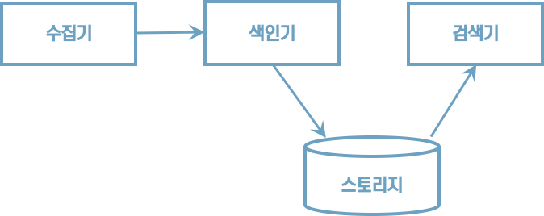

# 01 검색 시스템 이해하기

## 1.1 검색 시스템의 이해

### 1.1.1 검색 시스템이란?

* 검색엔진
    * 광활한 웹에서 정보를 수집해 검색 결과를 제공하는 프로그램이다.
    * 야후는 디렉터리 기반의 검색 결과를 세계 최초로 제공했다.
* 검색 시스템
    * 대용량 데이터를 기반으로 신뢰성 있는 검색 결과를 제공하기 위해 검색엔진을 기반으로 구축된 시스템을 통칭하는 용어다.
* 검색 서비스는 검색 엔진을 기반으로 구축한 검색 시스템을 활용해 검색 결과를 서비스로 제공한다.


>  검색 서비스 > 검색 시스템 > 검색 엔진


### 1.1.2 검색 시스템의 구성 요소

##### 수집기

수집기는 웹사이트, 블로그, 카페 등 웹에서 필요한 정보를 수집하는 프로그램이다.

##### 스토리지

데이터베이스에서 데이터를 저장하는 물리적인 장소다.

##### 색인기

검색엔진이 수집한 정보에서 사용자 질의와 일치하는 정보를 찾으려면 수집된 데이터를 검색 가능한 구조로 가공하고 저장해야 한다. 그 역할을 하는 것이 색인기다. 색인기는 다양한 형태소 분석기를 조합해 정보에서 의미가 있는 용어를 추출하고 검색에 유리한 <u>역색인 구조로 데이터를 저장한다.</u>

##### 검색기

검색기는 사용자 질의를 받아 색인기에서 저장한 역색인 구조에서 일치하는 문서를 찾아 결과로 반환한다.





### 1.1.3 관계형 데이터베이스와의 차이점

엘라스틱서치와 관계형 데이터베이스 비교

| 엘라스틱서치 | 관계형 데이터베이스 |
| :----------- | :------------------ |
| 인덱스       | 데이터베이스        |
| 샤드         | 파티션              |
| 타입         | 테이블              |
| 문서         | 행                  |
| 필드         | 열                  |
| 매핑         | 스키마              |
| Query DSL    | SQL                 |


추가,검색,삭제, 수정 기능 비교
| 엘라스틱서치에서 사용하는 HTTP 메서드 |기능 | 데이터베이스 질의문법|
| :----------- | :------------------ | :------------------ |
| GET    | 데이터 조회   |SELECT        |
| `PUT`     | `데이터 생성`       |INSERT        |
| POST      | 인덱스 업데이트, 데이터 조회 |UPDATE, SELECT        |
| DELETE    | 데이터 삭제             |DELETE        |
| HEAD      | 인덱스 정보 확인         |-        |


다음은 엘라스틱서치를 사용하기 위한 간단한 API 요청 구조다.

```http
curl -X(메서드) http://host:port/(인덱스)/(타입)/(문서 id) -d '{json 데이터}'
```


리눅스에서는 엘라스틱 서버의 정보를 다음 명령으로 확인할 수 있다.

```http
curl -XGET http://localhost:9200
```

실행결과

```json
{
  "name" : "JJN9Ar1",
  "cluster_name" : "docker-cluster",
  "cluster_uuid" : "rNQde4FrQBiFouVrBHfGfQ",
  "version" : {
    "number" : "6.8.6",
    "build_flavor" : "oss",
    "build_type" : "docker",
    "build_hash" : "3d9f765",
    "build_date" : "2019-12-13T17:11:52.013738Z",
    "build_snapshot" : false,
    "lucene_version" : "7.7.2",
    "minimum_wire_compatibility_version" : "5.6.0",
    "minimum_index_compatibility_version" : "5.0.0"
  },
  "tagline" : "You Know, for Search"
}
```


엘라스틱서치와 관계형 데이터베이스의 쿼리를 비교해보자.

| ID | Name        | Location | Gender | Date|
| :--- |  :--- | :--- | :--- | :--- |
| 1 | 가마돈 | 서울 | 남 | 2018-05-12 |
| 2 |로이드 | 도쿄 | 여 | 2018-05-11 |

SQL문

```sql
SELECT * FROM USER WHERE Name like '%가마돈%'
```

엘라스틱서치 API

```http
GET http://localhost:9200/user/_search/q=Name:가마돈
```


## 1.2 검색 시스템과 엘라스틱서치

### 1.2.1 엘라스틱서치가 강력한 이유

#### 오픈소스 검색엔진

엘라스틱서치는 루씬을 기반으로 개발된 오프소스 검색엔진이다.


#### 전문 검색

PostgreSQL, MongoDB 같은 대부분 데이터베이스는 기본적인 텍스트 검색 기능만 제공한다. 하지만 엘라스틱서치는 좀 더 고차원적인 전문 검색(Full Text)이 가능하다. 전문 검색이란 내용 전체를 색인해서 특정 단어가 포함된 문서를 검색하는 것을 말한다.


#### 통계 분석

비정형 로그 데이터를 수집하고 한곳에 모아 통계 분석을 할 수 있다. 엘라스틱서치와 키바나를 연결하면 실시간으로 쌓이는 로그를 시각화하고 분석할 수 있다.


#### 스키마리스

정형화되지 않은 다양한 형태의 문서도 자동으로 색인하고 검색할 수 있다.


#### RESTFul API

HTTP 기반의 RESTFul API를 지원하고 응답에도 JSON 형식을 사용해 개발언어, 운영체제, 시스템에 관계없이 이기종 플랫폼에서도 이용 가능하다.


#### 멀티테넌시

서로 상이한 인덱스일지라도 검색할 필드만 같으면 여러 개의 인덱스를 한번에 조회할 수 있다.


#### Document-Oriented

여러 계층의 데이터를 JSON 형식의 구조화된 문서로 인덱스에 저장할 수 있다. 계층 구조로 문서도 한번의 쿼리로 쉽게 조회할 수 있다.


#### 역색인

엘라스틱서치는 역색인을 지원한다. 반면 MongoDB, 카산드라 같은 일반적인 NoSQL은 역색인을 지원하지 않는다.

| 단어         | 문서 번호 |
| :----------- | :-------- |
| 엘라스틱서치 | 1         |
| 검색엔진     | 1,2       |
| 역색인       | 2,3       |
| 데이터베이스 | 3         |

'검색엔진'이란 단어가 포함된 모든 문서를 찾아야 한다고 하자. 일반적으로는 처음부터 끝까지 모든 문서를 읽어야만 원하는 결과를 얻을 수 있을 것이다. 하지만 역색인 구조는 해당 단어만 찾으면 단어가 포함된 모든 문서의 위치를 알 수 있기 때문에 빠르게 찾을 수 있다.


#### 확장성과 가용성

데이터는 샤드라는 작은 단위로 나뉘어 제공되면 데이터를 분산해서 빠르게 처리할 수 있다.


### 1.2.2 엘라스틱서치의 약점

1. 실시간이 아니다. 일반적으로 색인된 데이터는 1초 뒤에나 검색이 가능하다. 색인된 데이터는 내부적으로 커밋과 플러시 같은 복잡한 과정을 거치기 때문에 실시간이 아니다. 엄밀히 따지자면 준 실시간(Near Realtime)이라고 할 수 있다.
2. 트랜잭션과 롤백 기능을 제공하지 않는다.
3. 데이터의 업데이트를 제공하지 않는다. 엄밀히 말하자면 엘라스틱서치는 업데이트 명령이 요청될 경우 기존 문서를 삭제하고 변경된 내용으로 새로운 문서를 생성하는 방식을 사용한다.


