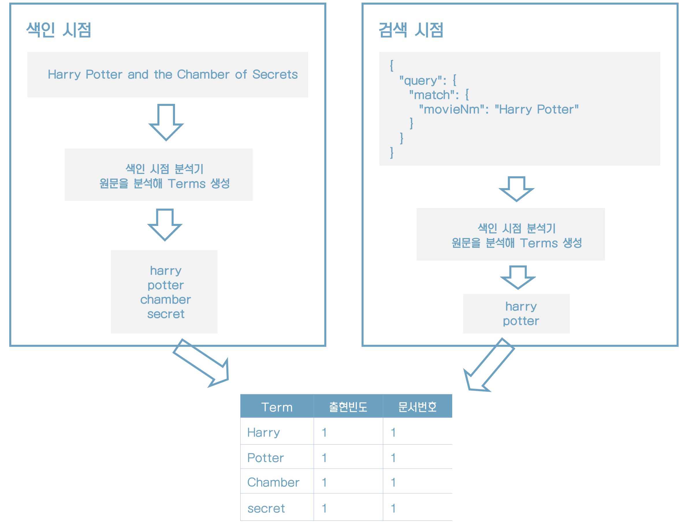

# 04 데이터 검색 

* 문서는 색인 시 설정한 분석기에 의해 분석 과정을 거쳐 토큰을 분리
* 분석기는 색인 시점에 사용할 수도 있지만 검색 시점에 사용하는 것도 가능하다.
* 특정 문장이 검색어로 요청되면 분석기를 통해 분석된 토큰의 일치 여부를 판단해서 그 결과에 점수(score)를 매긴다.
* 이를 기반으로 순서를 적용해 결과를 사용자에게 최종적으로 출력하게 된다.


## 4.1 검색 API



* 엘라스틱서치는 색인 시점에 Analyzer를 통해 분석된 텀을 Term, 출현빈도, 문서번호와 같이 역색인 구조로 만들어 내부적으로 저장한다.
* 검색 시점에는 Keyword와 Text타입을 구분하여 분석이 가능할 경우 분석을 수행한다.


### 4.1.1 검색 질의 표현 방식

* URI 검색
* Request Body 검색

##### URI 검색

HTTP GET 요청을 활용하는 방식으로 파라미터를 'Key=Value'형태로 전달하는 방식이다.

파라미터를 이용한 간단한 URI 검색 쿼리의 예다.

```http
GET movie_search/_search?q=prdtYear:2018
```

##### Request Body 검색

```http
POST movie_search/_search
{
	"query": {
		"term": { "prdtYear": "2018"}
	}
}
```


### 4.1.2 URI 검색

```http
POST movie_search/_search?q=movieNmEn:Family
```

```http
POST movie_search/_search?q=movieNmEn:* AND prdtYear:2017&analyze_wildcard=true&from=0&size=5&sort=_score:desc&_source_includes=movieCd,movieNm,movieNmEn,typeNm
```


### 4.1.3 Request Body 검색

```http
POST movie_search/_search
{
	"query": {
		"query_string": {
			"default_field": "movieNmEn",
			"query": "family"
		}
	}
}
```

```http
POST movie_search/_search
{
	"query": {
		"query_string": {
			"default_field": "movieNmEn",
			"query": "movieNmEn:* OR prdtYear:2017"
		}
	},
	"from": 0,
	"size": 5,
	"sort": [{
	    "_score": {
	      "order": "desc"
	    },
	    "movieCd": {
	      "order": "asc"
	    }
	 }],
	 "_source": [
	   "movieCd",
	   "movieNm",
	   "movieNmEn",
	   "typeNm"
	 ]
}
```


## 4.2 Query DSL 이해하기

Query DSL로 쿼리를 작성하려면 미리 정의된 문법에 따라 JSON 구조를 작성해야 한다.

```http
{
	"size":  // 리턴받는 결과의 개수. 기본값: 10
	"from": // 몇 번째 문서부터 가져올 지정. 기본값: 0
	"timeout": // 검색을 요청해서 결과를 받는데까지 걸리는 시간. 기본값: 무한대
	"_source": {} // 검색 시 필요한 필드만 출력하고 싶을 때
	"query": {} // 검색 조건문이 들어가는 공간
	"aggs": {} // 통계 및 집계 데이터를 사용할 때 사용
	"sort": {} // 문서 결과를 어떻게 출력할 지에 대한 조건
}
```

응답 JSON 구조는 아래와 같다.

```http
{
	"took": // 쿼리를 실행한 시간
	"time_out": // 쿼리 시간이 초과할 경우
	"_shards": {
		"total": // 쿼리를 요청한 전체 샤드의 개수
		"sucessful": // 성공적으로 응답한 샤드의 개수
		"failed": // 실패한 샤드의 개수
	},
	"hits": {
		"total": // 매칭된 문서의 전체 개수
		"max_score": // 문서의 스코어 값 중 가장 높은 값
		"hits": [] //각 문서 정보와 스코어 값
	}
}
```


### 4.2.2 Query DSL 쿼리와 필터

* 실제 분석기에 의한 전문 분석이 필요한 경우와 단순히 'Yes/No'로 판단할 수 있는 조건 검색의 경우
* 전자를 쿼리(Queries) 컨텍스트라 하고, 후자를 필터(Filter) 컨텍스트라는 용어로 구분한다.


|     | 쿼리 컨텍스트  | 필터 컨텍스트 |
| :-------- | :------ | :-------- |
| 용도 | 전문 검색 시 사용 | 조건 검색 시 사용(예: Yes/No) |
| 특징 | 분석기에 의해 분석이 수행됨<br />연관성 관련 Score를 계산<br />루씬 레벨에서 분석 과정을 거쳐야 하므로 상대적으로 느림 | Yes/No로 단순 판별 가능<br />연관성 관련 계산을 하지 않음<br />엘라스틱서치 레벨에서 처리가 가능하므로 상대적으로 빠름 |
| 사용 예 | "Harry Potter" 같은 문장 분석 | "create_year"필드의 값이 2018년인지 여부<br />"status" 필드에 'use'라는 코드 포함 여부 |


#### 쿼리 컨텍스트

* 문서가 쿼리와 얼마나 유사한지 스코어로 계산한다.
* 질의가 요청될 때마다 엘라스틱서치에서 내부의 루씬을 이용해 계산을 수행한다.(이때 결과가 캐싱되지 않는다)
* 일반적으로 전문 검색에 많이 사용한다.
* 캐싱되지 않고 디스크 연산을 수행하기 때문에 상대적으로 느리다.

다음 예제는 '기묘한 가족'이라는 문장을 대상으로 형태소 분석을 수행하여 movieNm 필드를 검색한다. <u>이때 검색 결과를 얻기 위해 모든 문서의 movieNm 필드 데이터를 분석하는 과정을 거친다.</u>

```http
POST movie_search/_search
{
	"query": {
	  "match": {
	    "movieNm": "기묘한 가족"
	  }
	}
}
```


#### 필터 컨텍스트

* 쿼리의 조건과 문서가 일치하는지(Yes/No)를 구분한다.
* 별도의 스코어를 계산하지 않고 단순 매칭 여부를 검사한다.
* 자주 사용되는 필터의 결과는 엘라스틱서치가 내부적으로 캐싱한다.
* 기본적으로 메모리 연산을 수행하기 때문에 상대적으로 빠르다.

다음 예제에서는 전체 문서 중 repGenreNm 필드의 값이 '다큐멘터리'인 문서만 필터링해서 검색한다. <u>검색하기 전에 필터링 과정을 미리 거치게 되며 검색 대상 문서의 수가 줄어들기 때문에 빠르게 결과를 얻을 수 있다.</u>

```http
POST movie_search/_search
{
	"query": {
	  "bool": {
	    "must": [
	      {
	        "match_all": {}
	      }
	    ],
	    "filter": {
	      "term": {
	        "repGenreNm": "다큐멘터리"
	      }
	    }
	  }
	}
}
```


### 4.2.3 Query DSL의 주요 파라미터

##### Multi Index 검색

기본적으로 모든 검색 요청은 Multi Index 및 Multi Type 검색이 가능하다.

```http
POST movie_search,movie_auto/_search
{
	"query": {
		"term": {
			"repGenreNm": "다큐멘터리"
		}
	}
}
```

검색 요청 시 인덱스 이름을 지정할 때 "*"를 와일드카드로 사용할 수 있다.

```http
POST /logs-2019-*/_search
```


##### 쿼리 결과 페이징

문서의 시작을 나타내기 위해 from 파라미터를 사용하고 문서의 개수를 나타내기 위해 size 파라미터를 사용하면 된다.

```http
# 첫 번째 페이지 요청
POST movie_search/_search
{
	"from": 0,
	"size": 5,
	"query": {
		"term": {
			"repNationNm": "한국"
		}
	}
}
```

두 번째 페이지를 요청하기 위해서는 from값을 조정하면 된다.

```http
# 두 번째 페이지 요청
POST movie_search/_search
{
	"from": 5,
	"size": 5,
	"query": {
		"term": {
			"repNationNm": "한국"
		}
	}
}
```

엘라스틱서치는 관계형 데이터베이스와 다르게 페이징된 해당 문서만 선택적으로 가져오는 것이 아니라 모든 데이터를 읽게 된다. 예를 들어, 예제와 같이 5건씩 페이징한 검색 결과의 2페이지를 요청하더라도 총 10건의 문서를 읽어야 한다. 설정된 페이지를 제공하기 위해서는 전체를 읽어서 사이즈만큼 필터링해서 제공하는 구조이기 때문에 페이지 번호가 높아질수록 쿼리 비용은 덩달아 높아질 수밖에 없다는 점에 주의해야 한다.


##### 쿼리 결과 정렬

```http
POST movie_search/_search
{
	"query": {
		"term": {
			"repNationNm": "한국"
		}
	},
	"sort": {
		"prdtYear": {
			"order": "asc"
		}
	}
}
```

1번째 정렬값이 같은 경우 2번째 값으로 정렬

```http
POST movie_search/_search
{
	"query": {
		"term": {
			"repNationNm": "한국"
		}
	},
	"sort": {
		"prdtYear": {
			"order": "asc"
		},
		"_score": {
		  "order": "desc"
		}
	}
}
```


##### _source 필드 필터링

movieNm 필드만 필터링하여 출력

```http
POST movie_search/_search
{
	"_source": [
		"movieNm"
	],
	"query": {
		"term": {
			"repNationNm": "한국"
		}
	}
}
```


##### 범위 검색

* lt: <
* gt: >
* lte: <=
* gte: >=


2016년부터 2017년까지 조회

```http
POST movie_search/_search
{
	"query": {
		"range": {
			"prdtYear": {
				"gte": "2016",
				"lte": "2017"
			}
		}
	}
}
```


##### operator 설정

엘라스틱서치는 검색 시 문장에 들어올 경우 기본적으로 OR 연산으로 동작한다.

```http
POST movie_search/_search
{
  "query": {
    "match": {
      "movieNm": {
        "query": "자전차왕 엄복동"
        , "operator": "and"
      }
    }
  }
}
```

operator 파라미터를 생략하면 OR 연산으로 동작해서 "저전차왕"이라는 단어 혹은 "엄복동"이라는 단어가 들어있는 모든 문서가 검색될 것이다. 하지만 예제에서는 operator 파라미터를 이용해 "and" 값을 명시했으므로 두 개의 텀이 모두 존재하는 문서만 결과로 제공한다.


##### minimum_should_match 설정

일반적으로 OR 연산을 수행할 경우 검색 결과가 너무 많아질 수 있다. 이 경우 텀의 개수가 몇 개 이상 매칭될 때만 결과로 나오게 할 수 있는데 이때 사용하는 파라미터가 minimum_should_match다.

```http
POST movie_search/_search
{
  "query": {
    "match": {
      "movieNm": {
        "query": "자전차왕 엄복동",
        "minimum_should_match": 2
      }
    }
  }
}
```


##### fuziness 설정

fuziness 파라미터를 사용하면 단순히 같은 값을 찾는 Match Query를 유사한 값을 찾는 Fuzzy Query로 변경할 수 있다. 이는 레벤슈타인(Levenshtein) 편집 거리 알고리즘을 기반으로 문서의 필드 값을 여러 번 변경하는 방식으로 동작한다. 유사한 검색 결과를 찾기 위해 허용 범위의 텀으로 변경해 가며 문서를 찾아 결과로 출력한다.

오차범위 값으로 0, 1, 2, AUTO로 총 4가지 값을 사용할 수 있는데, 이는 알파벳에는 유용하지만 한국어에는 적용하기 어렵다.


```http
POST movie_search/_search
{
  "query": {
    "match": {
      "movieNmEn": {
        "query": "Fli",
        "fuzziness": 1
      }
    }
  }
}
```


##### boost 설정

이 파라미터는 관련성이 높은 필드나 키워드에 가중치를 더 줄 수 있게 해준다. 영화 데이터의 경우 한글 영화 제목과 영문 영화 제목으로 두 가지 제목 필드를 제공하고 있다. 이때 한글 영화 제목에 좀 더 가중치를 부여해서 검색 결과를 좀 더 상위로 올리고 싶을 때 사용할 수 있다.

```http
POST movie_search/_search
{
  "query": {
    "multi_match": {
      "query": "Fly",
      "fields": ["movieNm^3", "movieNmEn"]
    }
  }
}
```


## 4.3 Query DSL의 주요 쿼리

### 4.3.1 Match All Query

match_all 파라미터를 사용하는 Match All Query는 색인에 모든 문서를 검색하는 쿼리다. 가장 단순한 쿼리로서 일반적으로 색인에 저장된 문서를 확인할 때 사용된다.

```http
POST movie_search/_search
{
  "query": {
    "match_all": {}
  }
}
```


### 4.3.2 Match Query

Match Query는 텍스트, 숫자, 날짜 등이 포함된 문장을 형태소 분석을 통해 텀을 분리한 후 이 텀들을 이용해 검색 질의를 수행한다. 그러므로 검색어가 분석돼야 할 경우에 사용해야 한다.

```http
POST movie_search/_search
{
  "query": {
    "match": {
      "movieNm": "그대 장미"
    }
  }
}
```

* "그대 장미"라는 검색어를 Match Query로 요청하면
* 엘라스틱서치는 해당 검색어에 대해 형태소 분석을 통해 "그대", "장미"라는 2개의 텀으로 분리한다.
* 별도 operator가 지정돼 있지 않기 때문에 두 개의 텀을 대상으로 <u>OR 연산</u>을 이용해 검색을 수행한다.


### 4.3.3 Multi Match Query

Match Query와 기본적인 사용법은 동일하나 단일 필드가 아닌 여러 개의 필드를 대상으로 검색할 때 사용하는 쿼리다.

```http
POST movie_search/_search
{
  "query": {
    "multi_match": {
      "query": "가족",
      "fields": ["movieNm", "movieNmEn"]
    }
  }
}
```


### 4.3.4 Term Query

텍스트 형태의 값을 검색하기 위해 엘라스틱서치는 두 가지 매핑 유형을 지원한다.

| 타입                | 설명                                                         |
| :------------------ | :----------------------------------------------------------- |
| Text 데이터 타입    | 필드에 데이터가 저장되기 전에 데이터가 분석되어 역색인 구조로 저장된다. |
| Keyword 데이터 타입 | 데이터가 분석되지 않고 그대로 필드에 저장된다.               |

Term Query는 Keyword 데이터 타입을 대상으로 하기 때문에 일반적으로 숫자, Keyword, 날짜 데이터를 쿼리하는 데 사용한다.

```http
POST movie_search/_search
{
  "query": {
    "term": {
      "genreAlt": "코미디"
    }
  }
}
```

* Term Query는 필드에 텀이 정확히 존재하지 않는 경우 검색이 되지 않는다.
* 영문의 경우 대소문자가 다를 경우 검색되지 않으므로 주의해야 한다.


### 4.3.5 Bool Query

관계형 데이터베이스에서는 AND, OR로 묶은 여러 조건을 Where 절에서 사용할 수 있다. 이처럼 엘라스틱서치에서도 여러 개의 쿼리를 조합해서 사용하고 싶을 때는 어떻게 해야 할까?

엘라스틱서치에서는 하나의 쿼리나 여러 개의 쿼리를 조합해서 더 높은 스코어를 가진 조건으로 검색을 수행할 수 있다. 이러한 유형의 쿼리를 Compound Query라 하는데, 엘라스틱서치에서는 Bool Query를 제공한다.

```http
{
	"query": {
		"bool": {
			"must": []
			"must_not": [],
			"should": [],
			"filter": []
		}
	}
}
```

| Elasticsearch    | SQL                  |설명|
| :------------------ | :------------- |:---------------------- |
| must : [필드] | AND 칼럼 = 조건  | 반드시 조건에 만족하는 문서만 검색된다.                      |
| must_not : [필드] | AND 칼럼 != 조건 | 조건을 만족하지 않는 문서가 검색된다.                        |
| should : [필드]   | OR 칼럼 = 조건   | 여러 조건 중 하나 이상을 만족하는 문서가 검색된다.           |
| filter : [필드]   | 칼럼 IN (조건)   |조건을 포함하고 있는 문서를 출력한다. 해당 파라미터를 사용하면 스코어별로 정렬되지는 않는다.|

대표 장르가 "코미디"이고, 제작 국가에 "한국"이 포함돼 있으며, 영화 타입 중 "단편"이 제외된 문서를 검색한다.

```http
POST movie_search/_search
{
  "query": {
    "bool": {
      "must": [
        {
          "term": {
            "repGenreNm": "코미디"
          }
        },
        {
          "match": {
            "repNationNm": "한국"
          }
        }
      ],
      "must_not": [
        {
          "match": {
            "typeNm": "단편"
          }
        }
      ]
    }
  }
}
```


### 4.3.6 Query String

엘라스틱서치에는 기본적으로 내장된 쿼리 분석기가 있다. query_string 파라미터를 사용하는 쿼리를 작성하면 내장된 쿼리 분석기를 이용하는 질의를 작성할 수 있다.

```http
POST movie_search/_search
{
  "query": {
    "query_string": {
      "default_field": "movieNm",
      "query": "(가정) AND (어린이 날)"
    }
  }
}
```

'가정'과 '어린이날'이 각각 형태소 분석기를 통해 분석되며, 분석된 텀을 대상으로 AND 조건과 만족하는 문서를 찾아 돌려준다. 여기서 주의해야 할 점은 기존 텀 쿼리와 다르게 공백은 연산자로 사용되지 않으며 입력된 텍스트 그대로 형태소 분석기에 전달된다는 점이다.


### 4.3.7 Prefix Query

해당 접두어가 있는 모든 문서를 검색하는 데 사용한다.

```http
POST movie_search/_search
{
  "query": {
    "prefix": {
      "movieNm": "자전차"
    }
  }
}
```


### 4.3.8 Exists Query

실제 값이 존재하는 문서만 찾고 싶다면 Exists Query를 사용하면 된다.

```http
POST movie_search/_search
{
  "query": {
    "exists": {
      "field": "movieNm"
    }
  }
}
```


### 4.3.9 Wildcard Query

검색어가 와일드카드와 일치하는 구문을 만든다. 이때 검색된 검색어는 형태소 분석이 이뤄지지 않는다.

| 와일드카드 옵션 | 설명                                                         |
| :-------------- | :----------------------------------------------------------- |
| *               | 문자의 길이와 상관없이 와일드카드와 일치하는 모든 문서를 찾는다. |
| ?               | 지정된 위치의 한 글자가 다른 경우의 문서를 찾는다.           |

와일드카드 옵션은 두 가지를 선택적으로 사용할 수 있다. 와일드카드를 사용할 경우 단어의 첫 글자로는 절대 사용해서는 안 된다. 첫 글자로 와일드카드가 사용될 경우 색인된 전체 문서를 찾아야 하는 불상사가 발생할 수 있기 때문이다.

```http
POST movie_search/_search
{
  "query": {
    "wildcard": {
      "movieNm": "장?"
    }
  }
}
```


### 4.3.10 Nested Query

* 분산 시스템에서 SQL에서 지원하는 조인과 유사한 기능을 수행하려면 엄청나게 많은 비용이 소모될 것이다.
* 수평적으로 샤드가 얼마나 늘어날지 모르는 상황에서 모든 샤드를 검색해야 할 수도 있기 때문이다.
* 업무를 수행하다 보면 문서 간의 부모/자식 관계의 형태로 모델링이 되는 경우가 종종 발생할 것이다.
* 이러한 경우에 대비해 엘라스틱서치에서는 분산 데이터 환경에서도 SQL 조인과 유사한 기능을 수행하는 Nested Query를 제공한다.


Nested 형태의 스키마를 이용해 인덱스를 생성한다.

```http
PUT movie_nested
{
  "settings": {
    "number_of_replicas": 1,
    "number_of_shards": 5
  },
  "mappings": {
    "properties": {
      "repGenreNm": {
        "type": "keyword"
      },
      "companies": {
        "type": "nested",
        "properties": {
          "companyCd": {
            "type": "keyword"
          },
          "companyNm": {
            "type": "keyword"
          }
        }
      }
    }
  }
}
```

생성된 인덱스에 문서를 하나 추가한다.

```http
PUT movie_nested/_doc/1
{
  "movieCd": "20184623",
  "movieNm": "바람난 아내들2",
  "movieNmEn": "",
  "prdtYear": "2018",
  "openDt": "",
  "typeNm": "장편",
  "prdtStatNm": "개봉예정",
  "nationAlt": "한국",
  "genreAlt": "멜로/로맨스",
  "repNationNm": "한국",
  "repGenreNm": "멜로/로맨스",
  "companies": [
    {
      "companyCd": "20173401",
      "companyNm": "(주)케이피에이기획"
    }
  ]
}
```

Nested Query를 이용해 Child로 저장된 문서의 특정 필드를 검색할 수 있다.

```http
GET movie_nested/_search
{
  "query": {
    "bool": {
      "must": [
        {
          "term": {
            "repGenreNm": "멜로/로맨스"
          }
        },
        {
          "nested": {
            "path": "companies",
            "query": {
              "bool": {
                "must": [
                  {
                    "term": {
                      "companies.companyCd": "20173401"
                    }
                  }
                ]
              }
            }
          }
        }
      ]
    }
  }
}
```

참고로 엘라스틱서치는 성능상의 이유로 Parent 문서와 Child 문서를 모두 동일한 샤드에 저장한다. 이러한 방식을 통해 네트워크 비용을 대폭 줄이는 것이 가능해진다.


## 4.4 부가적인 검색 API

### 4.4.1 효율적인 검색을 위한 환경설정

* 엘라스틱서치는 대량의 데이터를 처리하기 위해 기본적으로 데이터를 분산해서 처리한다.
* 그렇다면 빠른 검색을 위해 내부적으로는 어떻게 동작하는 것일까?
* 검색 요청이 발생하면 엘라스틱서치는 모든 샤드에 검색 요청을 브로드캐스팅해서 전달하고 기다린다.
* 각 샤드는 자신이 가지고 있는 데이터를 기준으로 검색을 수행하고 그 결과를 리턴한다.
* 그리고 모든 샤드로부터 검색 결과가 도착하면 도착한 모든 결과를 조합해서 최종 질의 결과를 출력한다.


#### 동적 분배 방식의 샤드 선택

* 엘라스틱서치는 부하 분산과 장애극복을 위해 원본 샤드의 데이터를 복제한 레플리카 샤드를 함께 운영한다.
* 검색 시 모든 샤드에서 검색을 수행하게 되면 사용자에게 중복된 결과를 전달하게 될 수 있을 것이다.
* 이러한 문제를 방지하기 위해 엘라스틱서치는 검색을 수행할 때 동일 데이터를 가지고 있는 샤드 중 하나만 선택해 검색을 수행한다.
* 만일 특별히 설정하지 않는다면 검색 요청의 적절한 분배를 위해 기본적으로 라운드로빈 방식의 알고리즘을 사용한다.
* 라운드로빈은 순차적으로 샤드를 선택하는 방식이다. 엘라스틱서치에서는 라운드로빈 말고도 동적 분배 방식의 알고리즘도 제공한다.
* 동적 분배 방식은 검색 요청의 응답시간, 검색 요청을 수행하는 스레드 풀의 크기 등을 고려해 최적의 샤드를 동적으로 결정하는 방식이다.

다음 예제는 동적으로 요청을 분배하도록 설정하는 예다.

```http
PUT _cluster/settings
{
  "transient": {
    "cluster.routing.use_adaptive_replica_selection": true
  }
}
```


#### 글로벌 타임아웃 설정

개별 검색 요청의 경우에는 Request Body에 직접 타임아웃을 설정할 수 있다. 이러한 방식을 많은 불편을 초래하기 때문에 모든 검색 쿼리에 동일하게 적용되도록 정책으로 설정하는 것이 좋다.

글로벌로 적용되는 타임아웃의 기본 정책은 무제한(-1)이다. 이를 변경하려면 다음과 같이 설정한다.

```http
PUT _cluster/settings
{
  "transient": {
    "search.default_search_timeout": "1s"
  }
}
```


### 4.2.2 Search Shards API

movie_search 인덱스의 정보를 확인해 보자.

```http
POST movie_search/_search_shards
```


### 4.4.3 Multi Search API

Multi Search API는 여러 건의 검색 요청을 통합해서 한번에 요청하고 한번에 결과를 종합해서 받을 때 사용되는 API다.

```http
POST _msearch
{"index": "movie_auto"}
{"query": {"match_all": {}}, "from": 0, "size": 10}
{"index": "movie_search"}
{"query": {"match_all": {}}, "from": 0, "size": 10}
```

Multi Search API를 사용하면 동시에 여러 개의 색인에서 검색을 수행할 수 있다.


### 4.4.4 Count API

```http
POST movie_search/_count?q=prdtYear:2017
```


```http
POST movie_search/_count
{
  "query": {
    "query_string": {
      "default_field": "prdtYear",
      "query": "2017"
    }
  }
}
```


### 4.4.5 Validate API

Validate API를 사용하면 쿼리를 실행하기에 앞서 쿼리가 유효하게 작성됐는지 검증하는 것이 가능하다.

```http
POST movie_search/_validate/query?q=prdtYear:2017
```

```http
POST movie_search/_validate/query
{
  "query": {
    "match": {
      "prdtYear": "2017"
    }
  }
}
```

만약 쿼리에 오류가 발생하는 경우는 자세한 정보를 보기 위해 URL 파라미터로 rewrite=true 파라미터를 추가하면 된다.

```http
POST movie_search/_validate/query?rewrite=true
{
  "query": {
    "match": {
      "prdtYear": "2017-01-01"
    }
  }
}
```


### 4.4.6 Explain API

문서가 가진 _score 값이 어떻게 계산된 것인지 자세한 정보를 알고 싶다면 Explain API를 사용하면 된다.

스코어 값이 어떤 방식으로 계산됐는지 알아보자.

```http
POST movie_search/_doc/eDzJqmkBjjM-ebDb8PsR/_explain
{
  "query": {
    "term": {
      "prdtYear": 2017
    }
  }
}
```


### 4.4.7 Profile API

Profile API는 쿼리에 대한 상세한 수행 계획과 각 수행 계획별로 수행된 시간을 돌려주므로 성능을 튜닝하거나 디버깅할 때 유용하게 활용할 수 있다.

```http
POST movie_search/_search
{
  "profile": "true", 
  "query": {
    "match_all": {}
  }
}
```


> "내 질의 결과에 대한 스코어가 어떻게 계산됐는가?"를 확인할 때는 
> ==> Explain API를 사용
>
> "내 질의를 실행하는 과정에서 각 샤드별로 얼마나 많은 시간이 소요됐는가?"를 알고 싶을 때는
> ==> Profile API를 사용


