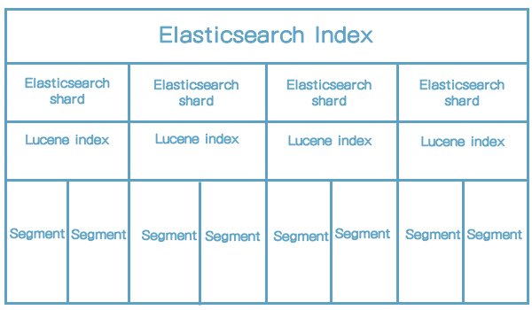
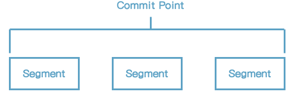
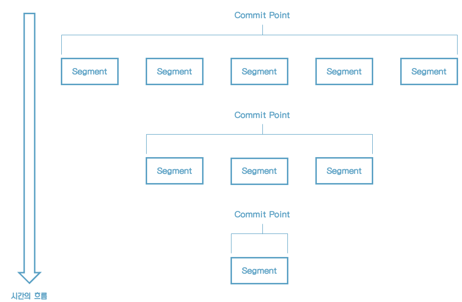

# 09 엘라스틱서치와 루씬 이야기

이번 장에서 다룰 내용

* 9.1 클러스터 관점에서 구성요소 살펴보기
* 9.2 엘라스틱서치 샤드 vs. 루씬 인덱스
* 9.3 엘라스틱서치가 근실시간 검색을 제공하는 이유
* 9.4 고가용성을 위한 Translog의 비밀
* 9.5 엘라스틱서치 샤드 최적화

## 9.1 클러스터 관점에서 구성요소 살펴보기

* 엘라스틱서치는 기본적으로 클러스터라는 단위로 데이터를 제공한다.
* 클러스터는 하나 이상의 물리적인 노드로 이루어져 있으며 각 노드는 모두 데이터 색인 및 검색 기능을 제공하는 일종의 물리적인 서버이기도 하다.
* 각 노드는 모두 색인 및 검색 기능을 제공하는 일종의 물리적인 서버이기도 하다.
* 내부에는 루씬 라이브러리가 있다.

### 9.1.1 클러스터

* 클러스터(Cluster)는 데이터를 실제로 가지고 있는 노드의 모음이다.
* 엘라스틱서치에서는 관련된 모든 노드들을 논리적으로 확장해서 클러스터라고 부른다.
* 같은 클러스터 내부의 데이터만 서로 공유가 가능하다.

### 9.1.2 노드

* 물리적으로 실행된 런타임 상태의 엘라스틱서치를 노드(Node)라고 부른다. 좀 더 정화히 설명하자면 엘라스틱서치 클러스터를 운영하기 위해 다수의 물리 서버에 엘라스틱서치를 설치하고 실행하게 되는데, 이때 실해된 엘라스틱서치 인스턴스를 노드라고 한다.

* 노드는 내부에 다수의 인덱스를 가지고 있으며, 각 인덱스는 다수의 문서를 가지고 있다.

* 노드는 논리적인 클러스터를 이루는 구성원의 일부이다.

* 노드는 다음과 형태로 실행할 수 있다.

    * 마스터 노드
    * 데이터 노드
    * 인제스트 노드
    * 트라이브 노드
    * 코디네이팅 노드

    

### 9.1.3 인덱스

* 인덱스는 유사한 특성을 가지고 있는 문서를 모아둔 문서들의 컬렉션이다. 쇼핑몰을 예로 들면 고객 정보, 상품 정보, 주민정보 등이 각 인덱스가 될 수 있다.

* 인덱스명은 모두 소문자로 설정해야 한다.

    

> **루씬 인덱스**
>
> 루씬에서는 전문(Full-Text)을 분석하고 분석된 결과를 물리적인 디스크로 저장한다. 이러한 과정을 루씬 입장에서는 색인(indexing) 과정이라고 부른다. 이 과정에 의해 생성된 데이터를 인덱스라고 하기 때문에 엘라스틱서치 인덱스와 잘 구분해서 이해해야 한다.

### 9.1.4 문서

* 문서는 검색 대상이 되는 실제 물리적인 데이터를 뜻한다.
* 문서는 인덱스를 생성할 수 있는 기본적인 정보 단위이고 엘라스틱서치에서는 JSON 형식으로 표현된다.

### 9.1.5 샤드

* 일반적으로 하드웨어에서 제공되는 리소스 이상의 데이터를 저장할 수 없지만 물리적인 한계를 뛰어넘기 위해 샤드라는 개념을 도입했다.
* 인덱스에 쿼리를 요청하면 인덱스가 가지고 있는 모든 샤드로 검색 요청이 전달되고 각 샤드에서 1차적으로 검색이 이뤄진 후 그 결과를 취합해서 최종 결과로 제공한다.

> 샤딩이 중요한 이유
>
> 1. 지속적으로 증가하는 콘텐츠가 수평적으로 분할되어 하드웨어의 한계를 극복할 수 있다.
> 2. 여러 노드에서 샤드를 통해 분산 처리되므로 성능이나 처리량을 향상시킬 수 있다.

### 9.1.6 레플리카

* 샤드의 복제본을 레플리카(Replica)라고 한다.
* 레플리카를 이용한 페일오버 메커니즘을 제공하고 있고 이를 이용해 안정적인 클러스터 운영을 보장한다.
* 인덱스가 생성될 때 샤드 개수와 레플리카 개수를 자유롭게 설정할 수 있다. 하지만 인덱스가 생성된 이후에는 샤드 개수를 변경하는 것이 불가능하기 때문이 이 점에 유의해야 한다. 그에 반해 레플리카 개수는 인덱스를 생성한 후에도 자유롭게 변경하는 것이 가능하다.

### 9.1.7 세그먼트

* 샤드 내부에는 루씬 라이브러리를 포함하고 있는데, 이를 이용해 대부분의 검색 기능을 제공한다.
* 루씬에 데이터가 색인되면 데이터는 최소한의 단위인 토큰으로 분리되고 특수한 형태의 자료구조로 저장되는데 이렇게 저장된 자료구조를 `세그먼트`라고 한다.

## 9.2 엘라스틱서치 샤드 vs. 루씬 인덱스

* 클러스터는 다수의 노드로 분산되어 있으며 고가용성을 보장하기 위해 노드 내부에 다수의 샤드를 가지고 있다는 사실도 알게 됐다.
* 엘라스틱서치에서 실제 데이터를 가지고 있는 최소 단위의 검색 모듈을 샤드라고 볼 수 있는데 그렇다면 샤드의 정체는 무엇일까?
* 엘라스틱서치는 루씬 라이브러리를 샤드 내부에 가지고 있으며, 이 루씬 라이브러리가 핵심 모듈이라고 설명했다.
* 루씬은 다수의 클래스로 구성돼 있는 검색 라이브러리이고, 이중 가장 중요한 클래스가 바로 IndexWriter와 IndexSearcher이다.

* <u>하나의 엘라스틱서치 샤드는 하나의 루씬 인덱스라고 설명할 수 있다.</u>

그림) 엘라스틱서치의 인덱스 구조

* 루씬 인덱스 내부에는 세그먼트라는 특수한 자료구조가 다수 존재한다.
* 루씬 인덱스는 세그먼트를 이용해 검색을 수행한다. 세그먼트는 내부적으로 역색인 구조이기 때문에 빠른 검색 결과를 얻을 수 있다.
* 루씬 인덱스는 자기 자신이 가지고 있는 세그먼트 내에서만 검색이 가능하다는 것과 달리 샤드는 모든 샤드가 가지고 있는 세그먼트들을 논리적으로 통합해서 검색할 수 있다.

> **세그먼트**
>
> * 루씬 내부에 존재하는 자료구조다.
> * 역색인 구조로 생성되어 읽기에 최적화돼 있다.
> * 하나의 루씬 내부에서만 존재할 수 있고 확장이 불가능하다.
>
> **루씬 인덱스**
>
> * 검색과 색인 기능을 가진 최소한의 검색엔진이다.
> * IndexWriter로 색인 과정을 통해 세그먼트를 생성한다.
> * IndexSearcher를 이용해 세그먼트를 검색한다.
> * 자신이 가진 세그먼트 내에서만 검색이 가능하다.
>
> **엘라스틱서치 샤드**
>
> * 엘라스틱서치에서 제공하는 가장 작은 단위의 검색엔진이다.
> * 내부적으로 루씬을 확장해서 검색엔진 역할을 수행한다.
> * 다수의 샤드가 협력해서 존재하는 모든 세그먼트를 검색할 수 있다.

* 루씬 인덱스의 경우 데이터를 저장할 때 물리 머신이 제공하는 리소스의 한계를 뛰어넘을 수 없다는 치명적인 문제가 있었다. 하지만 엘라스틱 서치는 이러한 한계를 뛰어넘어 데이터를 무한으로 확장할 수 있는 계기를 마련하게 된 것이다.

## 9.3 엘라스틱서치가 근실시간 검색을 제공하는 이유

엘라스틱서치에서는 색인과 검색이 매우 빠르게 일어나는데, 색인 결과가 물리적인 디스크에 생성되는데도 불구하고 사용자에게 실시간에 가까운 검색이 제공될 수 있는 이유는 무엇일까?

### 9.3.1 색인 작업 시 세그먼트의 기본 동작 방식

* 하나의 루씬 인덱스는 내부적으로 다수의 세그먼트로 구성돼 있다. 읽기 성능이 중요한 검색엔진에서는 하나의 세그먼트로 검색 요청을 처리하는 것보다 다수의 세그먼트를 생성해서 나눠서 처리하는 것이 훨씬 효육적이다.

그림) 여러 개로 분리되어 생성된 세그먼트

* 루씬은 검색 요청을 받으면 다수의 작은 세그먼트 조각들이 각각 검색 결과 조각을 만들어 내고 이를 통합해서 하나의 결과로 햡쳐서 응답하도록 설계돼 있다. 이러한 검색방식을 세그먼트 단위 검색(Per-Segment Search)이라고 한다.

* 세그먼트는 역색인 구조를 지닌 파일 자체를 의미하는데 세그먼트 내부에는 실제로 색인된 데이터가 역색인 구조로 저장돼 있다.

* 루씬에는 세그먼트들을 관리하기 위한 용도로 커밋 포인트라는 자료구조를 제공한다.

* 루씬의 IndexSearcher는 검색 요청 시 커밋 포인트를 이용해 가장 오래된 세그먼트부터 차례로 검색한 후 각 결과를 하나로 합쳐서 제공한다.

* 최초 색인 작업 요청이 루씬에 들어오면 IndexWriter에 의해 색인 작업이 이뤄지고 결과물로 하나의 세그먼트가 생성된다.

* 그 후 색인 작업이 추가로 요청될 때마다 새로운 세그먼트가 추가로 생성되고 커밋포인트에 기록된다.

* 색인 작업이 일어날 때마다 이런 식으로 세그먼트의 개수는 점점 늘어난다.

      

* 검색 작업을 요청할 때는 IndexSearcher가 커밋 포인트를 이용해 모든 세그먼트를 읽어 검색 결과를 제공한다. 내부에 존재하는 모든 세그먼트를 대상으로 검색하기 때문에 모든 데이터를 빠짐없이 읽는 데 전혀 문제가 없다.

* 하지만 시간이 흐를수록 세그먼트들의 개수는 빠르게 늘어난다. 너무 많은 세그먼트가 생성되면 읽기 성능이 저하될 수 있기 때문에 루씬은 백그라운드에서 주기적으로 세그먼트 파일을 병합(Merge)하는 작업을 수행하고 이를 통해 모든 세그먼트들을 물리적으로 하나의 파일로 병합한다.

그림) 시간의 흐름에 따라 하나로 병합되는 세그먼트

* 정책에 따라 몇 개의 세그먼트가 순차적으로 선택되어 하나로 합쳐지고, 이러한 일련의 과정이 지속적으로 반복적으로 수행된다. 일정 시간이 흘러 더는 추가 색인 작업이 없는 상태가 되면 겨로가적으로 하나의 커다란 세그먼트만 남는다.
* 루씬은 색인 작업 시 기존에 생성된 세그먼트에는 정보를 추가하거나 변경하지 않는다. 색인 작업을 할 때마다 새로운 세그먼트 파일이 생성된다.
* 세그먼트가 이러한 방식으로 복잡하게 처리되는 이유는 무엇일까? 기본적으로 한번 디스크에 저장된 세그먼트는 수정이 불가능하도록 특별히 관리된다. 주기적인 Merge 작업에 의해 세그먼트가 통합되고 삭제되기 전까지는 전혀 수정을 허용하지 않는다.

루씬에 데이터 추가 작업이 요청되면 IndexWriter는 다음과 같이 동작한다.

##### (1) 최초 색인이 요청된 경우

1. IndexWriter가 세그먼트를 생성한다.
2. IndexSearcher가 생성된 세그먼트를 읽어 검색을 제공한다.

##### (2) 추가 색인이 요청된 경우

1. IndexWriter가 세그먼트를 추가 생성한다.
2. 세그먼트가 추가 생성되는 동안 기존 세그먼트만 읽어 검색 결과를 제공한다.
3. 세그먼트 생성이 완료되면 생성된 모든 세그먼트를 읽어 검색결과를 제공한다.

##### (3) 주기적으로 세그먼트 Merge 작업이 일어날 경우

1. IndexWriter가 Merge 대상이 되는 세그먼트들을 복제한다.
2. IndexWriter가 복제한 세그먼트들을 하나의 세그먼트로 합친다.
3. 복제된 세그먼트들이 하나로 합쳐지는 동안 IndexSearcher는 원본 세그먼트를 읽어 검색 결과를 제공한다.
4. 복제본 통합 작업이 완료되면 원본 세그먼트와 교체하고 교체된 원본 세그먼트들은 삭제한다.
5. IndexSearcher는 새로운 세그먼트를 읽어 검색 결과를 제공한다.

### 9.3.2 세그먼트 불변성

* 루씬에서 수정을 허용하지 않는 세그먼트의 이러한 동작 방식을 불변성이라고 부른다.

    ​    

    세그먼트 불변성의 여러 가지 장점

    > **동시성 문제를 회피할 수 있다.**
    >
    > 불변성이 보장된다면 잠금(Lock)이 필요 없어진다.
    >
    > 
    >
    > **시스템 캐시를 적극적으로 활용할 수 있다.**
    >
    > 데이터가 OS 커널에서 제공하는 시스템 캐시가 한번 생성되면 일정 시간 동안은 그대로 유지된다. 불변성을 보장하면 시스템 캐시를 적극 활용할 수 있게 된다.
    >
    > 
    >
    > **높은 캐시 적중률을 유지할 수 있다.**
    >
    > 시스템 캐시의 수명이 길어진다. 이는 검색 시 데이터를 항상 메모리에서 읽어 올 수 있다는 의미로서 이를 통해 매우 큰 성능 향상을 꾀할 수 있다.
    >
    > 
    >
    > **리소스를 절감할 수 있다.**
    >
    > 역색인을 만드는 과정에서 많은 시스템 리소스(CPU, 메모리 I/O)가 사용된다. 수정을 허용하게 되면 일부분이 변경되더라도 해당 역색인을 대상으로 작업해야 하기 때문에 많은 시스템 리소스가 소모된다.

    

* 단점

    * 수정이 불가능하다는 점
    * 일부 데이터가 변경되더라도 전체 역색인 구조가 다시 만들어져야 한다.
    * 실시간 반영이 상대적으로 어려워진다.
    * 변경사항을 반영하려면 역색인을 새롭게 만드는 작업이 동반되어야 하는데 변경이 많은 경우 실시간 반영 자체가 불가능해진다.

* 이러한 단점을 극복하기 위해 루씬에서는 다수의 세그먼트를 생성해서 제공하는 방식을 택했다.

* 변경이 일어날 때마다 세그먼트를 다시 만드는 것이 아니라 기존 세그먼트를 그대로 두고 추가로 세그먼트를 생성하는 것이다.

* 그리고 검색 요청 시 생성된 모든 세그먼트를 읽어서 검색 결과를 제공한다.

* 상대적으로 읽기 연산의 비중이 큰 루씬에서는 세그먼트에 불변성을 부여함으로써 읽기 연산의 성능을 대폭 끌어올릴 수 있었다.

### 9.3.3 세그먼트 불변성과 업데이트

* 수정 연산의 경우 세그먼트의 불변성을 유지하기 위해 해당 데이터를 삭제한 후 다시 추가하는 방식으로 동작한다. 기존 데이터는 삭제 처리되어 검색 대상에서 제외되고 변경된 데이터는 새로운 세그먼트로 추가되어 검색 대상에 포함된다. 수정 연산이지만 내부적으로는 삭제 후 추가하는 방식을 사용함으로써 불변성을 지키면서도 검색엔젠에 수정 기능을 부여할 수 있는 것이다.
* 삭제 연산도 단순히 데이터를 삭제하는 것이 아니다. 사실 모든 문서에는 삭제 여부를 표시하는 비트 배열이 내부적으로 존재하는데, 삭제 요청이 들어오면 삭제될 대상 데이터의 비트 배열을 찾아 삭제여부만 표시하고 끝낸다.
* 그렇다면 검색 시 삭제 표시된 데이터는 어떻게 될까? 비트 배열에 삭제 여부만 표시했기 때문에 실제 데이터는 여전히 세그먼트 내부에 물리적으로 남아있다. 하지만 검색 시 비트 배열에 설정된 삭제여부 값을 항상 먼저 판단하기 때문에 불변성을 훼손하지 않고도 빠르게 검색 대상에서 제외시킬 수 있다.

루씬에 데이터 수정 작업이 요청되면 IndexWriter는 다음과 같이 동작한다.

##### (1) 세그먼트에서 일부 데이터가 삭제될 경우

1. 루씬은 삭제될 데이터가 포함된 세그먼트의 삭제 여부 비트 배열을 확인한다.
2. 삭제 여부 비트 배열의 flag를 삭제로 표시한다.
3. 세그먼트에 직접적인 변경사항은 없으므로 세그먼트의 불변성을 해치치 않으며 캐시도 그대로 유지된다.
4. IndexSearcher는 검색 작업 시 삭제 여부 비트 배열을 항상 먼저 확인하고 삭제 여부가 체크된 데이터를 검색 결과에서 제외한다.

##### (2) 세그먼트에서 일부 데이터가 수정될 경우

1. 앞의 작업(세그먼트에서 일부 데이터가 삭제될 경우)으로 삭제 처리를 먼저 수행한다.
2. 수정된 데이터를 새로운 세그먼트로 생성한다.
3. IndexSearcher는 모든 세그먼트를 읽어 검색 결과를 제공한다.

* 삭제될 데이터가 실제 물리적으로 삭제되는 시점은 언제일까? 바로 백그라운드에서 주기적으로 일어나는 Merge 작업이 수행될 때다. 루씬이 삭제 데이터를 바로 삭제하지 않고 Merge 작업을 통해 실행되는 이유는 내부의 세그먼트가 가지는 역색인 구조와 관련이 깊다.

* 일반적인 역색인 구조는 색인 대상이 되는 문서를 최소 단위인 텀 단위의 단어로 분리하고 역색인 구조에 따라 정렬한 뒤 저장한다. 문서 하나를 삭제하려면 전체 역색인 구조를 뒤져서 관련된 모든 텀을 제거해야 하기 때문에 세그먼트를 다시 생성하는 것과 별반 다를 바가 없어진다. 그래서 즉시 삭제하는 것이 아니라 주기적으로 세그먼트가 재생성되는 Merge 작업을 기다렸다가 물리적인 삭제 처리를 함께 진행하는 것이다.

### 9.3.4 루씬을 위한 Flush, Commit, Merge

> **루씬 Flush 작업**
>
> * 세그먼트가 생성된 후 검색이 가능해지도록 수행하는 작업
> * write() 함수로 동기화가 수행됐기 때문에 커널 시스템 캐시에만 데이터가 생성된다.
> * 이를 통해 유저 모드에서 파일을 열어서 사용하는 것이 가능해진다.
> * 물리적으로 디스크에 쓰여진 상태는 아니다.
>
> **루씬 Commit 작업**
>
> * 커널 시스템 캐시의 내용을 물리적인 디스크로 쓰는 작업
> * 실제 물리적인 디스크에 데이터가 기록되기 때문에 많은 리소스가 필요하다.
>
> **루씬 Merge 작업**
>
> * 다수의 세그먼트를 하나로 통합하는 작업
> * Merge 과정을 통해 삭제 처리된 데이터가 실제 물리적으로 삭제 처리된다.
> * 검색할 세그먼트의 개수가 줄어들기 때문에 검색 성능이 덩달아 좋아진다.

### 9.3.5 엘라스틱서치를 위한 Refresh, Flush, Optimize API

표) 루씬과 엘라스틱서치의 용어 비교

| 루씬   | 엘라스틱서치 |
| ------ | ------------ |
| Flush  | Refresh      |
| Commit | Flush        |
| Merge  | Optimize API |

* 단일 검색엔진을 표방하는 루씬과는 다르게 고가용성이 보장돼야 하는 분산 검색엔진인 엘라스틱서치의 경우 루씬에 비해 고려해야 할 사항이 훨씬 더 많아진다. 분산 시스템의 특성상 상대적으로 장애가 빈번하게 발생할 수 있고 단일 샤드에 장애가 발생하더라도 전체 클러스터에 영향이 없어야 한다.
* 이러한 이유로 엘라스틱서치에서는 루씬에서 제공하는 Flush, Commit, Merge 작업을 그대로 사용하지 않고 고가용성에 적합하도록 개선 및 확장해서 제공한다.

#### Refresh

* 엘라스틱서치는 대용량 데이터를 색인하고 실시간 검색을 할 수 있게 설계됐다. 엘라스틱서치는 실시간 검색에 가깝게 동작하기 위해 주기적으로 인메모리 버퍼에 대해 Flush 작업을 수행한다. 이러한 Flush 작업을 엘라스틱서치에서는 Refresh라고 부르며 클러스터에 존재하는 모든 샤드에서는 기본적으로 1초마다 한 번씩 Refresh 작업이 수행된다.
* Refresh라는 용어는 말 그대로 "인덱스를 새로고침한다"는 의미다. 말그대로 인덱스를 새로고침해서 새로 추가한 데이터의 검색이 가능해지게 한다는 의미인 것이다.
* 엘라스틱서치는 Refresh 주기를 수동으로 조절할 수 있는 API를 제공한다.

#### Flush

* 엘라스틱서치의 Flush는 루씬의 Commit작업을 수행하고 새로운 Translog를 시작하겠다는 의미다. 이 작업을 루씬에서 제공하는 Flush 작업과 절대로 혼동해서는 안 된다(루씬의 Flush를 엘라스틱서치에서는 Refresh라고 부른다).
* Translog는 샤드의 장애 복구를 위해 제공되는 특수한 파일이다. 엘라스틱서치 샤드는 자신에게 일어나는 모든 변경사항을 Translog에 먼저 기록한 후 내부에 존재하는 루씬을 호출한다. 시간이 흐를수록 Translog의 파일 크기는 계속해서 늘어나고 샤드는 1초마다 Refresh 작업을 수행해서 실시간에 가까운 검색을 제공한다. 지속적인 Refresh 작업에 의해 검색은 가능해지지만 아직은 디스크에 물리적인 동기화가 되지 않은 상태이기 때문에 주기적으로 루씬 Commit을 수행해야 한다.
* 정책에 의해 루씬 Commit이 정상적으로 수행되면 변경사항이 디스크에 물리적으로 기록되고 Translog 파일에서 Commit이 정상적으로 일어난 시점까지의 내역이 비로소 삭제된다.
* 결과적으로 엘라스틱서치에서 제공하는 Flush라는 작업은 루씬 Commit을 수행하고 장애 복구를 위한 Translog를 정리하는 일련의 과정을 통칭한다고 할 수 있다. 엘라스틱서치에서는 기본적으로 5초에 한번씩 Flush 작업이 수행된다.

#### Optimize API

* 엘라스틱서치에서는 인덱스 최적화를 위해 Optimize API를 제공한다. 이를 forced merge API라고도 하는데, 말 그대로 루씬 Merge 작업을 강제로 수행하는 기능이다. 이를 통해 파편화된 다수의 세그먼트를 하나의 커다란 세그먼트로 통합해서 좀 더 빠른 성능을 제공할 목적으로 사용된다.

### 9.3.6 엘라스틱서치와 NRT(Near Real-Time)

* 샤드를 한마디로 정의하자면 "장애 복구 기능을 가진 작은 루씬 기반의 단일 검색 서버"라고 할 수 있다. 이러한 작은 검색 서버들이 모여서 커다란 엘라스틱서치 클러스터를 구성하는 것이다.
* 사용자가 엘라스틱서치 인덱스를 검색하면 인덱스에 포함된 모든 샤드(루씬 인덱스)로 동시에 요청이 보내진다. 요청을 받은 각 샤드에서는 커밋 포인트를 이용해 내부에 존재하는 모든 세그먼트들을 순서대로 검색한 후 결과를 전달한다. 샤드로 요청을 보낸 엘라스틱서치는 모든 샤드로부터 검색 결과가 도착할 때까지 기다린다. 모든 샤드로부터 검색결과가 도착하면 하나의 커다란 결과 셋을 만들게 되고 이 결과 셋을 최종적으로 사용자에게 전달한다.
* 샤드의 내부에는 루씬이 핵심 요소로 자리 잡고 있기 때문에 샤드도 루씬이 가지는 불변성을 그대로 활용할 수 있다. 루씬이 제공하는 세그먼트 단위 검색을 활용하면 색인고 ㅏ거의 동시에 검색이 가능해지기 때문에 엘라스틱서치도 실시간에 가까운 검색 결과를 제공할 수 있게 되는 것이다.

## 9.4 고가용성을 위한 Translog의 비밀

* 엘라스틱서치는 분산 시스템이 지원해야 하는 고가용성을 제공하기 위해 내부적으로 Translog라는 특수한 형태의 파일을 유지하고 관리하고 있다. 장애 복구를 위한 백업 데이터 및 데이터 유실 방지를 위한 저장소로써 Translog를 적극 활용하고 있다.

### 9.4.1 Translog 동작 순서

* 엘라스틱서치 샤드는 내부에 Translog라는 특수한 파일을 가지고 있다. 샤드에 어떠한 변경사항이 생길 경우 Translog 파일에 먼저 해당 내역을 기록한 후 내부에 존재하는 루씬 인덱스로 데이터를 전달한다. 루씬으로 전달된 데이터는 인메모리 버퍼로 저장되고 주기적으로 처리되어 결과적으로 세그먼트가 된다.
* 엘라스틱서치는 기본적으로 1초에 한번씩 Refresh 작업이 수행되는데, 이를 통해 추가된 세그먼트의 내용을 읽을 수 있게 되고 검색에 사용된다. 하지만 Refresh 작업이 일어나더라도 Translog 파일에 기록된 내용을 삭제되지 않고 계속 유지된다. 이처럼 Translog는 엘라스틱서치 샤드에서 일어나는 모든 변경사항을 담고 있는 특수한 형태의 로그인 것이다. 이러한 특성을 이용해 엘라스틱서치는 Translog의 내역을 바탕으로 장애 발생 시 복구 작업을 수행할 수 있다.
* 하지만 Translog 파일에 로그가 계속해서 누적될 수는 없다. 특정 시점이 되면 Translog 내부의 로그 중 불필요한 과거의 로그는 삭제된다. 그렇다면 Translog의 내용이 삭제되는 정확한 시점은 언제일까?
* 엘라스틱에서 제공하는 Flush는 내부적으로 fsync() 함수를 이용해 실제 물리적인 디스크에 변경 내역을 기록한다. 이 작업은 운영체제 입장에서 많은 리소스가 필요한 무거운 작업이기 때문에 정책적으로 실행 시간을 조정할 수 있으며 기본적으로 5초에 한 번씩 수행된다.
* Flush 작업이 성공적으로 마무리되고 물리적으로 디스크 동기화에 성공하면 누적돼 있던 Translog 파일의 내용이 비로소 삭제된다. Flush가 일어난다는 것은 디스크에 물리적으로 기록된다는 것이고 이는 영구적으로 보관된다는 것을 의미하기 때문에 이 시점까지의 로그는 더는 필요하지 않게 된다. 결과적으로 Translog 내부의 로그는 의미가 없어지고 이 시점의 Flush 이전의 정보는 모두 삭제된다.

> **Translog 동작 순서**
>
> 1. 데이터가 추가되면 Translog에 기록되고 동시에 인메모리 버퍼에 추가된다.
> 2. Refresh가 수행되면 인메모리 버퍼에서는 사라지지만 Translog에는 계속 남아있다.
> 3. 더 많은 데이터가 추가되고 지속적으로 세그먼트가 추가된다.
> 4. Translog가 일정 크기 이상으로 커지면 Flush 작업이 수행된다.
> 5. 커밋 포인트가 디스크에 Flush된다.
> 6. 시스템 캐시의 내용이 디스크에 Flush 된다.
> 7. Translog의 기록이 비로소 삭제된다.

### 9.4.2 Translog가 존재하는 이유

