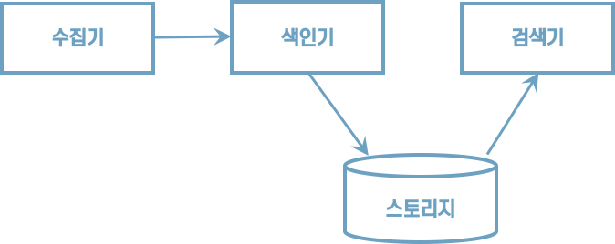

# 01 검색 시스템 이해하기

## 1.1 검색 시스템의 이해

### 1.1.1 검색 시스템이란?

* 검색엔진
    * 광활한 웹에서 정보를 수집해 검색 결과를 제공하는 프로그램이다.
    * 야후는 디렉터리 기반의 검색 결과를 세계 최초로 제공했다.
* 검색 시스템
    * 대용량 데이터를 기반으로 시노리성 있는 검색 결과를 제공하기 위해 검색엔진을 기반으로 구축된 시스템을 통칭하는 용어다.
* 검색 서비스는 검색 앤젠을 기반으로 구축한 검색 시스템을 활용해 검색 결과를 서비스로 제공한다.


>  검색 서비스 > 검색 시스템 > 검색 엔진


### 1.1.2 검색 시스템의 구성 요소

##### 수집기

수집기는 웹사이트, 블로그, 카페 등 웹에서 필요한 정보를 수집하는 프로그램이다.

##### 스토리지

데이터베이스에서 데이터를 저장하는 물리적인 장소다.

##### 색인기

검색엔진이 수집한 정보에서 사용자 질의와 일치하는 정보를 찾으려면 수집된 데이터를 검색 가능한 구조로 가공하고 저장해야 한다. 그 역할을 하는 것이 색인기다.

##### 검색기

검색기는 사용자 질의를 받아 색인기에서 저장한 역색인 구조에서 일치하는 문서를 찾아 결과로 반환한다.





### 1.1.3 관계형 데이터베이스와의 차이점

엘라스틱서치와 관계형 데이터베이스 비교

| 엘라스틱서치 | 관계형 데이터베이스 |
| :----------- | :------------------ |
| 인덱스       | 데이터베이스        |
| 샤드         | 파티션              |
| 타입         | 테이블              |
| 문서         | 행                  |
| 필드         | 열                  |
| 매핑         | 스키마              |
| Query DSL    | SQL                 |


추가,검색,삭제, 수정 기능 비교
| 엘라스틱서치에서 사용하는 HTTP 메서드 |기능 | 데이터베이스 질의문법|
| :----------- | :------------------ | :------------------ |
| GET    | 데이터 조회   |SELECT        |
| PUT       | 데이터 생성         |INSERT        |
| POST      | 인덱스 업데이트, 데이터 조회 |UPDATE, SELECT        |
| DELETE    | 데이터 삭제             |DELETE        |
| HEAD      | 인덱스 정보 확인         |-        |


다음은 엘라스틱서치를 사용하기 위한 간단한 API 요청 구조다.

```http
curl -X(메서드) http://host:port/(인덱스)/(타입)/(문서 id) -d '{json 데이터}'
```


리눅스에서는 엘라스틱 서버의 정보를 다음 명령으로 확인할 수 있다.

```http
curl -XGET http://localhost:9200
```

실행결과

```json
{
  "name" : "JJN9Ar1",
  "cluster_name" : "docker-cluster",
  "cluster_uuid" : "rNQde4FrQBiFouVrBHfGfQ",
  "version" : {
    "number" : "6.8.6",
    "build_flavor" : "oss",
    "build_type" : "docker",
    "build_hash" : "3d9f765",
    "build_date" : "2019-12-13T17:11:52.013738Z",
    "build_snapshot" : false,
    "lucene_version" : "7.7.2",
    "minimum_wire_compatibility_version" : "5.6.0",
    "minimum_index_compatibility_version" : "5.0.0"
  },
  "tagline" : "You Know, for Search"
}
```


