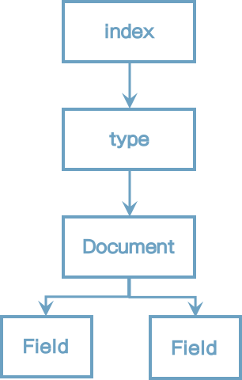
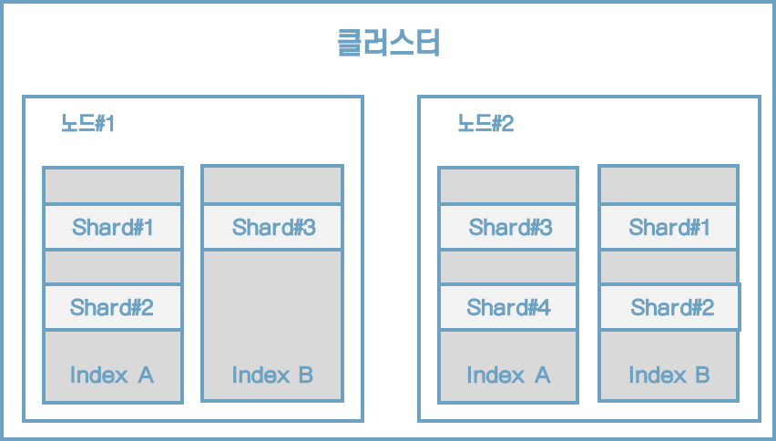

# 02 엘리스틱서치 살펴보기

## 2.1 엘라스틱서치를 구성하는 개념

### 2.1.1 기본 용어

엘라스틱서치의 데이터는 인덱스, 타입, 문서, 필드 구조로 구성된다.




##### 인덱스

* 인덱스는 데이터 저장 공간이다.
* 하나의 인덱스는 하나의 타입만 가지며 하나의 물리적인 노드에 여러 개의 논리적인 인덱스를 생성할 수 있다.
* 검색 시 인덱스 이름으로 문서 데이터를 거색하며, 여러 개의 인덱스를 동시에 검색하는 것도 가능하다.
* 분산환경으로 구성하면 하나의 인덱스가 여러 노드에 분산되어 관리된다.
* 인덱스 이름은 모두 소문자여야 한다.
* 인덱스가 없는 상태에서 데이터가 추가된다면 데이터를 이용해 인덱스가 자동으로 생성된다.


##### 샤드

* 색인된 문서는 하나의 인덱스에 담긴다.
* 인덱스 내부에 색인된 데이터는 물리적인 공간에 여러 개의 파티션으로 나뉘어 구성되는데, 이 파티션을 엘라스틱서치에서는 샤드라고 부른다.


##### 타입

* 타입은 인덱스의 논리적인 구조를 의미한다.


##### 문서

문서는 엘라스틱서치에서 데이터가 저장되는 최소 단위다. 기본적으로 JSON 포맷으로 데이터가 저장된다.


##### 필드

필드는 문서를 구성하기 위한 속성이라고 할 수 있다.


##### 매핑

매핑은 문서의 필드와 필드의 속성을 정의하고 그에 따른 색인 방법을 정의하는 프로세스다.


### 노드의 종류

엘라스틱서치는 각 설정에 따라 4가지 유형의 노드를 제공한다.

* 마스터 노드
    * 클러스터를 관리한다.
    * 노드 추가와 제거 같은 클러스터의 전반적인 관리를 담당한다.
* 데이터 노드
    * 실질적인 데이터를 저장한다.
    * 검색과 통계 같은 데이터 관련 작업을 수행한다.
* 코디네이팅 노드
    * 사용자의 요청만 받아서 처리한다.
    * 클러스터 관련 요청은 마스터 노드에 전달하고 데이터 관련 요청은 데이터 노드에 전달한다.
* 인제스트 노드
    * 문서의 전처리 작업을 담당한다.
    * 인덱스 생성 전 문서의 형식을 다양하게 변경할 수 있다.


#### 마스터 노드

* 마스터 노드는 인덱스를 생성, 삭제하는 등 클러스터와 관련된 전반적인 작업을 담당한다.
* 다수의 노드를 마스터 노드로 설정할 수 있지만 결과적으로 하나의 노드만이 마스터 노드로 선출되어 동작한다.
* 노드를 마스터 노드 전용으로 설정하고자 한다면 elasticsearch.yml 파일을 열고 다음과 같이 설정하면 된다.

```yaml
node.master: true
node.data: false
node.ingest: false
search.remote.connect: false
```


#### 데이터 노드

* 데이터 노드는 문서가 실제로 저장되는 노드다.
* 데이터 노드는 가능한 한 마스터 노드와 분리해서 구성하는 게 좋다.

```yaml
node.master: false
node.data: true
node.ingest: false
search.remote.connect: false
```


#### 코디네이팅 노드

* 데이터 노드, 마스터 노드, 인제스트 노드의 역할을 하지 않고, 들어온 요청을 단순히 라운드로빈 방식으로 분산시켜 주는 노드다.

```yaml
node.master: false
node.data: false
node.ingest: false
search.remote.connect: false
```


#### 인제스트 노드

* 색인에 앞서 데이터를 전처리하기 위한 노드다.
* 데이터 포맷을 변경하기 위해 스크립트로 전처리 파이프라인을 구성하고 실행할 수 있다.

```yaml
node.master: false
node.data: false
node.ingest: true
search.remote.connect: false
```


### 2.1.3 클러스터, 노드, 샤드




## 2.2 엘라스틱서치에서 제공하는 주요 API

#### API의 종류

* 인덱스 관리 API
* 문서 관리 API
* 검색 API
* 집계 API


#### 스키마리스 기능은 가급적이면 사용하지 말자

인덱스를 생성하지 않고 바로 데이터를 색인해보자.

```http
PUT /movie/_doc/1
{
    "movieCd": "1",
    "movieNm": "살아남은 아이",
    "movieNmEn": "Last Child",
    "prdtYear": "2017",
    "openDt": "",
    "typeNm": "장편",
    "prdtStatNm": "기타",
    "nationAlt": "한국",
    "genreAlt": "드라마,가족",
    "repNationNm": "한국",
    "repGenreNm": "드라마"
}
```

실행결과는 다음과 같다.

```json
{
  "_index" : "movie",
  "_type" : "_doc",
  "_id" : "1",
  "_version" : 1,
  "result" : "created",
  "_shards" : {
    "total" : 2,
    "successful" : 1,
    "failed" : 0
  },
  "_seq_no" : 0,
  "_primary_term" : 1
}
```

인덱스가 자동으로 생성되어 세부적인 필드 정보가 매핑되지 않은 것이다. 이런 식으로 인덱스를 자동으로 생성할 경우 특정 단어를 검색할 때 검색 결과에서 누락되는 등 문제가 발생할 가능성이 높아진다.

생성된 인덱스의 구성 정보를 조회해보자.

```http
GET /movie
```

결과는 다음과 같다.

```json
{
  "movie" : {
    "aliases" : { },
    "mappings" : {
      "_doc" : {
        "properties" : {
          "genreAlt" : {
            "type" : "text",
            "fields" : {
              "keyword" : {
                "type" : "keyword",
                "ignore_above" : 256
              }
            }
          },
          "movieCd" : {
            "type" : "text",
            "fields" : {
              "keyword" : {
                "type" : "keyword",
                "ignore_above" : 256
              }
            }
          },
          ...
    "settings" : {
      "index" : {
        "creation_date" : "1621601145957",
        "number_of_shards" : "5",
        "number_of_replicas" : "1",
        "uuid" : "8A699zeAR0ikI-mF_lZhxA",
        "version" : {
          "created" : "6080699"
        },
        "provided_name" : "movie"
      }
    }
  }
}
```

기본적으로 모든 필드가 text 타입과 keyword 타입을 동시에 제공하는 멀티필드 기능으로 구성된다. 이러한 경우 데이터 공간의 낭비를 초래한다.


