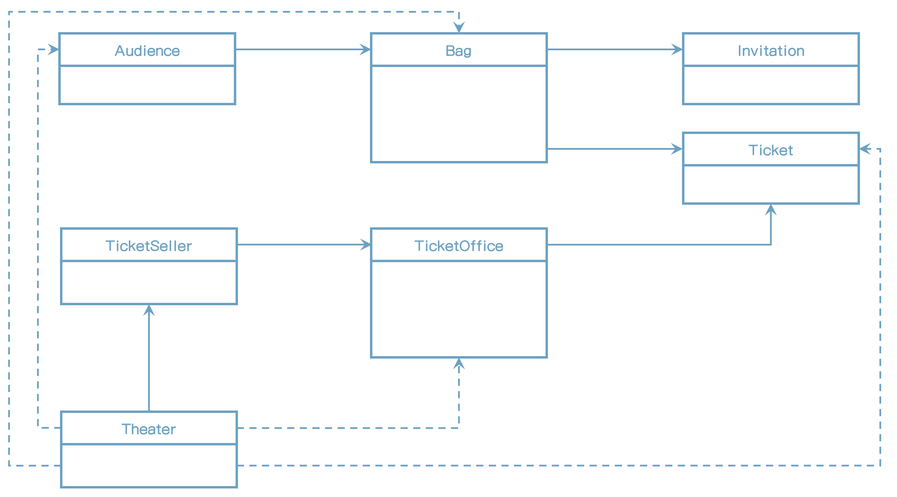
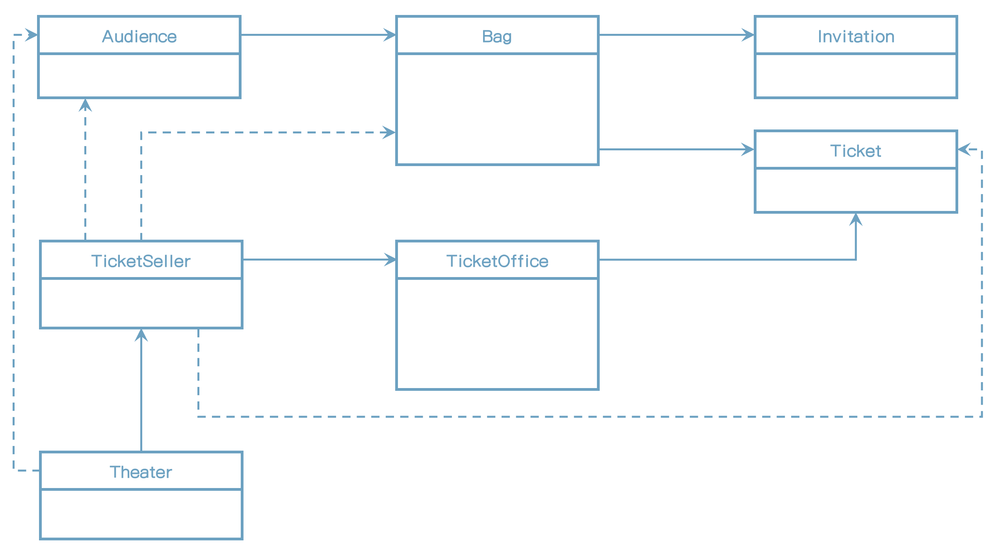

# 1장 객체, 설계

* 로버트 L.글래스는 <<소프트웨어 크리에이티비티 2.0>>에서 "이론 대 실무"라는 개인적인 의견을 밝히고 있다.
    * "이론이 먼저일까, 실무가 먼저일까?"
    * 대부분은 사람은 이론이 먼저라고 생각한다.
    * 글래스의 결론은 이론보다 실무가 먼저라는 것이다. 어떤 분야든 초기 단계에서는 아무것도 없는 상태에서 이론을 정립하기 보다는 실무를 관찰한 결과를 바탕으로 이론을 정립하는 것이 최선이다.
* 건축처럼 역사가 오래된 여느 다른 공학 분야에 비해 상대적으로 짧은 소프트웨어 분야의 역사를 감안했을 때 글래스가 우리에게 전하고자 하는 메시지는 분명하다.
    * 소프트웨어 분야는 아직 걸음마 단계에 머물러 있기 때문에 이론보다 실무가 더 앞서 있으며 실무가 더 중요하다는 것이다.
* 소프트웨어 개발에서 실무가 이론보다 앞서 있는 대표적인 분야로 '소프트웨어 설계'와 ''소프트웨어 유지보수'를 들 수 있다.
    * 실무는 훌륭한 소프트웨어를 설계하기 위해 필요한 다양한 기법과 도구를 초기부터 성공적으로 적용하고 발전시켜 왔던 것이다.

* 이론은 어떤가? 훌륭한 설계에 관한 최초의 이론은 1970년대가 돼서야 비로소 세상에 모습을 드러냈다.
    * 대부분의 설계 원칙과 개념 역시 이론에서 출발해서 실무에 스며들었다기보다는 실무에서 반복적으로 적용되던 기법들을 이론화한 것들이 대부분이다.
* 소프트웨어 유지보수의 경우 그 격차가 더 심하다.
    * 결론적으로 소프트웨어 설계와 유지보수에 중점을 두러면 이론이 아닌 실문에 초점을 맞추는 것이 효과적이다.

* 설계 분야에서 실무는 이론을 압도한다. 설계에 관해 설명할 때 가장 유용한 도구는 이론으로 덕지덕지 치장된 개념과 용어가 아니라 '코드' 그 자체다.
* 추상적인 개념과 이론은 훌륭한 코드를 작성하는 데 필요한 도구일 뿐이다. 프로그래밍을 통해 개념과 이론을 배우는 것이 개념과 이론을 통해 프로그래밍을 배우는 것보다 더 훌륭한 학습 방법이라고 생각한다. 
    * 개념은 지루하고 이론은 따분하다. 개발자는 코드를 만지며 손을 더럽힐 때 가장 많은 것을 얻어가는 존재다.


## 01 티켓 판매 애플리케이션 구현하기

요구사항

* 연극이나 음악회를 공연할 수 있는 작은 소극장을 경영하고 있다고 상상해 보자.
* 추첨을 통해 선정된 관람객에게 공연을 무료로 관람하는 초대장 발송하는 이벤트를 기획
* 이벤트에 당첨된 관람객과 그렇지 못한 관람객은 다른 방식으로 입장시켜야 한다.
* 이벤트에 당첨된 관람객은 초대장을 티켓으로 교환한 후 입장할 수 있다. 이벤트에 당첨되지 않은 관람객은 티켓을 구매해야만 입장할 수 있다.


초대장이라는 개념을 구현한 Invitation

```java
public class Invitation {
    private LocalDateTime when;
}
```

공연을 관람하기 원하는 모든 사람들은 티켓을 소지하고 있어야 한다. Ticket 클래스

```java
public class Ticket {
    private Long fee;

    public Long getFee() {
        return fee;
    }
}
```

이벤트 당첨자는 티켓으로 교환할 초대장을 가지고 있다. 이벤트에 당첨되지 않은 관람객은 티켓을 구매할 수 있는 현금을 보유하고 있다.
따라서 관람객이 가지고 올 수 있는 소지품은 초대장, 현금, 티켓 세 가지뿐이다. (+가방)

관람객이 소지품을 보관할 Bag
Bag 클래스는 초대장(ticket), 티켓(ticket), 현금(amount)을 인스턴스 변수로 포함한다.

```java
public class Bag {
    private Long amount;
    private Invitation invitation;
    private Ticket ticket;

    public Bag(Long amount) {
        this.amount = amount;
    }

    public Bag(Invitation invitation, long amount) {
        this.invitation = invitation;
        this.amount = amount;
    }

    public boolean hasInvitation() {
        return invitation != null;
    }

    public boolean hasTicket() {
        return ticket != null;
    }

    public void setTicket(Ticket ticket) {
        this.ticket = ticket;
    }

    public void minusAmount(Long amount) {
        this.amount -= amount;
    }

    public void plusAmount(Long amount) {
        this.amount += amount;
    }
}
```

이벤트에 당첨된 관람객의 가방 안에는 현금과 초대장이 들어있지만 이벤트에 당첨되지 않은 관람객의 가방 안에는 초대장이 들어있지 않을 것이다.

관람객이라는 개념을 구현하는 Audience
관람객은 소지품을 보관하기 위해 가방을 소지할 수 있다.

```java
public class Audience {
    private Bag bag;

    public Audience(Bag bag) {
        this.bag = bag;
    }

    public Bag getBag() {
        return bag;
    }
}
```

관람객이 소극장에 입장하기 위해서는 매포소에서 초대장을 티켓으로 교환하거나 구매해야 한다.
따라서 매포소에는 관람객에게 판매할 티켓과 티켓의 판매 금액이 보관돼 있어야 한다.

매표소를 구현하기 위한 TicketOffice

```java
public class TicketOffice {
    private long amount;
    private List<Ticket> tickets = new ArrayList<>();

    public TicketOffice(long amount, Ticket ... tickets) {
        this.amount = amount;
        this.tickets.addAll(Arrays.asList(tickets));
    }

    public Ticket getTicket() {
        return tickets.remove(0);
    }

    public void minusAmount(Long amount) {
        this.amount -= amount;
    }

    public void plusAmount(Long amount) {
        this.amount += amount;
    }
}
```

판매원은 매표소에서 초대장을 티켓으로 교환해 주거나 티켓을 판매하는 역할

```java
public class TicketSeller {
    private TicketOffice ticketOffice;

    public TicketSeller(TicketOffice ticketOffice) {
        this.ticketOffice = ticketOffice;
    }

    public TicketOffice getTicketOffice() {
        return this.ticketOffice;
    }
}
```

소극장을 구현하는 Theater
Theater 클래스가 관람객을 맞이할 수 있도록 enter 메소드를 구현하자.

```java
public class Theater {
    private TicketSeller ticketSeller;

    public Theater(TicketSeller ticketSeller) {
        this.ticketSeller = ticketSeller;
    }

    public void enter(Audience audience) {
        if (audience.getBag().hasInvitation()) {
            Ticket ticket = ticketSeller.getTicketOffice().getTicket();
            audience.getBag().setTicket(ticket);
        } else {
            Ticket ticket = ticketSeller.getTicketOffice().getTicket();
            audience.getBag().minusAmount(ticket.getFee());
            ticketSeller.getTicketOffice().plusAmount(ticket.getFee());
            audience.getBag().setTicket(ticket);
        }
    }
}
```

소극장은 먼저 관람객의 가방 안에 초대장이 들어 있는지 확인한다. 만약 초대장이 들어 있다면 이벤트에 당첨된 관람객이므로 판매원에게서 티켓을 관람객의 가방 안에 넣어준다. 가방 안에 초대장이 없다면 티켓을 판매해야 한다. 이 경우 소극장은 관람객의 가방에서 티켓 금액만큼을 차감한 후 매표소에 금액을 증가시킨다. 마지막으로 소극장은 관람객의 가방 안에 티켓을 넣어줌으로써 관람객의 입장 절차를 끝낸다.


## 02 무엇이 문제인가

로버트 마틴\<Robert C.Martin\>은 <<클린 소프트웨어>>에서 소프트웨어 모듈이 가져야 하는 세 가지 기능에 관해 설명한다.

> 모든 소프트웨어 모듈에는 세 가지 목적이 있다. 
>
> 1. 첫 번째 목적은 실행 중에 제대로 동작하는 것이다.
> 2. 두 번째 목적은 변경을 위해 존재하는 것이다.
> 3. 세 번째 목적은 코드를 읽는 사람과 의사소통하는 것이다.

마틴에 따르면 모든 모듈은 제대로 실행돼야 하고, <u>변경이 용이해야 하며, 이해하기 쉬워야 한다.</u>

앞에서 작성한 프로그램은 관람객들을 입장시키는 데 필요한 기능을 오류 없이 정확하게 수행하고 있다.
하지만 불행하게도 변경 용이성과 읽는 사람과의 의사소통이라는 목적은 만족시키지 못한다.


### 예상을 빗나가는 코드

* 문제는 관람객과 판매원이 소극장의 통제를 받는 수동적인 존재라는 점이다.
    * 여러분이 관람객이라고 가정해보자. 문제는 소극장이 관람객의 가방을 마음대로 열어 본다는 데 있다. 
    * 여러분이 판매원이라도 동일한 문제가 발생한다. 소극장이 여러분의 허락도 없이 매표소에 보관 중인 티켓과 현금에 마음대로 접근할 수 있기 때문이다.

* 이해 가능한 코드란 그 동작이 우리의 예상에서 크게 벗어나지 않는 코드다. 
    * 현실에서는 관람객이 직접 자신의 가방에서 초대장을 꺼내 판매원에게 건낸다. 
    * 티켓을 구매하는 관람객은 가방 안에서 돈을 직접 꺼내 판매원에게 지불한다. 
    * 판매원은 매표소에 있는 티켓을 직접 꺼내 관람객에게 건내고 관람객에게서 직접 돈을 받아 매표소에 보관한다. 
    * 현재의 코드는 우리의 상식과는 너무나도 다르게 동작하기 때문에 코드를 읽는 사람과 제대로 의사소통하지 못한다.

* 코드를 이해하기 어렵게 만드는 또 다른 이유가 있다.
    * Theater의 enter 메서드를 이해하기 위해서는 Audience가 Bag을 가지고 있고, Bag 안에는 현금과 티켓이 들어 있으며 TicketSeller가 TicketOffice에서 티켓을 판매하고 TicketOffice안에 돈과 티켓이 보관돼 있다는 모든 사실을 동시에 기억하고 있어야 한다.
    * 이 코드는 코드를 작성하는 사람뿐만 아니라 코드를 읽고 이해해야 하는 사람 모두에게 큰 부담을 준다.
    * 하지만 가장 심각한 문제는 Audience와 TicketSeller를 변경할 경우 Theatereh 함께 변경해야 한다는 사실이다.


### 변경에 취약한 코드

* 변경에 취약하다는 것이다.
    * 이 코드는 관람객이 현금과 초대장을 보관하기 위해 항상 가방을 들고 다닌다고 가정한다. 또한 판매원이 매표소에서만 티켓을 판매한다고 가정한다.
    * 또한 판매원이 매표소에서만 티켓을 판매한다고 가정한다.
    * 관람객이 가방을 들고 있지 않다면?
    * 관람객이 현금이 아니라 신용카드를 이용해서 결제한다면?
    * 판매원이 매표소 밖에서 티켓을 판매해야 한다면?
    
* 관람객이 가방을 들고 있다는 가정이 바뀌었다고 상상해보자
    * Audience 클래스에서 Bag을 제거해야 할 뿐만 아니라 Audience의 Bag에 직접 접근하는 Theater의 enter 메서드 역시 수정해야 한다.
    * 이러한 세부적인 사실 중 한 가지라도 바뀌면 해당 클래스뿐만 아니라 이 클래스에서 의존하는 Theater도 함께 변경해야 한다.
    * 다른 클래스가 Audience의 내부에 대해 더 많이 알면 알수록 Audience를 변경하기 어려워진다.
* 이는 객체 사이의 의존성(dependency)과 관련된 문제다. 
    * 문제는 의존성이 변경과 관련돼 있다는 점이다.
    * <u>의존성은 변경에 대한 영향을 암시한다.</u>
    * 의존성이라는 말 속에는 어떤 객체가 변경될 때 그 객체에게 의존하는 다른 객체도 함께 변경될 수 있다는 사실이 내포돼 있다.
* 그렇다고 해서 객체 사이의 의존성을 완전히 없애는 것이 정답이 아니다.
    * 객체지향 설계는 서로 의존하면서 협력하는 객체들의 공동체를 구축하는 것이다.
    * 우리의 목표는 애플리케이션의 기능을 구현하는 데 필요한 최소한의 의존성만을 유지하고 불필요한 의존성을 제거하는 것이다.
* 객체 사이의 의존성이 과한 경우를 가리켜 결합도(coupling)가 높다고 말한다.
    * 반대로 객체들이 합리적인 수준으로 의존할 경우 결합도가 낮다고 말한다.
    * 결합도는 의존성과 관련돼 있기 때문에 결합도 역시 변경과 관련이 있다.
    * 두 객체 사이의 결합도가 높으면 높을수록 함께 변경될 확률이 높아지기 때문에 변경하기 어려워진다.
    * <u>따라서 설계의 목표는 객체 사이의 결합도를 낮춰 변경이 용이한 설계를 만드는 것이어야 한다.</u>




그림) 너무 많은 클래스에 의존하는 Theater


## 03 설계 개선하기

* 예제 코드는 로버트 마틴이 이야기한 세 가지 목적 중 한 가지는 만족시키지만 다른 두 조건은 만족시키지 못한다. 이 코드는 기능은 제대로 수행하지만 이해하기 어렵고 변경하기가 쉽지 않다.
* 여기서 변경과 의사소통이라는 문제가 서로 엮여 있다는 점을 주목하라.
    * 코드를 이해하기 어려운 이유는 Theater가 관람객의 가방과 판매원의 매표소에 직접 접근하기 때문이다.
    * Theater가 관람객의 가방과 판매원의 매표소에 직접 접근한다는 것은 Theater가 Audience와 TicketSeller에 결합된다는 것을 의미한다.
    * 따라서 Audience와 TicketSeller를 변경할 때 Theater도 함께 변경해야 하기 때문에 전체적으로 코드를 변경하기도 어려워진다.

* 해결방법은 간단하다.
    * Theater가 Audience와 TicketSeller에 관해 너무 세세한 부분까지 알지 못하도록 정보를 차단하면 된다.
    * Theater가 원하는 것은 관람객이 소극장에 입장하는 것뿐이다.
    * 따라서 관람객이 스스로 가방 안의 현금과 초대장을 처리하고 판매원이 스스로 매표소의 티켓과 요금을 다루게 한다면 이 모든 문제를 한 번에 해결할 수 있을 것이다.
* 다시 말해서 관람객과 판매원을 <u>자율적인 존재</u>로 만들면 되는 것이다.


### 자율성을 높이자

설계를 변경하기 어려운 이유는 Theater가 Audience와 TicketSeller뿐만 아니라 Audience 소유의 Bag과 TicketSeller가 근무하는 TicketOffice까지 마음대로 접근할 수 있기 때문이다. 해결방법은 Audience와 TicketSeller가 직접 Bag과 TicketOffice를 처리하는 자율적인 존재가 되도록 설계를 변경하는 것이다.

첫 번째 단계는 Theater의 enter 메서드에서 TicketOffice에 접근하는 모든 코드를 TicketSeller 내부로 숨기는 것이다.

```java
public class Theater {
    private TicketSeller ticketSeller;

    public Theater(TicketSeller ticketSeller) {
        this.ticketSeller = ticketSeller;
    }

    public void enter(Audience audience) {
        ticketSeller.sellTo(audience);
    }
}
```



그림) Theater의 결합도를 낮춘 설계


> > > >
> > > >
> > > >여기


TicketSeller 클래스

```java
public class TicketSeller {
    private TicketOffice ticketOffice;

    public TicketSeller(TicketOffice ticketOffice) {
        this.ticketOffice = ticketOffice;
    }

    public void sellTo(Audience audience) {
        ticketOffice.plusAmount(audience.buy(ticketOffice.getTicket()));
    }
}
```

Audience

```java
public class Audience {
    private Bag bag;

    public Audience(Bag bag) {
        this.bag = bag;
    }

    public Long buy(Ticket ticket) {
        if (bag.hasInvitation()) {
            bag.setTicket(ticket);
            return 0L;
        } else {
            bag.setTicket(ticket);
            bag.minusAmount(ticket.getFee());
            return ticket.getFee();
        }
    }
}
```


### 무엇이 개선됐는가

* 수정된 Audience와 TicketSeller는 자신이 가지고 있는 소지품을 스스로 관리한다.
* Audience나 TicketSeller의 내부 구현을 변경하더라도 Theater를 함께 변경할 필요가 없어졌다는 것이다.
    * Audience가 가방이 아니라 작은 지갑을 소지하도록 변경하고 싶은가? Audience 내부에서 하면 된다.
    * TicketSeller가 매표소가 아니라 은행에 돈을 보관하도록 만들고 싶은가? TicketSeller 내부만 만들면 된다.


### 어떻게 한 것인가

* 판매자가 티켓을 판매하기 위해 TicketOffice를 사용하는 모든 부분을 TicketSeller 내부로 옮기고
* 관람객이 티켓을 구매하기 위해 Bag을 사용하는 모든 부분을 Audience 내부로 옮긴 것이다.
* 수정한 후의 Theater는 Audience나 TicketSeller의 내부에 직접 접근하지 않는다.


### 캡슐화와 응집도

* 핵심은 객체 내부의 상태를 캡슐화하고 객체 간에 오직 메시지를 통해서만 상호작용하도록 만드는 것이다.
    * Theater는 TicketSeller의 내부에 대해서 알지 못하고 단지 sellTo 메시지를 이해하고 응답할 수 있다는 사실만 알고 있을 뿐이다.
    * TicketSeller 역시 Audience의 내부에 대해서는 전혀 알지 못하며 buy 메시지에 응답할 수 있다.
* 밀접하게 연관된 작업만을 수행하고 연관성 없는 작업은 다른 객체에게 위임하는 객체를 가리켜 **응집도(cohesion)**가 높다고 말한다.
* 객체의 응집도를 높이기 위해서는 객체 스스로 자신의 데이터를 책임져야 한다. 객체는 자신의 데이터를 스스로 처리하는 자율적인 존재여야 한다.
* 외부의 간섭을 최대한 배제하고 <u>메시지를 통해서만 협력하는 자율적인 객체들의 공통체</u>를 만드는 것이 훌륭한 객체지향 설계를 얻을 수 있는 지름길인 것이다.


### 절차지향과 객체지향

* 절자치향 프로그래밍
    * 수정하기 전의 코드에서는 Audience, TicketSeller, Bag, TicketOffice는 관람객을 입장시키는 데 필요한 정보를 제공하고 모든 처리는 Theater의 enter 메서드 안에 존재했었다.
    * 이 관점에서 Theater의 enter 메서드는 **프로세스(Process)**이며 Audience, TicketSeller, Bag, TicketOffice는 **데이터(Data)**다.
    * 프로세스와 데이터를 별도의 모듈에 위치시키는 방식을 **절차적 프로그래밍(Procedural Programming)**이라고 부른다.
* <u>변경하기 쉬운 설계는 한 번에 하나의 클래스만 변경할 수 있는 설계다.</u>
* 객체지향 프로그래밍
    * 수정한 후의 코드에서는 데이터를 사용하는 프로세스가 데이터를 소유하고 있는 Audience와 TicketSeller 내부로 옮겨졌다. 
    * 이처럼 데이터와 프로세스가 동일한 모듈 내부에 위치하도록 프로그래밍하는 방식을 객체지향 프로그래밍이라고 부른다.


### 책임의 이동

* 책임의 이동이란
    * <u>변경 전</u>의 절차적 설계에서는 Theater가 전체적인 작업을 도맡아 처리했다. 
    * <u>변경 후</u>의 객체지향 설계에서는 각 객체가 자신이 맡은 일을 스스로 처리했다. 
    * 다시 말해 Theater에 올려 있던 책임이 개별 객체로 이동한 것이다. 이것이 바로 **책임의 이동**이 의미하는 것이다.
* <u>객체가 어떤 데이터를 가지느냐보다는 객체에 어떤 책임을 할당할 것이냐에 초점을 맞춰야 한다.</u>
* 설계를 어렵게 만드는 것은 **의존성**이라는 것을 기억하라.
    * 해결방법은 불필요한 의존성을 제거함으로써 Theater가 몰라도 되는 세부사항을 Audience와 TicketSeller 내부로 감춰 캡슐화하는 것이다.
    * 불필요한 세부사항을 객체 내부로 캡슐화하는 것은 객체의 자율성을 높이고 응집도 높은 객체들의 공동체를 창조할 수 있게 한다.


### 더 개선할 수 있다

* Bag은 스스로 자기 자신을 책임지지 않고 Audience에 의해 끌려다니는 수동적인 존재다.
* TicketOffice도 TicketSeller에 의해 끌려다니는 존재다.


Bag을 자율적인 존재로 바꿔보자.

```java
public class Bag {
    private Long amount;
    private Invitation invitation;
    private Ticket ticket;

    public Bag(Long amount) {
        this.amount = amount;
    }

    public Bag(Invitation invitation, long amount) {
        this.invitation = invitation;
        this.amount = amount;
    }

    public Long hold(Ticket ticket) {
        if (hasInvitation()) {
            setTicket(ticket);
            return 0L;
        } else {
            setTicket(ticket);
            minusAmount(ticket.getFee());
            return ticket.getFee();
        }
    }

    public boolean hasInvitation() {
        return invitation != null;
    }

    public boolean hasTicket() {
        return ticket != null;
    }

    public void setTicket(Ticket ticket) {
        this.ticket = ticket;
    }

    private void minusAmount(Long amount) {
        this.amount -= amount;
    }

    private void plusAmount(Long amount) {
        this.amount += amount;
    }
}
```

TicketSeller

```java
public class TicketSeller {
    private TicketOffice ticketOffice;

    public TicketSeller(TicketOffice ticketOffice) {
        this.ticketOffice = ticketOffice;
    }

    public void sellTo(Audience audience) {
        ticketOffice.sellTicketTo(audience);
    }
}
```


### 그래, 거짓말이다

* 레베카 워프스브록은 능동적이고 자율적인 존재로 소프트웨어 객체를 설계하는 원칙을 가리켜 **의인화(anthropomorphism)**라고 부른다.
    * 관람객이 입장하기 위해서는 누군가가 문을 열고 입장을 허가해줘야 한다.
    * 가방에서 돈을 꺼내는 것은 관람객이지 가방이 아니다.
    * 판매원이 매표소에 없는데도 티켓이 저절로 관람객에게 전달되지는 않을 것이다.

* 훌륭한 객체지향 설계란 소프트웨어를 구성하는 모든 객체들이 자율적으로 행동하는 설계를 가리킨다.
* 이해하기 쉽게 변경하기 쉬운 코드를 작성하고 싶다면 차라리 한 편의 애니메이션을 만든다고 생각하라. 
* 다른 사람의 코드를 읽고 이해하는 동안에는 애니메이션을 보고 있다고 여러분의 뇌를 속여라.


## 04 객체지향 설계

### 설계가 왜 필요한가

개인적으로 가장 좋아하는 설계의 정의는 다음과 같다.

> 설계란 코드를 배치하는 것이다.

* 어떤 사람들은 설계가 코드를 작성하는 것보다는 높은 차원의 창조적인 행위라고 생각하는 것 같다.
* 하지만 설계를 구현과 떨어트려서 이야기하는 것은 불가능하다.
* 설계는 코드를 작성하는 매 순간 코드를 어떻게 배치할 것인지를 결정하는 과정에서 나온다.
* 설계는 코드 작성의 일부이며 코드를 작성하지 않고서는 검증할 수 없다.

좋은 설계란 무엇인가?

* 오늘 완성해야 하는 기능을 구현하는 코드를 짜야 하는 동시에 내일 쉽게 변경할 수 있는 코드를 짜야 한다.
* 좋은 설계란 오늘 요구하는 기능을 온전히 수행하면서 내일의 변경을 매끄럽게 수용할 수 있는 설계다.

* <u>변경을 수용할 수 있는 설계가 중요한 이유는 요구사항이 항상 변경되기 때문이다.</u>


### 객체지향 설계

* 변경 가능한 코드란 이해하기 쉬운 코드다.
    * 여러분이 어떤 코드를 변경해야 하는데 그 코드를 이해할 수 없다면 어떻겠는가?
    * 그 코드가 유연하다고 하더라도 아마 코드를 수정하겠다는 마음이 선뜻 들지는 않을 것이다.

