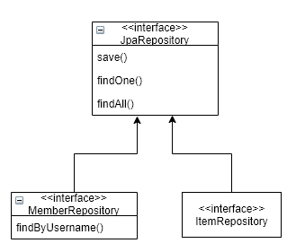
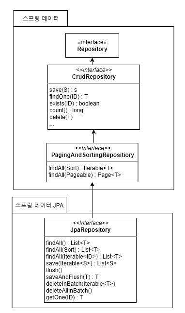
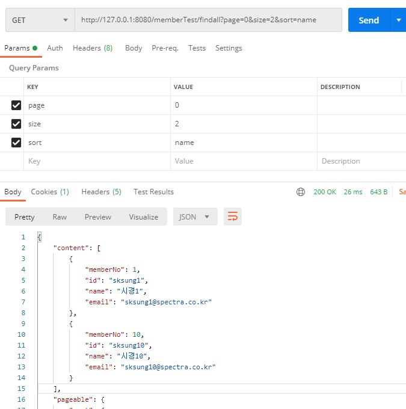
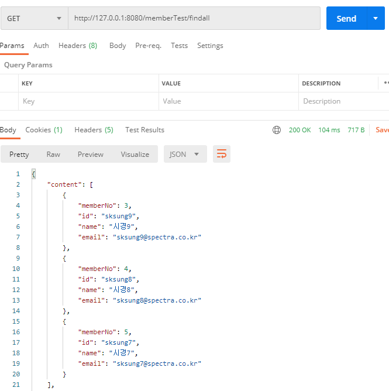
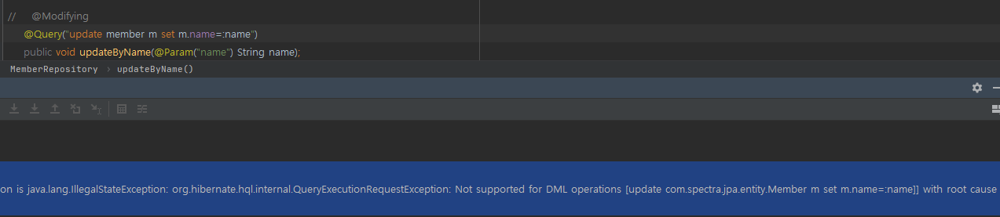

### 12장. 스프링 데이터 JPA

##### 12.1 스프링 데이터 JPA 소개

* 스프링 프레임워크에서 JPA를 편리하게 사용할 수 있도록 지원하는 프로젝트

* CRUD를 처리하기 위한 공통 인터페이스를 제공
* 데이터 접근 계층을 개발할 때 구현 클래스 없이 인터페이스만 작성해도 개발을 완료할 수 있음



##### 12.2 스프링 데이터 JPA 설정

추가 라이브러리 설정 ( pom.xml )

```
<dependency>
    <groupId>org.springframework.data</groupId>
    <artifactId>spring-data-jpa</artifactId>
    <version>2.3.5.RELEASE</version>
</dependency>
```


##### 12.3 공통 인터페이스 기능

* 스프링 데이터 : 스프링 데이터 모듈은 공통으로 사용하는 인터페이스

* 스프링 데이터 JPA : 제공하는 JpaRepository 인터페이스가 추가로 JPA에 특화된 기능을 제공 받음

* T : 엔티티, ID : 엔티티의 식별자 타입, S : 엔티티와 그 자식 타입

* 주요 메서드

  save(S) : 새로운 엔티티는 저장하고 이미 있는 엔티티는 수정한다. 다시 말해서 새로운 id라면 삽입이 되고, 이미 있는 id가 존재한다면 수정이 되어진다. 

  delete(T) : 엔티티 하나를 삭제한다. 내부에서 EntityManager.remove() 를 호출한다.

  findOne(ID) : 엔티티 하나를 조회한다. 내부에서 EntityManager.find() 를 호출한다. 즉시 조회를 하여 객체를 전달하는 방식이다.

  getOne(ID) : 엔티티를 프록시로 조회한다. 내부에서 EntityManager.getReference() 를 호출한다. lazy-loading을 통해 객체를 전달하는 방식이다.

  findAll(…): 모든 엔티티를 조회한다. 정렬( Sort )이나 페이징( Pageable ) 조건을 파라미터로 제공할 수 있다.



##### 12.4 쿼리 메소드 기능

스프링 데이터 JPA가 제공하는 쿼리 메소드 기능

###### 12.4.1 메소드 이름으로 쿼리 생성

정해진 규칙에 따라 메소드 이름을 지을 경우 JPA는 메소드 이름을 분석하여 JPQL을 생성하여 실행

```
public Member findById(String id);
```

참고 : https://docs.spring.io/spring-data/jpa/docs/2.3.5.RELEASE/reference/html/#jpa.query-methods.query-creation

###### 12.4.2 JPA NamedQuery

쿼리에 이름을 부여해서 사용 => "도메인 클래스" + "." + ""메소드 이름"으로 Named 쿼리를 찾아 실행

실행할 Named 쿼리가 없을 경우 메소드 이름으로 쿼리 생성 전략을 사용

```
@NamedQuery(name="member.findByEmail",query="select m from member m where m.email=:email")
```

###### 12.4.3 @Query, 리포지토리 메소드에 쿼리 정의

@org.springframework.data.jpa.repository.Query 어노테이션 사용

nativeQuery=true 설정은 사용자가 직접 정의하여 실행하는 쿼리일 경우 설정 할 수 있음

```
@Query("UPDATE member m SET m.name = ?1")
int updateByName(String name);
```

###### 12.4.4 파라미터 바인딩

스프링 데이터 JPA는 위치 기반 파라미터 바인딩과 이름기반 파라미터 바인딩 모두 지원


###### 12.4.5 벌크성 수정 쿼리

대량의 데이터들을 쿼리를 통해 수정한다는 의미 ( 대량 처리를 했을 시에는 속도가 빠르지만 한 행 처리에 있어서는 다소 느린 점이 있음 )

스프링 데이터 JPA에서 벌크성 수정, 삭제 쿼리는  org.springframework.data.jpa.repository.Modifying 어노테이션을 사용

벌크성 쿼리를 실행 후 영속성 컨텍스트를 초기화하고 싶으면 @Modifying(clearAutomatically=true) 기본 false

```
@Modifying
@Query("UPDATE member m SET m.name = ?1")
int updateByName(String name);
```

https://devhyogeon.tistory.com/4

###### 12.4.6 반환 타입

결과 값이 한 건 이상이면 컬렉션 인터페이스를, 단 건이면 반환타입을 지정한다

단 건으로 예상했지만 2건 이상 조회 될 경우 NonUniqueResultException 예외가 발생하고,

조회 결과 값이 없을 경우 예외를 무시하고 null을 반환한다

```
public Member findById(String id);
public List<Member> findByName(String name);
```

###### 12.4.7 페이징과 정렬

```
// 전체 데이터 건수를 조회하는 count 쿼리를 추가로 호출
Page<Member> findByName(String name, Pageable pageable); 
// count 쿼리 사용하지 않음
List<Member> findByName(String name, Pageable pageable);
List<Member> findByName(String name, Sort sort);
```

* page 인터페이스 

  pageable과 page를 사용하여 반복적인 페이징 처리를 손쉽게 개발 할 수 있다
  
  PageRequest 객체를 주입 ( 페이지는 0부터 시작 )
  
  ```
  public interface Page<T> extends Iterable<T> {
      int getNumber(); //현재 페이지
      int getSize(); //페이지 크기
      int getTotalPages(); //전체 페이지 수
      int getNumberOfElements(); //현재 페이지에 나올 데이터 수
      long getTotalElements(); //전체 데이터 수
      boolean hasPreviousPage(); //이전 페이지 여부
      boolean isFirstPage(); //현재 페이지가 첫 페이지 인지 여부
      boolean hasNextPage(); //다음 페이지 여부
      boolean isLastPage(); //현재 페이지가 마지막 페이지 인지 여부
      Pageable nextPageable(); //다음 페이지 객체, 다음 페이지가 없으면 null
      Pageable previousPageable();//다음 페이지 객체, 이전 페이지가 없으면 null
      List<T> getContent(); //조회된 데이터
      boolean hasContent(); //조회된 데이터 존재 여부
      Sort getSort(); //정렬 정보
  }
  ```

###### 12.4.8 힌트

JPA 구현체에게 제공하는 힌트

```
@QueryHints(value = {@QueryHint(name="org.hibernate.readOnly", value="true")}, forCounting = true)
public Page<Member> findAll(Pageable pageable);
```

###### 12.4.9 Lock

 lock 종류에는 낙관적(Optimisstic lock), 비관적(Pessimistic lock), 암시적(Implicit lick), 명시적(Explicit) 잠금이 있다

##### 12.5 명세

스프링 데이터 JPA는 JPA Criteria로 이 개념을 사용할 수 있도록 지원한다

명세의 핵심 개념은 predicate(술어)인데, 이는 참이나 거짓으로 평가되는, 연산자로 조립할 수 있는 개념이다

예를 들어 데이터를 검색하기 위한 제약 조건(where id = ?, date < ?)에서 제약조건 하나하나를 predicate라고 할 수 있다

Specification을 적용하기 위해서는 Repository에 `JpaSpecificationExecutor<T>` 인터페이스를 추가로 상속받아 사용한다

https://starrybleu.github.io/development/2018/07/31/spring-data-jpa-specification.html

##### 12.6 사용자 정의 리포지토리 구현

클래스명 규칙은 repository 인터페이스 이름 + Impl 로 작성해야 스프링 데이터 JPA가 사용자 정의 구현 클래스로 인식한다

만약 다른 이름을 붙이고 싶으면 repository-impl-postfix 속성을 변경하면 된다

<repositories base-package="com.spectra.jpa.repository" repository-impl-postfix="Exclu" />

##### 12.7 WEB확장

스프링 MVC에서 사용할 수 있는 편리한 기능을 제공

###### 12.7.1 설정

스프링 빈으로 등록 -> <bean class="org.springframework.data.web.config.SpringDataWebConfiguration" />

javaConfig -> @org.springframework.data.web.config.EnableSpringDataWebSupport

###### 12.7.2 도메인 클래스 컨버터 기능

파라미터 정보로 받은 model 을 사용하여 뷰에 넘겨준다

###### 12.7.3 페이징과 정렬 기능

default : page : 0 / size : 20 / 




```
@GetMapping(value = "findall", produces = {MediaType.APPLICATION_JSON_VALUE})
public ResponseEntity<Page<Member>> findall(@PageableDefault(size=3, sort="name", direction = Sort.Direction.DESC) Pageable pageable) {
    Page<Member> member = memberService.findAll(pageable);
    return new ResponseEntity<Page<Member>>(member, HttpStatus.OK);
}
```



##### 12.8 스프링 데이터 JPA가 사용하는 구현체

스프링 데이터 JPA가 제공하는 공통 인터페이스는 org.springframework.data.jpa.repository.support.SimpleJpaRepository 클래스가 구현한다

* @Repository

  JPA 예외를 스프링이 추상화한 예외로 변환한다

  ```
  @Repository
  public interface MemberRepository extends JpaRepository<Member, Long>, MemberRepositoryCustom {
  ```

* @Transactional

  JPA의 모든 변경은 트랜잭션 안에서 이루어져야한다

  스프링 데이터 JPA가 제공하는 공통 인터페이스를 사용하면 데이터를 변경 (등록, 수정, 삭제)하는 메소드에 트랜잭션 처리가 되어있다

  서비스 계층에서 트랜잭션을 시작했으면 리포지토리도 해당 트랜잭션을 전파받아서 그대로 사용한다

* @Transactional(readOnly=true)

  데이터를 조회하는 메소드에서는 readOnly=true 옵션이 적용되어 있다

  데이터를 변경하지 않는 트랜잭션에서 사용할 경우 플러시를 생략해서 약간의 성능 향상을 얻을 수 있다

* save()

  저장할 엔티티가 새로운 엔티티면 저장(persist)하고 이미 있는 엔티티면 병합(merge)한다

##### 12.10 스프링 데이터 JPA와 QueryDSL 통합

###### 12.10.1 QueryDslPredicateExecutor

리포지토리에서 org.springframework.data.querydsl.QueryDslPredicateExecutor 상속받아 사용한다

검색조건으로 사용하면서 스프링 데이터 JPA가 제공하는 페이징과 정렬 기능도 함께 사용할 수 있다

###### 12.10.2 QueryDslRepositorySupport

리포지토리에서 org.springframework.data.querydsl.QueryDslRepositorySupport 상속받아 사용한다

검색조건에 따라 동적으로 쿼리 생성이 가능하며 join 기능을 사용할 수 있다


#### Q&A

##### Q1.  벌크성 수정 쿼리가 무엇인가요?

A : 대량의 데이터들을 쿼리를 통해 수정한다는 의미
대량 처리를 했을 시에는 속도가 빠르지만 한 행 처리에 있어서는 다소 느린 점이 있음

##### Q2. 12.4.9 lock은 어떤 경우에 사용하나요?

A : lock 종류에는 낙관적(Optimisstic lock), 비관적(Pessimistic lock), 암시적(Implicit lick), 명시적(Explicit) 잠금이 있다
데이터 수정 시 잠금 또는 프로그램을 통해 잠금이 발생하는지에 따라 구분할 수 있고,
같은 데이터를 바라볼 때 동시 수정 등을 막기 위해 정합성을 보증하기 위해 사용한다.

https://skasha.tistory.com/49

##### Q3. @Transactional은 NoSQL DB에도 사용이 가능한가요?

A : 

##### Q4.  Spring Data 에서 제공하는 CrudRepository 를 쓰는 것과 JpaRepository 를 쓰는 것을 어떻게 구분해서 쓰면 좋을까요?

A : CrudRepository : CRUD 관련 기능 제공
PagingAndSortingRepository : 페이징 및 sorting 관련 기능 제공
JpaRepository : JPA 관련 특화 기능 제공 (ex. flushing, 배치성 작업 등 + CrudRepository + PagingAndSortingRepository)

##### Q5. 벌크성 쿼리 작성시 @Modifying 을 쓰지 않으면 어떻게 되나요?

A :  Not supported for DML operations 에러가 발생한다


@Modifying(clearAutomatically = true)

##### Q6. 스프링 데이터 Jpa 쿼리 생성 기능에 비해 복잡해보이는 명세(Specification) 을 사용하는 경우는 어떤 경우가 있을까요?

A : 동적으로 쿼리를 생성해야할 경우에 효율적입니다


