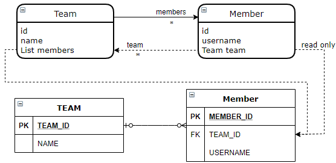
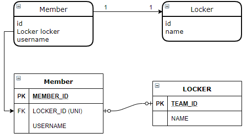
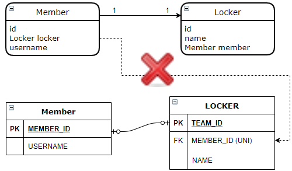
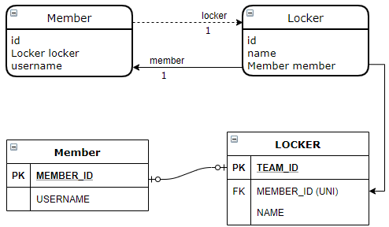
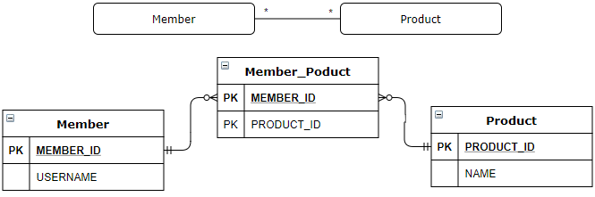
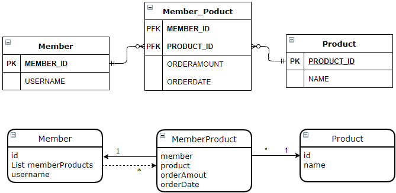

# 06. 다양한 연관관계 매핑

- 다중성, 단/양방향, 연관관계의 주인을 고려한 연관 관계
  - 다대일 @ManyToOne : 단방향, 양방향
  - 일대다 @OneToMany : 단방향, 양방향
  - 일대일 @OneToOne : 주 테이블 단방향, 양방향
  - 일대일 @OneToOne : 대상 테이블 단방향, 양방향
  - 다대다 @ManyToMany : 단방향, 양방향

## 6.1 다대일

- 연관 관계의 주인은 항상 "다" 쪽이다. 아래 회원(N), 팀(1) 에서 연관관계의 주인은 회원 이다.

### 1. 다대일 단방향 [N:1]


```java
// Member.team 필드로 회원 테이블의 TEAM_ID 외래키를 관리한다.
public class Member {
  ...
  @ManyToOne
  @JoinColumn(name = "TEAM_ID")
  private Team team;
```

### 2. 다대일 양방향 [N:1, 1:N]


- 양방향은 외래 키가 있는 쪽이 연관관계의 주인이다 - 다대일/일대다 관계는 항상 "다" 에 외래키가 있다.

```java
public class Team {
  ...
  @OneToMany(mappedBy = "team")
  private List<Member> members = new ArrayList<Member>();
```

- 양방향 연관관계는 항상 서로를 참조해야 한다 - 편의 메소드를 이용한다

  ```java
  Member#setTeam(Team)
  Team#addMember(Member)
  ```

## 6.2 일대다

### 1. 일대다 단반향 [1:N]


- 일대다 단방향 매핑의 단점: **매핑한 객체가 관리하는 외래 키가 다른 테이블에 있다**
  - 연관관계 처리를 위해 추가적인 UPDATE 가 필요하다
- 그러므로, 다대일 양방향 매핑을 사용하자: 성능, 관리적 문제 해결을 위해
  - 관리해야하는 외래 키가 본인 테이블에 있다

```java
class Team ...
    ...
    @OneToMany
    @JoinColumn(name = "TEAM_ID")    // MEMBER.TEAM_ID (FK)
    private List<Member> members = new ArrayList<Member>();
```

### 2. 일대다 양방향 [1:N, N:1]

- 일대다 양방향 매핑은 존재하지 않는다 -> 다대일 양방향 매핑을 사용한다
  - 양방향 매핑에서 @OneToMany 는 연관관계의 주인이 될 수 없다 -> "다" 쪽이 주인
  - 그러므로 @ManyToOne  에는 mappedBy 속성이 없다
- 일대다 단방향 매핑, 다대일 단방향 매핑(읽기 전용) 으로 일대다 양방향 매핑처럼 할 수 있다
  - 양방향 처럼 보일 뿐, 일대다 단방향 매핑의 단점은 동일하다.



```java
class Member ...
    @ManyToOne
    @JoinColumn(name = "TEAM_ID", insertable = false, updateable = false)
    private Team team;
```

## 6.3 일대일 [1:1]

- 일대일 관계는 반대도 일대일
- 일대일은 주 테이블, 대상 테이블 어느 한쪽이 외래키를 가질 수 있다

### 1. 주 테이블에 외래 키

#### 단방향



```java
class Member ...
    @OneToOne
    @JoinColumn(name = "LOCKER_ID")
    private Locker locker;
```

#### 양방향


```java
class Locker ...
    @OneToOne(mappedBy = "locker")
    private Member member;
```

### 2. 대상 테이블에 외래 키

#### 단방향

- 지원하지 않는다



#### 양방향



```java
class Member ...
    @OneToOne(mappedBy = "member")
    private Locker locker;
```

```java
class Locker ...
    @OneToOne
    @JoinColumn(name = "MEMBER_ID")
    private Member member;
```


## 6.4 다대다 [N:N]

- 관계형 데이터베이스에서 테이블 2개로 다대다 관계를 표현할 수 없다. 연결 테이블을 이용해야 한다.



### 1. 다대다 단방향

```java
class Member ...
    @ManyToMany
    @JoinTable(name = "MEMBER_PRODUCT", 
               joinColumns = @JoinColumn(name = "MEMBER_ID"),
               inverseJoinColumns = @JoinColumn(name = "PRODUCT_ID"))
    private List<Product> products = new ArrayList<Product>();
```

- @JoinTable.name : 연결 테이블
- @JoinTable.joinColumns : 현재 방향인 회원과 매핑할 조인 컬럼 정보
- @JoinTable.inverseJoinColumns : 반대 방향인 상품과 매핑할 조인 컬럼 정보

### 2. 다대다 양방향

```java
class Product ...
    @ManyToMany(mappedBy = "products")
    private List<Member> members;
```

- 양방향은 연관관계 편의 메소드를 사용하는 것이 편하다

```java
member.getProducts().add(product);
product.getMembers().add(member);
```

```java
class Member ...
    public void addProduct(Product product) {
        ...
        products.add(product);
        product.getMembers().add(this);
    }
-----------------------------------------
member.addProduct(product);
```

### 3. 다대다: 매핑의 한계와 극복, 연결 엔티티 사용

- 연결 테이블에 컬럼이 추가되면 @ManyToMany 를 사용할 수 없다



```java
class Member ...
    @OneToMany(mappedBy = "member")
    private List<MemberProduct> memberProducts;
```

```java
@Entity
@IdClass(MemberProductId.class)
public class MemberProduct {
    @Id 
    @ManyToOne
    @JoinColumn(name = "MEMBER_ID")
	private Member member;    // MemberProductId.member

    @Id
    @ManyToOne
    @JoinColumn(name = "PRODUCT_ID")
    private Product product;  // MemberProductId.product
```

```java
public class MemberProductId implements Serializable {
    private String member;   // MemberProduct.member
    private String product;  // MemberProduct.product
```

- 복합 기본 키를 위한 식별자 클래스
  - 복합 키는 별도의 식별자 클래스로 작성
  - Serializable 구현
  - equals, hashCode 메소드 구현
  - 기본 생성자 작성
  - public 이어야 한다
  - @IdClass 를 사용하거나 @EmbeddedId 를 사용한다
- 식별관계: 부모 테이블의 기본 키를 자신의 기본 키 + 외래 키로 사용하는 것
- 복합 키를 사용하는 것은 항상 식별자 클래스를 만들어야 하므로 복잡하다

### 4. 다대다: 새로운 기본 키 사용

- 새로운 대리 키를 사용하여 매핑을 단순하고 이해하기 쉽게 한다


```java
class Order ...
    @Id @GeneratedValue
    @Column(name = "ORDER_ID")
    private Long id;

	@ManyToOne
    @JoinColumn(name = "MEMBER_ID")
    private Member member;

	@ManyToOne
	@JoinColumn(name = "PRODUCT_ID")
	private Product product;
```

```java
class Member ...
    @OneToMany(mappedBy = "member")
    private List<MemberProduct> memberProducts;
```

- 간편하고 영구히 쓸 수 있으며 **비즈니스에 의존하지 않는다**.
- 권장: Long 값 , 대체키(UUID 등), 키 생성 전략

### 5. 다대다 연관관계 정리

- 연결 테이블을 만들때 식별자 구성 방법
  - 식별 관계: 받아온 식별자를 기본 키 + 외래 키로 사용
  - 비식별 관계: 받아온 식별자는 외래 키로 사용, 새로운 식별자를 추가


## Q&A

#### p214. 일대다 양방향에서 @JoinColumn에 insertable=false, updatable=false를 붙였는데, 이것을 안붙이고 사용하면 어떤 문제가 있을까?

- @ManyToOne @JoinColumn(name = "TEAM_ID") 로 다대일 단방향 매핑이 되므로, 같은 외래 키를 양쪽에서 모두 관리하게 된다. 그러므로 위 설정으로 읽기 전용으로 설정한다.


#### p218. 6.11예제에서 @OneToOne(mappedBy="locker")의 mappedBy가 없으면 어떻게 되는가?

- 연결 테이블이 생성된다


#### EER의 ticket과 node의 관계에서 연관관계를 어떻게 구성하는 것이 좋은 방법일까? (단/양방향, 일대다/다대일)

- 

