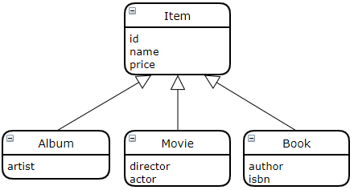
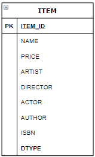
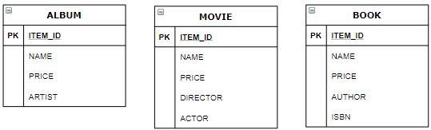
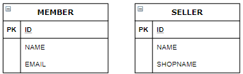
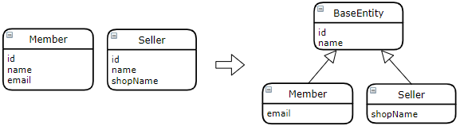
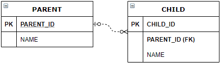

# 07. 고급 매핑

- 상속 관계 매핑
- @MappedSuperclass
- 복합 키와 식별 관계 매핑
- 조인 테이블
- 엔티티 하나에 여러 테이블 매핑하기

## 7.1 상속 관계 매핑

- 관계형 데이터베이스에서 상속과 유사한 모델링 기법 → 슈퍼타입 서브타입 관계(Super-Type Sub-Type Relationship)
- ORM 의 상속 관계 매핑은, 객체 상속 구조와 슈퍼타입 서브타입 관계의 매핑
- 슈퍼타입 서브타입 논리 모델을 실제 물리 테이블로 구현하는 방법
  - 각각의 테이블로 변환 → **조인 전략** : 개별 테이블, 조인으로 조회
  - 통합 테이블로 변환 → **단일 테이블 전략**
  - 서브타입 테이블로 변환 → **구현 클래스마다 테이블 전략** : 서브 타입마다 하나의 테이블



### 1. 조인 전략(Joined Strategy)


- 엔티티 각각 테이블로 만들고, DTYPE 컬럼을 구분 컬럼으로 사용

```java
@Entity
@Inheritance(strategy = InheritanceType.JOINED)
@DiscriminatorColumn(name = "DTYPE")
public abstract class Item {
```

```java
@Entity
@DiscriminatorValue("A")
public class Album extends Item { ... }

@Entity
@DiscriminatorValue("M")
public class Movie extends Item { ... }
```

- 자식 테이블의 ID 재정의

```java
@Entity
@DiscriminatorValue("B")
@PrimaryKeyJoinColumn("name = "BOOK_ID")
public class Book extends Item {
```

### 2. 단일 테이블 전략(Single-Table Strategy)



- 모든 컬럼을 한 테이블에 통합하므로 구분 컬럼으로 자식 데이터 구분

```java
@Entity
@Inheritance(strategy = InheritanceType.SINGLE_TABLE)
@DiscriminatorColumn(name = "DTYPE")
public abstract class Item { ... }

@Entity
@DiscriminatorValue("A")
public class Album extends Item { ... } ...
```

### 3. 구현 테이블마다 테이블 전략(Table-per-Concrete-Class Strategy)



- 자식 엔티티마다 필요 컬럼 모두 포함한 테이블 생성 (추천하지 않음)

```java
@Entity
@Inheritance(strategy = InheritanceType.TABLE_PER_CLASS)
public abstract class Item { ... }

@Entity
public class Album extends Item { ... } ...
```

#### 매핑 전략의 장/단점

| 매핑 전략                   | 장점                                                         | 단점                                                         |
| :-------------------------- | ------------------------------------------------------------ | ------------------------------------------------------------ |
| 조인전략                    | 테이블이 정규화 된다<br />외래 키 참조 무결성 제약조건 활용할 수 있다<br />저장공간을 효율적으로 사용 | 조인에 의한 조희 성능 저하<br />복잡한 조회 쿼리 <br />등록할 INSERT SQL 두 번 실행 |
| 단일 테이블 전략            | 조인 없으므로 조회 성능 좋다<br />단순한 조회 쿼리           | 자식 엔티티 매핑 컬럼은 null 허용해야함<br />테이블이 커질 수 있다(=성능 저하 될 수 있다) |
| 구현 테이블마다 테이블 전략 | 서브 타입을 구분해서 처리할 때 효과적<br />not null 제약조건 사용 가능 | 여러 자식 테이블을 함께 조회하면 성능 저하(UNION 사용)<br />자식 테이블을 통합해서 쿼리하기 어렵다 |

#### 특징

| 매핑 전략                   | 특징                                                         |
| :-------------------------- | ------------------------------------------------------------ |
| 조인전략                    | hibernate 등 구현체에 따라 구분 컬럼 없이도 동작             |
| 단일 테이블 전략            | 구분 컬럼 필수(@DiscriminatorColumn)<br />@DiscriminatorValue 없으면 기본은 엔티티 이름 |
| 구현 테이블마다 테이블 전략 | 구분 컬럼을 사용하지 않는다                                  |

## 7.2 @MappedSuperclass

- @MappedSuperclass 는 실제 테이블과 매핑되지 않고 매핑 정보 상속 목적으로 사용





```java
@MappedSuperclass
public abstract class BaseEntity { ... }

@Entity
public class Member extends BaseEntity { ... }

@Entity
public class Seller extends BaseEntity { ... }
```

```java
// id 를 MEMBER_ID 로 재정의 (2개 이상 재정의시 @AttributeOverrides)
@Entity
@AttributeOverride(name = "id", column = @Column(name = "MEMBER_ID"))  // 연관관계 재정의
public class Member extends BaseEntity { ... }
```

- @MappedSuperclass
  - 테이블과 매핑되지 않고 공통의 자식 클래스 엔티티의 매핑 정보 상속을 위해
  - 지정 클래스는 엔티티가 아니므로 em.find() 나 JPQL 사용 불가
  - 추상 클래스 작성 권장

## 7.3 복합 키와 식별 관계 매핑

### 1. 식별 관계 vs 비식별 관계

#### 식별 관계(Identifying Relationship)


- 부모 테이블의 기본 키를 자식 테이블의 기본 키 + 외래 키 로 사용

#### 비식별 관계(Non-Identifying Relationship)

- 부모 테이블의 기본 키를 자식 테이블의 외래 키로만 사용
- 필수적 비식별 관계(Mandatory): 외래 키에 NULL 허용하지 않는다. 연관관계 필수.


- 선택적 비식별 관계(Optional): 외래 키에 NULL 허용. 연관관계 선택적.



### 2. 복합 키: 비식별 관계 매핑

- 식별자 필드가 2개 이상이면 별도의 식별자 클래스가 필요하다.


#### @IdClass

- 좀 더 관계형 데이터베이스 관점

```java
@Entity
@IdClass(ParentId.class)
public class Parent {
    @Id @Column(name = "PARENT_ID1")
    private String id1;
    
    @Id @Column(name = "PARENT_ID2")
    private String id2;
    ...
}
```

- @IdClass 사용 식별자 클래스 작성 방법
  - 식별자 클래스 속성명과 엔티티의 식별자 속성명 같아야 한다
  - Serializable interface 구현
  - equals, hashCode 구현
  - 기본 생성자 필요
  - public class

```java
public class ParentId implements Serializable {
    private String id1;   // Parent.id1
    private String id2;   // Parent.id2
    
    public ParentId(String id1, String id2) { ... }
    
    @Override
    public boolean equals(Object o) { ... }

    @Override
    public int hashCode() { ... }
}
```

- 식별자 클래스 생성: ParentId 가 직접 사용되지 않고 em.persist() 로 영속성 컨텍스트에 엔티티 등록 직전에 내부적으로 Parent 의 id1, id2 로 ParentId 가 생성하고 영속성 컨텍스트의 키로 사용된다

- 식별자 클래스로 조회

  ```java
  ParentId parentId = new ParentId("myId1", "myId2");
  Parent parent = em.find(Parent.class, parentId);
  ```

- 자식 엔티티 클래스: 부모의 기본 키가 복합 키이므로 자식의 외래 키도 복합 키

```java
@Entity 
public class Child {
    @Id private String id;
    
    @ManyToOne
    @JoinColumns({
        @JoinColumn(name = "PARENT_ID1", referencedColumnName = "PARENT_ID1"),
        @JoinColumn(name = "PARENT_ID2", referencedColumnName = "PARENT_ID2")
    })
    private Parent parent;
}
```

#### @EmbeddedId

- 좀 더 객체지향적 관점

```java
@Entity
public class Parent {
    @EmbeddedId
    private ParentId id;
    ...
}
```

- @EmbeddedId 식별자 클래스 작성 방법
  - @Embeddable
  - Serializable interface 구현
  - equals, hashCode 구현
  - 기본 생성자 필요
  - public class

```java
@Embeddable
public class ParentId implements Serializable {
	@Column(name = "PARENT_ID1")  // 기본키 직접 매핑
    private String id1;
    @Column(name = "PARENT_ID2")
    private String id2;
    ....
}
```

- 식별자 클래스 사용: 직접 생성해서 사용

  - 저장

    ```java
    Parent parent = new Parent();
    ParentId parentId = new ParentId("myId1", "myId2");
    parent.setId(parentId); ...
    ```

  - 조회

    ```java
    ParentId parentId = new ParentId("myId1", "myId2");
    Parent parent = em.find(Parent.class, parentId);
    ```

#### 복합 키와 equals(), hashCode()

- 영속성 컨텍스트는 엔티티 식별자를 키로 엔티티를 관리한다. 따라서 식별자 객체의 동등성(equals)이 지켜지지 않으면 엔티티 조회에 문제가 생길 수 있다. 
- 그러므로 복합 키는 식별자 비교를 위한 equals(), hashCode() 를 필수로 구현해야 한다.

#### @IdClass vs @EmbeddedId

### 3. 복합 키: 식별 관계 매핑


#### @IdClass 와 식별 관계

-  기본 키와 외래 키를 같이 매핑. @Id @ManyToOne

```java
@Entity
public class Parent() {
  @Id @Column(name = "PARENT_ID")
  private String id;
  ...
}
```

```java
@Entity
@IdClass(ChildId.class)
public class Child() {
  @Id @ManyToOne 
  @JoinColumn(name = "PARENT_ID")
  public Parent parent;
  
  @Id @Column(name = "CHILD_ID")
  private String childId;
  ...
}

public class ChildId implements Serializable {
  private String parent;  // Child.parent
  private String childId; // Child.childId
  ...
}
```

```java
@Entity
@IdClass(GrandChildId.class)
public class GrandChild() {
  @Id @ManyToOne 
  @JoinColumns({@JoinColumn(name = "PARENT_ID"), @JoinColumn(name = "CHILD_ID")})
  public Child child;
  
  @Id @Column(name = "GRANDCHILD_ID")
  private String id;
  ...
}

public class GrandChildId implements Serializable {
  private ChildId child;  // GrandChild.child
  private String id;      // GrandChild.id
  ...
}
```

#### @EmbeddedId 와 식별 관계

- @MapsId 로 외래키 매핑을 기본 키에도 매핑

```java
@Entity
public class Parent() {
  @Id @Column(name = "PARENT_ID")
  private String id;
  ...
}
```

```java
@Entity
public class Child() {
	@EmbeddedId
  public ChildId id;
  
  @MapsId("parentId")  // ChildId.parentId
  @ManyToOne
  @JoinColumn(name = "PARENT_ID")
  private Parent parent;
  ...
}

@Embeddable
public class ChildId implements Serializable {
  private String parentId;  // @MapsId("parentId")
  
  @Column(name = "CHILD_ID")
  private String id;
  ...
}
```

```java
@Entity
public class GrandChild() {
  @EmbeddedId
  public GrandChildId id;
  
  @MapsId("childId")  // GrandChildId.parentId
  @ManyToOne
  @JoinColumns({@JoinColumn(name = "PARENT_ID"), @JoinColumn(name = "CHILD_ID")})
  private Child child;
  ...
}

@Embeddable
public class GrandChildId implements Serializable {
  private ChildId childId;  // @MapsId("chlidId")
  
  @Column(name = "GRANDCHILD_ID")
  private String id;
  ...
}
```

### 4. 비식별 관계로 구현


- 위와 비교하여 훨씬 쉽고 코드도 단순하다. 복합 키 클래스도 필요하지 않다.

```java
@Entity
public class Parent {
  @Id @GeneratedValue
  @Column(name = "PARENT_ID")
  private Long id;
  ...
}
```

```java
@Entity
public class Child {
  @Id @GeneratedValue
  @Column(name = "CHILD_ID")
  private Long id;
  
  @ManyToOne
  @JoinColumn(name = "PARENT_ID")
  private Parent parent;
  ...
}
```

```java
@Entity
public class GrandChild {
  @Id @GeneratedValue
  @Column(name = "GRANDCHILD_ID")
  private Long id;
  
  @ManyToOne
  @JoinColumn(name = "CHILD_ID")
  private Child child;
  ...
}
```

### 5. 일대일 식별 관계


- @MapsId

```java
@Entity
public class Board {
  @Id @GeneratedValue
  @Column(name = "BOARD_ID")
  private Long id;
  private String title;
  
  @OneToOne(mappedBy = "board")
  private BoardDetail boardDetail;
}
```

```java
@Entity
public class BoardDetail {
  @Id 
  private Long boardId;
  
  @MapsId               // 식별자인 BoardDetail.boardId 와 매핑
  @OneToOne
  @JoinColumn(name = "BOARD_ID")
  private Board board;
  
  private String content;
}
```

### 6. 식별, 비식별 관계의 장단점

- 식별 관계 (단점)
  - 부모 테이블 기본 키만큼 자식 테이블의 기본 키 컬럼이 늘어난다 → 조인 SQL 이 복잡, 기본 키 인덱스 커질 수 있다
  - 2개 이상의 컬럼을 합해 복합 기본 키를 만들어야 하는 경우가 많다
  - 기본 키로 비즈니스 의미가 있는 키 조합 많이 사용한다
  - 부모 테이블 기본 키 사용으로 상대적으로 유연하지 못하다
  - 일대일을 제외하고는 2개 이상의 복합 기본 키를 사용하므로 식별자 클래스를 작성해야 한다
  - 장점: 기본 키 인덱스 사용, 조인 없이 하위 테이블 검색 가능
- 비식별 관계 (장점)
  - 비즈니스와 무관한 대리 키를 주로 사용 → 비즈니스 변경에 유리
  - JPA 에서 제공하는 @GenerateValue 등 으로 대리 키 생성이 용이

- 정리
  - 비식별 관계를 사용하고 기본 키는 Long 타입의 대리 키를 사용하자 
  - 외부 조인을 해야하는 선택적 비식별 관계 보다는 필수적 비식별 관계를 사용

## 7.4 조인 테이블

- 테이블 연관관계 설계 방식
  - 조인 컬럼(외래 키) 사용: @JoinColumn
  - 조인 테이블(테이블) 사용: 별도 조인 테이블이 외래 키를 가지고 연관 관계를 관리 @JoinTable

### 1. 일대일 조인 테이블


- 조인 테이블 외래 키 컬럼 모두 unique 제약

```java
@Entity
public class Parent {
  @Id @GeneratedValue
  @Column(name = "PARENT_ID")
  private Long id;
  ...
  
  @OneToOne
  @JoinTable(name = "PARENT_CHILD", 
             joinColumns = @JoinColumn(name = "PARENT_ID"),
             inverseJoinColumns = @JoinColumn(name = "CHILD_ID"))
  private Child child;
}
```

```java
@Entity
public class Child {
  @Id @GeneratedValue
  @Column(name = "CHILD_ID")
  private Long id;
  ...
}
```

### 2. 일대다 조인 테이블


- "다" 쪽에 unique 제약

```java
@Entity
public class Parent {
  @Id @GeneratedValue
  @Column(name = "PARENT_ID")
  private Long id;
  ...
  
  @OneToMany
  @JoinTable(name = "PARENT_CHILD", 
             joinColumns = @JoinColumn(name = "PARENT_ID"),
             inverseJoinColumns = @JoinColumn(name = "CHILD_ID"))
  private List<Child> child = new ArrayList<>();
}
```

```java
@Entity
public class Child {
  @Id @GeneratedValue
  @Column(name = "CHILD_ID")
  private Long id;
  ...
}
```

### 3. 다대일 조인 테이블

```java
@Entity
public class Parent {
  @Id @GeneratedValue
  @Column(name = "PARENT_ID")
  private Long id;
  ...
  
  @OneToMany(mappedBy = "parent")
  private List<Child> child = new ArrayList<>();
}
```

```java
@Entity
public class Child {
  @Id @GeneratedValue
  @Column(name = "CHILD_ID")
  private Long id;
  ...
  @ManyToOne(optional = false)
  @JoinTable(name = "PARENT_CHILD", 
             joinColumns = @JoinColumn(name = "CHILD_ID"),
             inverseJoinColumns = @JoinColumn(name = "PARENT_ID"))
   private Parent parent;
}
```

### 4. 다대다 조인 테이블


```java
@Entity
public class Parent {
  @Id @GeneratedValue
  @Column(name = "PARENT_ID")
  private Long id;
  ...
  
  @ManyToMany
  @JoinTable(name = "PARENT_CHILD", 
             joinColumns = @JoinColumn(name = "PARENT_ID"),
             inverseJoinColumns = @JoinColumn(name = "CHILD_ID"))
  private List<Child> child = new ArrayList<>();
}
```

```java
@Entity
public class Child {
  @Id @GeneratedValue
  @Column(name = "CHILD_ID")
  private Long id;
  ...
}
```

## 7.5 엔티티 하나에 여러 테이블 매핑

- @SecondaryTable: 하나의 엔티티에 여러 테이블 매핑. @SecondaryTables 로 더 많은 테이블 매핑


```java
@Entity
@Table(name = "BOARD")
@SecondaryTable(name = "BOARD_DETAIL",
               pkJoinColumns = @PrimaryKeyJoinColumn(name = "BOARD_DETAIL_ID"))
public class Board {
  @Id @GeneratedValue
  @Column(name = "BOARD_ID")
  private Long id;
  private String title; // Board 테이블에 매핑
  
  @Column(table = "BOARD_DETAIL")
  private String content;
}
```

- 항상 두 테이블을 조회하므로 최적화 어렵다. 일대일 매핑을 사용하라.


## Q&A

#### p.247 attic 또는 eer에서 상속 매핑을 적용할 수 있는 것이 어떤게 있을까요?

- 시나리오 노드: 공통의 노드 특성과 개별 노드별 특성

#### p.250 @Inheritance (strategy=InheritanceType.TABLE_PER_CLASS) 전략을 일반적으로 추천하지 않는 이유는 무엇인가요?

- Join 대신 UINON 을 사용하므로 성능상 좋지 않음

#### p.256 JPA 복합 키를 구현하는 방법 @IdClass와 @EmbeddedId 두 가지 중 어떤 것을 사용하는 것이 좋을까요? 각각은 어떤 경우에 사용하여야 적절할까요?

- @IdClass 가 DB 관점 이므로 기존 DB 를 유지하면서 개선을 하는 경우 등에 적합할 듯. 복합키 매핑이 여러 곳에 사용되는 경우.

``` json
Department by Id
{
    “name”: “RnD”,
    “location”: “Kalutara”,
    “empNumber”: 5,
    “employees”: [
        {
            “name”: “Bhagya”,
            “departmentName”: “RnD”,
            “designation”: “Architect”,
            “departmentLocation”: “Kalutara”,
            “salary”: 500000
        },
        {
            “name”: “Singam”,
            “departmentName”: “RnD”,
            “designation”: “Engineer”,
            “departmentLocation”: “Kalutara”,
            “salary”: 50000
        }
    ]
}

Employee by Id
{
    “name”: “Bhagya”,
    “departmentName”: “RnD”,
    “designation”: “Architect”,
    “departmentLocation”: “Kalutara”,
    “salary”: 500000
}

```

- @EmbeddedId 는 객체지향적. 하나의 복합키만 존재하는 경우

```json
Department by Id
{
    “departmentId”: {
        “name”: “RnD”,
        “location”: “Kalutara”
    },
    “empNumber”: 5,
    “employees”: [
        {
            “employeeId”: {
                “departmentId”: {
                    “name”: “RnD”,
                    “location”: “Kalutara”
                },
                “name”: “Bhagya”
            },
            “designation”: “Architect”,
            “salary”: 500000
        },
        {
            “employeeId”: {
                “departmentId”: {
                    “name”: “RnD”,
                    “location”: “Kalutara”
                },
                “name”: “Singam”
            },
            “designation”: “Engineer”,
            “salary”: 50000
        }
    ]
}

Employee by Id
{
    “employeeId”: {
        “departmentId”: {
            “name”: “RnD”,
            “location”: “Kalutara”
        },
        “name”: “Bhagya”
    },
    “designation”: “Architect”,
    “salary”: 500000
}
```

- 참고:
  - https://medium.com/@bhagyajayashani/composite-key-handling-using-idclass-annotation-in-spring-boot-java-26f40bbd38a2
  - https://medium.com/@bhagyajayashani/composite-key-handling-using-embeddedid-annotation-in-spring-boot-java-67c29da9d119

#### p.262 복합 키에는 왜 @GenerateValue를 사용할 수 없을까요?

- @Id + @GeneratedValue 를 붙일 수 있어서?
- 복합 키는 생성 보다는 할당의 관점
- JPA 와 하이버네이트에서 복합 키에 @GeneratedValue 를 사용해서 매핑하는 방법
  - https://vladmihalcea.com/how-to-map-a-composite-identifier-using-an-automatically-generatedvalue-with-jpa-and-hibernate/
  - 일반적이지는 않지만 기본 키 중 하나는 자동 생성 복합 키 매핑이 가능. SEQUENCE  식별자를 사용한다면 JPA 스펙을 사용할 수 있고, IDENTITY 인 경우 @SQLInsert 어노테이션으로 할 수 있다.

#### p.278 attic에서 @SecondaryTable 을 적용할만한 곳이 있을까요?

- 없을 듯?
- legacy table 에서 여러 테이블을 매핑해서 구성해야 하는 경우 정도 외에는 쓰이는 경우가 별로 없을 듯.

#### p.269 attic에서 center와 ticket과의 관계에서 비식별키를 사용하는 경우에 REST URL을 어떤식으로 사용해야 하는지요? 식별키로 사용하는 것과 어떤 차이가 있는지 설명해주세요

- 식별: /centers/{centerId}/tickets
- 비식별: /tickets/?centerId={centerId}

