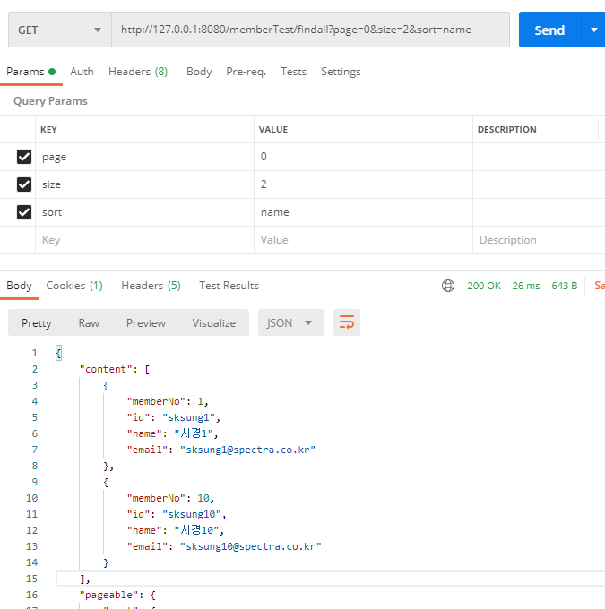
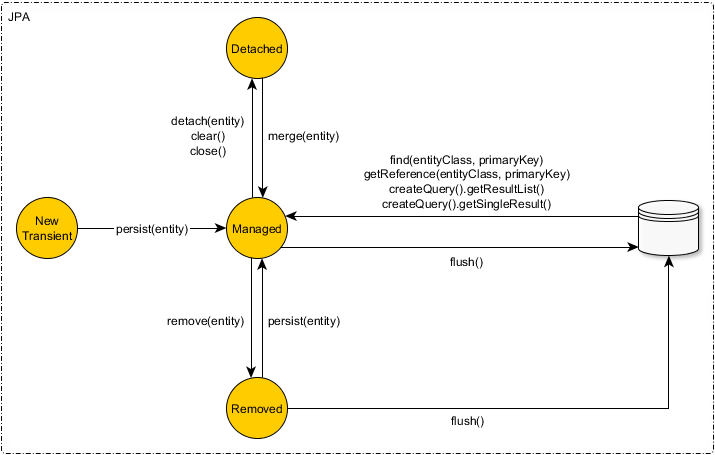
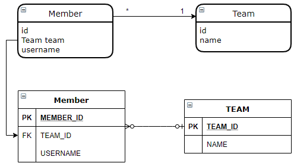
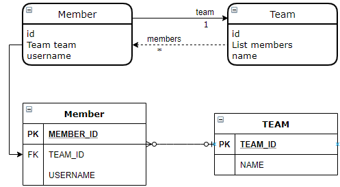
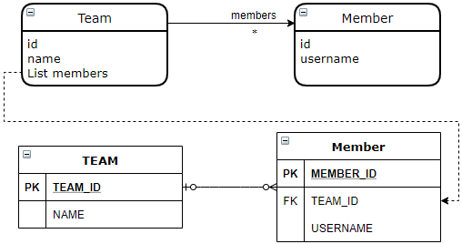
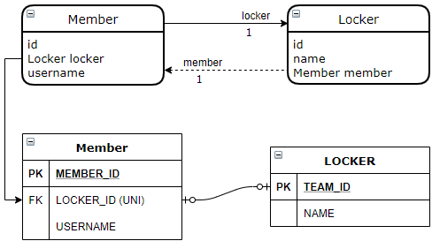
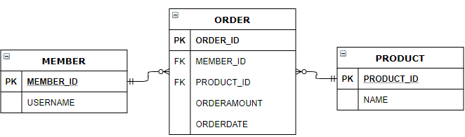

## 08. 프록시와 연관관계 관리

* 프록시와 즉시로딩, 지연로딩
* 영속성 전이와 고아 객체

### 8.1 프록시

Team 정보 조회할 때 회원정보를 항상 조회하는 것은 효율적이지 않다.
JPA는 이런 문제를 해결하려고 엔티티가 실제 사용될 때까지 데이타베이스 조회를 지연하는 방법을 제공하는데 이것을 지연 로딩이라고 한다.

```java
@Entity
@NoArgsConstructor
@Getter
public class Team {
    @Id
    private Long id;

    private String name;

    @OneToMany(mappedBy = "team")
    private List<Member> members = new ArrayList<>();

    public Team(Long id, String name) {
        this.id = id;
        this.name = name;
    }
}
```

```java
@Entity
@NoArgsConstructor
@AllArgsConstructor
@Getter
public class Member {

    @Id
    private Long id;

    private String name;

    @ManyToOne
    @JoinColumn(name = "team_id")
    private Team team;

    public Member(Long id, String name) {
        this.id = id;
        this.name = name;
    }
}
```

```java
public void testSave(EntityManager em) {
    Team team = new Team(1L, "개발팀");
    Member member1 = new Member(1L, "한경만", team);
    Member member2 = new Member(2L, "정은영", team);

    em.persist(team);
    em.persist(member1);
    em.persist(member2);

    em.flush();
    em.clear();

    Team findTeam = em.find(Team.class, 1L);
    System.out.println("findTeam: " + findTeam.getName());
    System.out.println("teamClass: " + findTeam.getClass().getName());
    System.out.println("memberClass: " + findTeam.getMembers().getClass().getName());

    System.out.println("memberSize: " + findTeam.getMembers().size());
}

```

### 8.2 즉시 로딩과 지연 로딩

* 즉시 로딩: 엔터티를 조회할 때 연관된 엔티니도 함께 조회한다. (fetch = FetchType.EAGER)
* 지연 로딩: 연관된 엔티니를 실제 사용할 때 조회한다. (fetch = FetchType.LAZY)

### 8.3 지연 로딩 활용

Fetch 속성의 기본 설정값은 다음과 같다.

* @ManyToOne, @OneToOne: 즉시 로딩
* @OneToMany, @ManyToMany: 지연로딩

### 8.4 영속성 전이: CASCADE

특정 엔터티를 영속 상태로 만들 때 연관된 엔터티도 함께 영속 상태로 만들고 싶으면 영속성 전이 기능을 사용하면 된다.
JPA는 CASCADE 옵션으로 영속성 전이를 제공한다.

#### 8.4.1 영속성 저장

cascade = Cascade.PERSIST

```java
@Entity
@NoArgsConstructor
@Getter
public class Team {
    @Id
    private Long id;

    private String name;

    @OneToMany(mappedBy = "team", fetch = FetchType.EAGER, cascade = CascadeType.PERSIST)
    private List<Member> members = new ArrayList<>();

    public Team(Long id, String name) {
        this.id = id;
        this.name = name;
    }
}
```

```java
@Entity
@NoArgsConstructor
@AllArgsConstructor
@Getter
public class Member {

    @Id
    private Long id;

    private String name;

    @ManyToOne
    @JoinColumn(name = "team_id")
    private Team team;

    public Member(Long id, String name) {
        this.id = id;
        this.name = name;
    }
}
```

```java
public void save(EntityManager em) {
    Team team = new Team(1L, "개발팀");
    Member member1 = new Member(1L, "한경만", team);
    Member member2 = new Member(2L, "정은영", team);

    team.getMembers().add(member1);
    team.getMembers().add(member2);

    em.persist(team);
}
```

#### 8.4.2 영속성 삭제

cascade = Cascade.REMOVE

```java
@Entity
@NoArgsConstructor
@Getter
public class Team {
    @Id
    private Long id;

    private String name;

    @OneToMany(mappedBy = "team", fetch = FetchType.EAGER, cascade = {CascadeType.PERSIST, CascadeType.REMOVE})
    private List<Member> members = new ArrayList<>();

    public Team(Long id, String name) {
        this.id = id;
        this.name = name;
    }
}
```

```java
@Entity
@NoArgsConstructor
@AllArgsConstructor
@Getter
public class Member {

    @Id
    private Long id;

    private String name;

    @ManyToOne
    @JoinColumn(name = "team_id")
    private Team team;

    public Member(Long id, String name) {
        this.id = id;
        this.name = name;
    }
}
```

```java
public static void save(EntityManager em) {
    Team team = new Team(1L, "개발팀");
    Member member1 = new Member(1L, "한경만", team);
    Member member2 = new Member(2L, "정은영", team);

    team.getMembers().add(member1);
    team.getMembers().add(member2);

    em.persist(team);

    em.remove(team);
}
```

CASCADE 종류

- CascadeType.RESIST – 엔티티를 생성하고, 연관 엔티티를 추가하였을 때 persist() 를 수행하면 연관 엔티티도 함께 persist()가 수행된다.  만약 연관 엔티티가 DB에 등록된 키값을 가지고 있다면 detached entity passed to persist Exception이 발생한다.
- CascadeType.MERGE – 트랜잭션이 종료되고 detach 상태에서 연관 엔티티를 추가하거나 변경된 이후에 부모 엔티티가 merge()를 수행하게 되면 변경사항이 적용된다.(연관 엔티티의 추가 및 수정 모두 반영됨)
- CascadeType.REMOVE – 삭제 시 연관된 엔티티도 같이 삭제됨
- CascadeType.DETACH – 부모 엔티티가 detach()를 수행하게 되면, 연관된 엔티티도 detach() 상태가 되어 변경사항이 반영되지 않는다.
- CascadeType.ALL – 모든 Cascade 적용

### 8.5 고아 객체

JPA는 부모 엔터티와 연관관계가 끊어진 자식 엔터티를 자동으로 삭제하는 기능을 제공하는데 이것을 고아 객체 제거라 한다.
부모 엔터티의 컬렉션에서 자식 엔터티의 참조만 제거하면 자식 엔터티가 자동으로 삭제된다.

```java
@Entity
@NoArgsConstructor
@Getter
public class Team {
    @Id
    private Long id;

    private String name;

    @OneToMany(mappedBy = "team", fetch = FetchType.EAGER, cascade = CascadeType.PERSIST, orphanRemoval = true)
    private List<Member> members = new ArrayList<>();

    public Team(Long id, String name) {
        this.id = id;
        this.name = name;
    }
}
```

```java
@Entity
@NoArgsConstructor
@AllArgsConstructor
@Getter
public class Member {

    @Id
    private Long id;

    private String name;

    @ManyToOne
    @JoinColumn(name = "team_id")
    private Team team;

    public Member(Long id, String name) {
        this.id = id;
        this.name = name;
    }
}
```

```java
public static void save(EntityManager em) {
    Team team = new Team(1L, "개발팀");
    Member member1 = new Member(1L, "한경만", team);
    Member member2 = new Member(2L, "정은영", team);

    team.getMembers().add(member1);
    team.getMembers().add(member2);

    em.persist(team);

    em.flush();
    em.clear();

    Team findTeam = em.find(Team.class, 1L);
    em.remove(findTeam);
}
```

위의 예에서 Member가 1000명이라면 1000개의 Delete 쿼리가 실행된다.

이를 개선하기 위해서는 아래와 같이 jpql을 사용한다.

```java
public static void save(EntityManager em) {
    Team team = new Team(1L, "개발팀");
    Member member1 = new Member(1L, "한경만", team);
    Member member2 = new Member(2L, "정은영", team);

    team.getMembers().add(member1);
    team.getMembers().add(member2);

    em.persist(team);

    em.flush();
    em.clear();

    em.createQuery("delete from Member m where m.team.id = :teamId")
    		.setParameter("teamId", 1L)
        .executeUpdate();
        
    Team findTeam = em.find(Team.class, 1L);
    em.remove(findTeam);
}
```


#### Q&A

Q. 엔티티 조회 시 즉시로딩, 지연로딩 방법 중 각각은 어떤 경우에 적합한지 알려주세요.

A. 매번 빈번히 조회되는 경우는 즉시로딩. Ticket조회 시 node는 항상 조회된다.

Node 조회 시 경우에 따라 Ticket정보를 조회해야 할때는 지연로딩

지연로딩 사용 시 LazyInitializationException을 주의해야 한다.
em.close() 가 실행된 이후에 조회하면 오류가 발생한다.
Spring Service(Transaction) 레벨에서 entityManager가 동작하기 때문에 Controller에서 여러 Service 호출 시 주의해야 한다. (OSIV 활용)

Q. Member와 Team은 자주 함께 사용되었다. 에서 자주, 가끔에 대한 기준은 무엇일까요?


Q. attic에서 cascade를 적용할만한 곳이 있을까요?

A. Aggregate 내


Q. cascade REFRESH, DETACH 사용예제를 보여주세요

A.

###### detach 예제

```java
@OneToMany(mappedBy = "team", cascade = {CascadeType.DETACH})
private List<Member> members = new ArrayList<>();
```

```java
public void save(EntityManager em) {
    Team team = new Team(1L, "개발팀");
    Member member1 = new Member(1L, "한경만", team);
    Member member2 = new Member(2L, "정은영", team);

    team.getMembers().add(member1);
    team.getMembers().add(member2);

    em.persist(team);

    em.flush();
    em.clear();

    Team findTeam = em.find(Team.class, 1L);

    em.detach(findTeam);

    findTeam.getMembers().get(0).setName("한경만1");
}
```

detach시 Team뿐만 아니라 Member정보도 Detach되어 member의 변경사항이 반영되지 않는다.

###### refresh 예제

```java
@OneToMany(mappedBy = "team", cascade = {CascadeType.REFRESH})
private List<Member> members = new ArrayList<>();
```


```java
public void save(EntityManager em) {
    Team team = new Team(1L, "개발팀");
    Member member1 = new Member(1L, "한경만", team);
    Member member2 = new Member(2L, "정은영", team);

    team.getMembers().add(member1);
    team.getMembers().add(member2);

    em.persist(team);

    em.flush();
    em.clear();

    Team findTeam = em.find(Team.class, 1L);

    em.refresh(findTeam);
}
```

refresh 시 Team 뿐만 아니라 Member 정보도 새로 DB에서 조회한다.


Q. 자식 엔티티 삭제에 Cascade.REMOVE 와 orphanRemoval = true 를 사용하는 것의 차이점은 무엇인가요?

A.

team.getMembers().clear() 할때는 orphanRemoval이 동작한다.

em.remove(team); 할때는 2개가 동일하게 동작한다.

<hr/>


> 코드 샘플
> https://github.com/rudaks-han/jpabook.git


## 10. 객체지향 쿼리 언어

* 객체지향 쿼리 소개
* JPQL
* Criteria
* QueryDSL
* 네이티브 SQL
* 객체지향 쿼리 심화


### 10.1 객체지향 쿼리 소개

___

EntityManager.find() 로 하면 엔터티 하나를 조회할 수 있지만 복잡한 쿼리를 작성하기 쉽지 않다.

> 예) 나이가 30살 이상인 회원을 모두 검색


JPQL의 특징

* 테이블이 아닌 객체 대상으로 검색한다.
* SQL을 추상화해서 특정 데이터베이스 SQL에 의존하지 않는다.


###### JPA가 공식 지원하는 기능

* JPQL
* Criteria 쿼리
* 네이티브 SQL

###### 비공식적인 기능

* QueryDSL
* JDBC 직접 사용, MyBatis같은 SQL 매퍼 사용


#### 10.1.1 JPQL 소개

JPQL(Java Persistence Query Language)은 엔터티 객체를 조회하는 객체 지향 쿼리다.
문법은 SQL과 비슷하고 ANSI 표준 SQL이 제공하는 기능을 유사하게 지원한다.

JPQL은 SQL을 추상화해서 특정 데이터베이스에 의존하지 않는다.


java에서 코드 작성

```java
Query query = em.createQuery("select m from Member m where m.username = 'kim'");
List<Member> results = query.getResultList();
```

실행한 JPQL

```sql
select
    m.name,
    m.age 
from Member m 
where m.name = 'kim'
```


실행 SQL

```sql
 select
 		member0_.name as col_0_0_,
		member0_.age as col_1_0_ 
 from Member member0_ 
 where member0_.name= 'kim'
```


#### 10.1.2 criteria 쿼리 소개

Criteria는 JPQL을 생성하는 빌더 클래스다.

장점은 문자가 아닌 query.select(m).where(...)처럼 프로그래밍 코드로 JPQL을 작성할 수 있다. (오타체크, compile time check)

```java
CriteriaQuery<Member> cq = query.select(m).where(sb.equal("username"), "kim"));
List<Member> resultList = em.createQuery(cq).getResultList();
```

criteria의 단점은 복잡하고 장황하다. 따라서 사용하기 불편하고 작성한 코드가 한눈에 들어오지 않는다.


#### 10.1.3 QueryDSL 소개

JPQL 빌더이다. 

장점은 코드기반이며 단순하고 사용하기 쉽다.

```java
JPAQuery query = new JPAQuery(em);
query.from(member)
  .where(member.name.eq("kim"))
  .orderBy(member.name.desc());
```

#### 10.1.4 네이티브 SQL 소개

SQL을 직접 사용할 수 있는 기능이다.

오라클의 connect by 이나 특정 SQL 힌트 등 특정 데이터베이스에만 동작하는 기능

```java
String sql = "select id, name, age, city, street, zipCode, team_id from member where id = ?";

Query nativeQuery = em.createNativeQuery(sql, Member.class)
  .setParameter(1, 1);
List<Member> results = nativeQuery.getResultList();
```

#### 10.1.5 JDBC 직접 사용, 마이바이트 같은 SQL 매퍼 프레임워크 사용

JPA에서 JDBC 커넥션을 획득하려면 JPA 구현체가 제공하는 방법으로 사용

jdbc에서는 적절하게 강제 flush를 해야 한다.


### 10.2 JPQL

___

###### SELECT 문

```sql
SELECT m FROM Member AS m where m.username = 'hello'
```

* 대소문자 구분
  * SQL 키워드를 제외한 엔터티, 속성명은 대소문자를 구분한다.
* 엔터티 이름 
  * JPQL에서 사용한 Member는 클래스명이 아니라 엔터티 명이다. @Entity(name = "XXX")
* 별칭은 필수
  * 하이버네이트에서는 별칭 생략 가능

###### TypeQuery, Query

* TypedQuery

```java
TypedQuery<Member> query = em.createQuery("select m from Member m", Member.class);
List<Member> results = query.getResultList();
```

* Query

```java
Query query = em.createQuery("select m.name, m.age from Member m")
List results = query.getResultList();

for (Object o: results) {
  Object[] result = (Object[]) o;
  System.out.println("name: " + result[0]);
  System.out.println("age: " + result[1]);
}
```


#### 10.2.2 파라미터 바인딩

###### 이름 기준 파라미터

``` java
TypedQuery<Member> query = em.createQuery("select m from Member m where m.username = :username", Member.class);
query.setParameter("username", usernameParam);
```

###### 위치 기준 파라미터

```java
TypedQuery<Member> query = em.createQuery("select m from Member m where m.username = ?1", Member.class);
query.setParameter(1, usernameParam);
```

이름 기준 파라미터 바인딩을 사용해라.

#### 10.2.4 프로젝션

SELECT 절에 조회할 대상을 지정하는 것을 프로젝션이라고 하고 (SELECT. (프로젝션 대상) FROM)으로 대상을 선택한다.
프로젝션 대상은 엔터티, 임베디드 타입, 스칼라 타입이 있다. 스칼라 타입은 숫자, 문자 등 기본 데이터 타입을 뜻한다.

* 엔터티 프로젝션

```sql
SELECT m From Member m
```

조회한 엔터티는 영속성 컨텍스트에서 관리된다.

* 임베디드 타입 프로젝션

```sql
SELECT o.address FROM Order o
```

임베디드 타입은 엔터티 타입이 아닌 값 타입이다. 따라서 영속성 컨텍스트에서 관리되지 않는다.

* 스칼라 타입 프로젝션

```sql
SELECT username FROM Member m
```

* 여러 값 조회

```sql
SELECT m.name, m.age FROM Member m
```


#### 10.2.4 페이징 API

페이징 처리용 SQL은 데이터베이스마다 처리하는 SQL 문법이 다르다.

JPA는 두 API로 추상화했다.

* setFirstResult(int startPosition): 조회 시작위치
* setMaxResults(int maxResult): 조회할 데이터 수

```java
TypedQuery<Member> query = em.createQuery("select m from Member m order by m.name desc", Member.class);
query.setFirstResult(10);
query.setMaxResults(20);
```

#### 10.2.5 집합과 정렬

집합은 집합함수와 함께 통계 정보를 구할 때 사용한다.

```sql
select 
	t.name, 
	count(m.age), 
	sum(m.age), 
	avg(m.age), 
	max(m.age), 
	min(m.age) 
from Member m
```

#### 10.2.6 JPQL 조인

###### 내부조인

```sql
select m from Member m inner join m.team t
```

###### 외부 조인

```sql
select m from Member m left [outer] join m.team t
```

###### 컬렉션 조인

```sql
select t, m from Team t left join t.members m
```

###### 세타 조인

where절을 사용하여 세타 조인을 할 수 있다.

```sql
select count(m) from Member m, Team t where m.username = t.name
```

###### JOIN ON 절 (JPA 2.1)

JPA 2.1부터 조인할 때 ON절을 지원한다.

내부 조인의 ON절은 WHERE절 사용할 때와 결과가 같으므로 보통 ON절은 외부 조인에서만 사용한다.

```sql
SELECT m, t from Member m left join m.team t on t.name = '개발팀'
```

###### 페치 조인

JPQL 성능 최적화를 위해 제공하는 기능이다.
페치 조인은 지연 로딩이 일어나지 않는다. 

###### 엔터티 페치 조인

```sql
select m from Member join fetch m.team
```

실행된 SQL

```sql
SELECT M.*, T.*
FROM MEMBER T
INNER JOIN TEAM T ON M.TEAM_ID = T.ID
```

조인되는 엔터티가 프록시가 아니라 실제 엔터티이다. 


###### 컬렉션 페치 조인

```sql
select t from Team t join fetch t.members where t.name = '개발팀'
```

실행된 SQL

```sql
SELECT T.*, M.*
FROM TEAM T
INNER JOIN MEMBER M ON T.ID = M.TEAM_ID
WHERE T.NAME = '개발팀'
```

>  일대다 조인은 결과가 증가할 수 있지만 일대일, 다대일 조인은 결과가 증가하지 않는다.


###### 페치 조인과 일반 조인의 차이

```sql
select t from Team t join t.members m where t.name = '개발팀'
```

실행된 SQL

```sql
SELECT T.* FROM TEAM T INNER JOIN MEMBER M ON T.ID = M.TEAM_ID WHERE T.NAME = '개발팀'
```

일반 조인은 팀만 조회하고 회원은 조회하지 않는다. 단지 SELECT 절에 지정한 엔터티만 조회를 한다.

###### 페치 조인의 특징과 한계

페치 조인을 사용하면 SQL 한번으로 연관된 엔터티를 함께 조회할 수 있어서 SQL 호출 횟수를 줄여 성능을 최적화 할 수 있다.

페치 조인은 글로벌 로딩 전략보다 우선한다.

> 글로벌 로딩 전략: 엔터티에 직접 적용하는 로딩 전략

```java
@OneToMany(fetch = FetchType.LAZY) // 글로벌 로딩 전략
```

글로벌 로딩 전략은 될 수 있으면 지연 로딩을 사용하고 최적화가 필요하면 페치 조인을 적용하는 것이 효과적이다.


페치 조인의 한계

* 페치 조인 대상에는 별칭을 줄 수 없다.
* 둘 이상의 컬렉션을 페치할 수 없다.
* 컬렉션을 페치 조인하면 페이징 API를 사용할 수 없다.


#### 10.2.8 경로 표현식

3가지 경로 표현식이 있다.

* 상태 필드: 예) t.name, t.age
* 단일 값 연관 필드: 예) m.team
* 컬렉션 값 연관 필드: 예) m.orders


#### 10.2.9 서브 쿼리

JPQL도 SQL 처럼 서브 쿼리를 지원한다.

###### 서브 쿼리

```sql
select m from Member m where m.age > (select avg(m2.age) from Member m2
```

###### EXISTS

```sql
select m from Member m where exists (select t from m.team t where t.name = '연구소')
```

###### ALL | ANY | SOME 

```sql
select m from Member m where m.age >= all (select m2.age from Member m2)
```

###### IN

```sql
select m from Member m where m IN (select m2 from Member m2 where m2.name = '한경만')
```

#### 10.2.10 조건식

###### Between

```sql
select m from Member m where m.age between 10 and 50
```

###### IN

```sql
select m from Member m where m.name in ('한경만', '김지훈')
```

###### Like

```sql
select m from Member m where m.name like '김%'
```

###### NULL

```sql
select m from Member m where m.name is NULL
```

###### 컬렉션 식

```sql
select m from Member m where m.orders is not empty
```

###### 날짜 함수

```sql
select t from Team t where t.createdDate < CURRENT_DATE
```

###### Case 식

* 기본 CASE

```sql
select 
	case 
  	when m.age <= 10 then '학생' 
	  when m.age > 10 and m.age <= 20 then '경로' 
	  else '일반' 
	end
from Member m
```

* 심플 CASE

```sql
select
	case t.name
		when '팀A' then '인센티브110%',
		when '팀B' then '인센티브120%'
		else '인센티브105%'
	end
from Team t
```

* COALESCE
  * 스칼라식을 차례대로 조회해서 null이 아니면 반환한다.

```sql
select coalesce(m.name, '이름없는 회원') from Member m
```

m.username이 null이면 '이름없는 회원'을 반환한다.

* NULLIF
  * 두 값이 같으면 null을 반환하고 다르면 첫번째 값을 반환한다.

```sql
select NULLIF(m.name, '관리자') from Member m
```

사용자 이름이 관리자면 null을 반환하고 나머지는 본인의 이름을 반환한다.


#### 10.2.11 다형성 쿼리

skip

### 10.3 Criteria

___

skip


### 10.4 QueryDSL

Criteria는 문자가 아닌 코드로 JPQL을 작성해서 문법 오류를 컴파일 단계에서 잡을 수 있는 장점이 있지만 너무 복잡하고 어렵다는 것이다.

Criteria와 비슷하지만 간결하고 쉽게 개발할 수 있는 프로젝트가 바로 QueryDSL이다

#### 10.4.1 QueryDSL 설정

필요 라이브러리

```xml
<dependency>
  <groupId>com.querydsl</groupId>
  <artifactId>querydsl-apt</artifactId>
  <version>${querydsl.version}</version>
</dependency>
<dependency>
  <groupId>com.querydsl</groupId>
  <artifactId>querydsl-jpa</artifactId>
  <version>${querydsl.version}</version>
</dependency>
```

환경설정

```xml
<build>
  <plugins>
    <plugin>
      <groupId>com.mysema.maven</groupId>
      <artifactId>apt-maven-plugin</artifactId>
      <version>1.1.3</version>
      <executions>
        <execution>
          <goals>
            <goal>process</goal>
          </goals>
          <configuration>
            <outputDirectory>target/generated-sources/java</outputDirectory>
            <processor>com.querydsl.apt.jpa.JPAAnnotationProcessor</processor>
            <options>
              <querydsl.entityAccessors>true</querydsl.entityAccessors>
            </options>
          </configuration>
        </execution>
      </executions>
    </plugin>
  </plugins>
</build>
```

mvn compile을 입력하면 outputDirectory에 지정한 target/generated-sources위치에 QMember.java처럼 Q로 시작하는 쿼리 타입들이 생성된다.


#### 10.4.2 시작

```java
JPAQuery query = new JPAQuery(em);
query.from(member)
  .where(member.name.eq("한경만"))
  .orderBy(member.name.desc());
```

실행되는 SQL

```sql
select m from Member m
where m.name = ?1
order by m.name desc
```

###### 기본 Q 생성

compile 하면 아래 코드가 자동생성된다.

```java
public class QMember extends EntityPathBase<Member> {
    public static final QMember member = new QMember("member1");
    ...
}
```

#### 10.4.3 검색 조건 쿼리

```java
JPAQuery query = new JPAQuery(em);
query.from(member)
  .where(
    member.name.eq("한경만")
    .and(member.age.gt(5))
    .and(member.age.lt(50))
    .and(member.name.contains("한경"))
    .and(member.name.startsWith("한"))
);
```

10.4.5 페이징과 정렬

```java
JPAQuery query = new JPAQuery(em);
query.from(member)
  .orderBy(member.age.desc())
  .offset(0)
  .limit(10);
```

#### 10.4.6 그룹

```java
JPAQuery query = new JPAQuery(em);
query.from(member)
  .groupBy(member.team().name);
```

#### 10.4.7 조인

```java
JPAQuery query = new JPAQuery(em);
query.from(member)
  .leftJoin(member.team(), team)
  .on(team.name.eq("개발팀"))
  .orderBy(member.name.desc());
```


### 10.5 네이티브 SQL

___

JPQL은 표준 SQL이 지원하는 대부분의 문법과 SQL 함수들을 지원하지만 특정 데이터베이스에 종속적인 기능은 지원하지 않는다.

* 특정 데이터베이스만 지원하는 함수, 문법, SQL 쿼리 힌트
* 인라인뷰, UNION, INTERSECT
* 스토어드 프로시저

```java
String sql = "select id, name, age, city, street, zipCode, team_id from member where id = ?";

Query nativeQuery = em.createNativeQuery(sql, Member.class)
  .setParameter(1, 1);
```


### 10.6 객체지향 쿼리 심화

___

#### 10.6.1 벌크 연산

수백개 이상의 엔터티를 하나씩 처리하기에는 시간이 너무 오래 걸린다.
이럴 때는 여러 건을 한번에 수정하거나 삭제하는 벌크 연산을 사용

```java
String sql = "update Product p set p.price = p.price * 1.1 + where p.stockAmount < :stockAmount";
em.createQuery(sql)
  .setParameter("stockAmount", 10)
  .executeUpdate();
```


###### 벌크 연산의 주의점

벌크 연산을 사용할 때는 영속성 컨텍스트를 무시하고 데이터베이스에 직접 쿼리한다는 점이다.

이런 문제를 해결하는 방법은 아래와 같다.

* em.refresh() 사용
* 벌크 연산 먼저 실행
* 벌크 연산 수행 후 영속성 컨텍스트 초기화

#### 10.6.2 영속성 컨텍스트와 JPQL

###### 쿼리 후 영속 상태인 것과 아닌 것

JPQL로 엔터티를 조회하면 영속성 컨텍스트에서 관리되지만 엔터티가 아니면 영속성 컨텍스트에서 관리되지 않는다.

```sql
select m from Member m // 엔터티 조회 (관리 O)
select o.address from Order o // 임베디드 타입 조회 (관리 X)
select m.id, m.username from Member m // 단순 필드 조회 (관리 X)
```

###### JPQL로 조회한 엔터티와 영속성 컨텍스트

만일 영속성 컨텍스트에 회원 1이 이미 있는데 JPQL로 회원1을 다시 조회하면 어떻게 될까?
--> JPQL로 조회한 회원1의 결과를 버리고 영속성 컨텍스트 내의 회원1을 반환한다.

###### find() vs JPQL

find는 영속성 컨텍스트에 있으면 데이타베이스를 조회하지 않음

```java
Member member1 = em.find(Member.class, 1L); // 최초 조회
Member member2 = em.find(Member.class, 1L); // 영속성 컨텍스트에 있으므로 데이터 베이스를 조회하지 않음
```

JPQL은 항상 데이타베이스를 조회한다.

```java
// 첫번째 호출: 데이터베이스에서 조회
Member member1 = em.createQuery("select m from Member m where m.id = :id", Member.class)
  	.setParameter("id", 1L)
  	.getSingleResult(); 

// 두번째 호출: 데이터베이스에서 조회
Member member2 = em.createQuery("select m from Member m where m.id = :id", Member.class)
  	.setParameter("id", 1L)
  	.getSingleResult();
```


#### 10.6.3 JPQL과 플러시 모드

플러시는 영속성 컨텍스트의 변경 내역을 데이터베이스에 동기화 하는 것이다.
JPA는 플러시가 일어날 때 영속성 컨텍스트에 등록, 수정, 삭제한 엔터티를 찾아서 INSERT, UPDATE, DELETE SQL을 만들어 데이터베이스에 반영한다.

```java
em.setFlushMode(FlushModeType.AUTO) // 커밋 또는 쿼리 실행 시 플러시 (기본값)
  em.setFlushMode(FlushModeType.COMMIT) // 커밋시에만 플러시
```


###### 쿼리와 플러시 모드

JPQL을 실행하기 전에 영속성 컨텍스트의 내용을 데이터베이스에 반영해야 한다.

그렇지 않으면 아래와 같은 문제가 발생한다.

```java
// 가격을 1000 -> 2000원으로 변경
product.setPrice(2000);

// 가격이 2000원인 상품 조회
Product product2 = em.createQuery("select m from Proudct p where p.price = 2000", Product.class)
  	.getSingleResult();
```

위의 예에서 영속성 컨텍스트는 2000이지만 데이터베이스에는 아직 1000이다.

가격이 2000원이 상품을 조회했는데 데이터베이스에는 1000원이어서 조회되지 않는 문제가 발생할 수 있다.

그래서 JPA에서는 JPQL 실행 시 자동 플러시(AUTO)가 되어 2000원인 상품을 조회할 수 있다.


###### 플러시 모드의 최적화

```java
em.setFlushMode(FlushModeType.COMMIT)
```

너무 많은 플러시가 발생할 때 사용하여 성능을 최적화 할 수 있다.


> 코드 샘플
> https://github.com/rudaks-han/jpabook.git


### Question


360 프로젝션 타입 중 임베디드 타입은 어떤 경우에 사용할 수 있을까요?

> 조회만 하고 영속성 컨텍스트로 변경을 하지 않을 경우(?)


364 페이징 API 를 사용할 때, h2db 의 결과도 보여주세요.

```sql
select
    member0_.id as id1_0_,
    member0_.city as city2_0_,
    member0_.street as street3_0_,
    member0_.zipCode as zipcode4_0_,
    member0_.age as age5_0_,
    member0_.name as name6_0_,
    member0_.team_id as team_id7_0_ 
from
    Member member0_ 
order by
    member0_.name desc limit ? offset ?
```


398 10.42 예제의 사용자 정의 함수가 동작하는 실제 코드를 보여주세요.

1. 방언 클래스 상속

```java
public class MyH2Dialect extends H2Dialect {
    public MyH2Dialect() {
        registerFunction(
            "group_concat",
            new StandardSQLFunction("group_concat", StandardBasicTypes.STRING)
        );
    }
}
```

2. 상속한 방언 클래스 등록(persistence.xml)

```xml
<property name="hibernate.dialect" value="jpabook.start.jpql.udf.MyH2Dialect"/>
```


3. 실제 사용

```java
public static void query(EntityManager em) {
  Query query = em.createQuery("select group_concat(m.name) from Member m");
  List<String> results = query.getResultList();

  System.out.println("----------- result -----------");
  for (String str: results) {
    System.out.println(str);
  }
}
```

결과

> 한경만,김지훈

### 12장. 스프링 데이터 JPA

##### 12.1 스프링 데이터 JPA 소개

* 스프링 프레임워크에서 JPA를 편리하게 사용할 수 있도록 지원하는 프로젝트

* CRUD를 처리하기 위한 공통 인터페이스를 제공
* 데이터 접근 계층을 개발할 때 구현 클래스 없이 인터페이스만 작성해도 개발을 완료할 수 있음


##### 12.2 스프링 데이터 JPA 설정

추가 라이브러리 설정 ( pom.xml )

```
<dependency>
    <groupId>org.springframework.data</groupId>
    <artifactId>spring-data-jpa</artifactId>
    <version>2.3.5.RELEASE</version>
</dependency>
```


##### 12.3 공통 인터페이스 기능

* 스프링 데이터 : 스프링 데이터 모듈은 공통으로 사용하는 인터페이스

* 스프링 데이터 JPA : 제공하는 JpaRepository 인터페이스가 추가로 JPA에 특화된 기능을 제공 받음

* T : 엔티티, ID : 엔티티의 식별자 타입, S : 엔티티와 그 자식 타입

* 주요 메서드

  save(S) : 새로운 엔티티는 저장하고 이미 있는 엔티티는 수정한다. 다시 말해서 새로운 id라면 삽입이 되고, 이미 있는 id가 존재한다면 수정이 되어진다. 

  delete(T) : 엔티티 하나를 삭제한다. 내부에서 EntityManager.remove() 를 호출한다.

  findOne(ID) : 엔티티 하나를 조회한다. 내부에서 EntityManager.find() 를 호출한다. 즉시 조회를 하여 객체를 전달하는 방식이다.

  getOne(ID) : 엔티티를 프록시로 조회한다. 내부에서 EntityManager.getReference() 를 호출한다. lazy-loading을 통해 객체를 전달하는 방식이다.

  findAll(…): 모든 엔티티를 조회한다. 정렬( Sort )이나 페이징( Pageable ) 조건을 파라미터로 제공할 수 있다.


##### 12.4 쿼리 메소드 기능

스프링 데이터 JPA가 제공하는 쿼리 메소드 기능

###### 12.4.1 메소드 이름으로 쿼리 생성

정해진 규칙에 따라 메소드 이름을 지을 경우 JPA는 메소드 이름을 분석하여 JPQL을 생성하여 실행

```
public Member findById(String id);
```

참고 : https://docs.spring.io/spring-data/jpa/docs/2.3.5.RELEASE/reference/html/#jpa.query-methods.query-creation

###### 12.4.2 JPA NamedQuery

쿼리에 이름을 부여해서 사용 => "도메인 클래스" + "." + ""메소드 이름"으로 Named 쿼리를 찾아 실행

실행할 Named 쿼리가 없을 경우 메소드 이름으로 쿼리 생성 전략을 사용

```
@NamedQuery(name="member.findByEmail",query="select m from member m where m.email=:email")
```

###### 12.4.3 @Query, 리포지토리 메소드에 쿼리 정의

@org.springframework.data.jpa.repository.Query 어노테이션 사용

nativeQuery=true 설정은 사용자가 직접 정의하여 실행하는 쿼리일 경우 설정 할 수 있음

```
@Query("UPDATE member m SET m.name = ?1")
int updateByName(String name);
```

###### 12.4.4 파라미터 바인딩

스프링 데이터 JPA는 위치 기반 파라미터 바인딩과 이름기반 파라미터 바인딩 모두 지원


###### 12.4.5 벌크성 수정 쿼리

대량의 데이터들을 쿼리를 통해 수정한다는 의미 ( 대량 처리를 했을 시에는 속도가 빠르지만 한 행 처리에 있어서는 다소 느린 점이 있음 )

스프링 데이터 JPA에서 벌크성 수정, 삭제 쿼리는  org.springframework.data.jpa.repository.Modifying 어노테이션을 사용

벌크성 쿼리를 실행 후 영속성 컨텍스트를 초기화하고 싶으면 @Modifying(clearAutomatically=true) 기본 false

```
@Modifying
@Query("UPDATE member m SET m.name = ?1")
int updateByName(String name);
```

https://devhyogeon.tistory.com/4

###### 12.4.6 반환 타입

결과 값이 한 건 이상이면 컬렉션 인터페이스를, 단 건이면 반환타입을 지정한다

단 건으로 예상했지만 2건 이상 조회 될 경우 NonUniqueResultException 예외가 발생하고,

조회 결과 값이 없을 경우 예외를 무시하고 null을 반환한다

```
public Member findById(String id);
public List<Member> findByName(String name);
```

###### 12.4.7 페이징과 정렬

```
// 전체 데이터 건수를 조회하는 count 쿼리를 추가로 호출
Page<Member> findByName(String name, Pageable pageable); 
// count 쿼리 사용하지 않음
List<Member> findByName(String name, Pageable pageable);
List<Member> findByName(String name, Sort sort);
```

* page 인터페이스 

  pageable과 page를 사용하여 반복적인 페이징 처리를 손쉽게 개발 할 수 있다
  
  PageRequest 객체를 주입 ( 페이지는 0부터 시작 )
  
  ```
  public interface Page<T> extends Iterable<T> {
      int getNumber(); //현재 페이지
      int getSize(); //페이지 크기
      int getTotalPages(); //전체 페이지 수
      int getNumberOfElements(); //현재 페이지에 나올 데이터 수
      long getTotalElements(); //전체 데이터 수
      boolean hasPreviousPage(); //이전 페이지 여부
      boolean isFirstPage(); //현재 페이지가 첫 페이지 인지 여부
      boolean hasNextPage(); //다음 페이지 여부
      boolean isLastPage(); //현재 페이지가 마지막 페이지 인지 여부
      Pageable nextPageable(); //다음 페이지 객체, 다음 페이지가 없으면 null
      Pageable previousPageable();//다음 페이지 객체, 이전 페이지가 없으면 null
      List<T> getContent(); //조회된 데이터
      boolean hasContent(); //조회된 데이터 존재 여부
      Sort getSort(); //정렬 정보
  }
  ```

###### 12.4.8 힌트

JPA 구현체에게 제공하는 힌트

```
@QueryHints(value = {@QueryHint(name="org.hibernate.readOnly", value="true")}, forCounting = true)
public Page<Member> findAll(Pageable pageable);
```

###### 12.4.9 Lock

 lock 종류에는 낙관적(Optimisstic lock), 비관적(Pessimistic lock), 암시적(Implicit lick), 명시적(Explicit) 잠금이 있다

##### 12.5 명세

스프링 데이터 JPA는 JPA Criteria로 이 개념을 사용할 수 있도록 지원한다

명세의 핵심 개념은 predicate(술어)인데, 이는 참이나 거짓으로 평가되는, 연산자로 조립할 수 있는 개념이다

예를 들어 데이터를 검색하기 위한 제약 조건(where id = ?, date < ?)에서 제약조건 하나하나를 predicate라고 할 수 있다

Specification을 적용하기 위해서는 Repository에 `JpaSpecificationExecutor<T>` 인터페이스를 추가로 상속받아 사용한다

https://starrybleu.github.io/development/2018/07/31/spring-data-jpa-specification.html

##### 12.6 사용자 정의 리포지토리 구현

클래스명 규칙은 repository 인터페이스 이름 + Impl 로 작성해야 스프링 데이터 JPA가 사용자 정의 구현 클래스로 인식한다

만약 다른 이름을 붙이고 싶으면 repository-impl-postfix 속성을 변경하면 된다

<repositories base-package="com.spectra.jpa.repository" repository-impl-postfix="Exclu" />

##### 12.7 WEB확장

스프링 MVC에서 사용할 수 있는 편리한 기능을 제공

###### 12.7.1 설정

스프링 빈으로 등록 -> <bean class="org.springframework.data.web.config.SpringDataWebConfiguration" />

javaConfig -> @org.springframework.data.web.config.EnableSpringDataWebSupport

###### 12.7.2 도메인 클래스 컨버터 기능

파라미터 정보로 받은 model 을 사용하여 뷰에 넘겨준다

###### 12.7.3 페이징과 정렬 기능

default : page : 0 / size : 20 / 




```
@GetMapping(value = "findall", produces = {MediaType.APPLICATION_JSON_VALUE})
public ResponseEntity<Page<Member>> findall(@PageableDefault(size=3, sort="name", direction = Sort.Direction.DESC) Pageable pageable) {
    Page<Member> member = memberService.findAll(pageable);
    return new ResponseEntity<Page<Member>>(member, HttpStatus.OK);
}
```


##### 12.8 스프링 데이터 JPA가 사용하는 구현체

스프링 데이터 JPA가 제공하는 공통 인터페이스는 org.springframework.data.jpa.repository.support.SimpleJpaRepository 클래스가 구현한다

* @Repository

  JPA 예외를 스프링이 추상화한 예외로 변환한다

  ```
  @Repository
  public interface MemberRepository extends JpaRepository<Member, Long>, MemberRepositoryCustom {
  ```

* @Transactional

  JPA의 모든 변경은 트랜잭션 안에서 이루어져야한다

  스프링 데이터 JPA가 제공하는 공통 인터페이스를 사용하면 데이터를 변경 (등록, 수정, 삭제)하는 메소드에 트랜잭션 처리가 되어있다

  서비스 계층에서 트랜잭션을 시작했으면 리포지토리도 해당 트랜잭션을 전파받아서 그대로 사용한다

* @Transactional(readOnly=true)

  데이터를 조회하는 메소드에서는 readOnly=true 옵션이 적용되어 있다

  데이터를 변경하지 않는 트랜잭션에서 사용할 경우 플러시를 생략해서 약간의 성능 향상을 얻을 수 있다

* save()

  저장할 엔티티가 새로운 엔티티면 저장(persist)하고 이미 있는 엔티티면 병합(merge)한다

##### 12.10 스프링 데이터 JPA와 QueryDSL 통합

###### 12.10.1 QueryDslPredicateExecutor

리포지토리에서 org.springframework.data.querydsl.QueryDslPredicateExecutor 상속받아 사용한다

검색조건으로 사용하면서 스프링 데이터 JPA가 제공하는 페이징과 정렬 기능도 함께 사용할 수 있다

###### 12.10.2 QueryDslRepositorySupport

리포지토리에서 org.springframework.data.querydsl.QueryDslRepositorySupport 상속받아 사용한다

검색조건에 따라 동적으로 쿼리 생성이 가능하며 join 기능을 사용할 수 있다


#### Q&A

##### Q1.  벌크성 수정 쿼리가 무엇인가요?

A : 대량의 데이터들을 쿼리를 통해 수정한다는 의미
대량 처리를 했을 시에는 속도가 빠르지만 한 행 처리에 있어서는 다소 느린 점이 있음

##### Q2. 12.4.9 lock은 어떤 경우에 사용하나요?

A : lock 종류에는 낙관적(Optimisstic lock), 비관적(Pessimistic lock), 암시적(Implicit lick), 명시적(Explicit) 잠금이 있다
데이터 수정 시 잠금 또는 프로그램을 통해 잠금이 발생하는지에 따라 구분할 수 있고,
같은 데이터를 바라볼 때 동시 수정 등을 막기 위해 정합성을 보증하기 위해 사용한다.

https://skasha.tistory.com/49

##### Q3. @Transactional은 NoSQL DB에도 사용이 가능한가요?

A : 

##### Q4.  Spring Data 에서 제공하는 CrudRepository 를 쓰는 것과 JpaRepository 를 쓰는 것을 어떻게 구분해서 쓰면 좋을까요?

A : CrudRepository : CRUD 관련 기능 제공
PagingAndSortingRepository : 페이징 및 sorting 관련 기능 제공
JpaRepository : JPA 관련 특화 기능 제공 (ex. flushing, 배치성 작업 등 + CrudRepository + PagingAndSortingRepository)

##### Q5. 벌크성 쿼리 작성시 @Modifying 을 쓰지 않으면 어떻게 되나요?

A :  Not supported for DML operations 에러가 발생한다


@Modifying(clearAutomatically = true)

##### Q6. 스프링 데이터 Jpa 쿼리 생성 기능에 비해 복잡해보이는 명세(Specification) 을 사용하는 경우는 어떤 경우가 있을까요?

A : 동적으로 쿼리를 생성해야할 경우에 효율적입니다


# 14. 컬렉션과 부가 기능

## 14.1 컬렉션

- Collection, List, Set, Map 컬렉션 지원
- 사용 범위
  - @OneToMany, @ManyToMany 로 매핑 할 때
  - @ElementCollection 으로 값 타입을 하나 이상 보관할 때
- JPA 구현체에 따라 제공 기능이 다를 수 있다. 


### 1. JPA 와 컬렉션

```java
public class Team {
  @Id
  private String id;
  @OneToMany
  @JoinColumn
  private Collection<Member> members = new ArrayList<>();
}
```

- 엔티티를 영속 상태로 만들 때 컬렉션 필드를 하이버네이트에서 준비한 컬렉션으로 감싸서 사용한다.
  - 컬렉션을 효율적으로 사용하기 위해 원본 상태를 감싸고 있는 하이버네이트 내장 컬렉션(혹은 래퍼 컬렉션)을 생성해서 참조를 변경한다.
    - Collection, List → PersistentBag : 중복 O, 순서 X
    - Set → PersistentSet : 중복 X, 순서 X
    - List + @OrderColumn → PersistentList : 중복 O, 순서 O
  - 사용시 초기화 해서 사용하는 것을 권장한다.

### 2. Collection, List

```java
@Entity
public class Parent {
    @Id @GeneratedValue
    private Long id;
    
    @OneToMany
    @JoinColumn
    private Collection<CollectionChild> collection = new ArrayList<>();
    
    @OneToMany
    @JoinColumn
    private List<ListChild> list = new ArrayList<>();
}
```

- 중복 확인(비교) 없이 저장 → 엔티티 추가해도 지연 로딩된 컬렉션을 초기화 하지 않는다

### 3. Set

```java
@Entity
public class Parent {
    @OneToMany
    @JoinColumn
    private Set<SetChild> set = new HashSet<>();
}
```

- hashcode + equals 로 비교하여 추가 → 엔티티 추가 할 때 지연 로딩된 컬렉션을 초기화

### 4. List + @OrderColumn

```java
@Entity
public class Board {
    @Id @GeneratedValue
    private Long id;
    
    private String title;
    private String content;
    
    @OneToMany(mappedBy = "board")
    @OrderColumn(name = "POSITION")
    private List<Comment> comments = new ArrayList<>();
}

@Entity
public class Comment {
    @Id @GeneratedValue
    private Long id;
    
    private String comment;
    
    @ManyToOne
    @JoinColumn(name = "BOARD_ID")
    private Board board;
}
```

- List + @OrderColumn: 순서가 있는 특수 컬렉션 → 데이터베이스에 순서 값 저장해서 조회에서 사용한다
- @OrderColumn 단점
  - Board 엔티티에서 매핑하므로 Comment INSERT 시 POSITION 저장되지 않고, UPDATE SQL 이 추가로 발생한다.
  - List 를 변경하면 연관된 많은 위치 값을 변경해야 한다. 중간의 댓글을 삭제하면 이후 댓글 POSITION UPDATE 실행
  - 중간에 POSITION 이 없으면 조회한 리스트에는 null 이 포함된다. 컬렉션 순회할 때 NPE 발생

### 5. @OrderBy

```java
@Entity
public class Team {
    @Id @GeneratedValue
    private Long id;
    
    private String name;
    
    @OneToMany(mappedBy = "team")
    @OrderBy("username desc, id asc")
    private Set<Member> members = new HashSet<>();
}

@Entity
public class Member {
    @Id @GeneratedValue
    private Long id;
    
    @Column(name = "MEMBER_NAME")
    private String username;
    
    @ManyToOne
    private Team team;
}
```

- 엔티티 필드를 대상으로 ORDER BY 절을 이용해 컬렉션 정렬

## 14.2 @Converter

- 엔티티의 데이터를 변환하여 데이터베이스에 저장

```sql
CREATE TABLE MEMBER {
	ID VARCHAR(255) NOT NULL,
	USERNAME VARCHAR(255),
	VIP VARCHAR(1) NOT NULL,
	PRIMARY KEY (ID)
}
```

```java
@Entity
public class Member {
    @Id
    private String id;
    private String username;
    
    @Converter(converter=BooleanToYNConverter.class)
    private boolean vip;
}
```

```java
@Converter
public class BooleanToYNConverter implements AttributeConverter<Boolean, String> {
    @Override
    public String convertToDatabaseColumn(Boolean attribute) {
        return (attribute != null && attribute) ? "Y" : "N";
    }
    @Override
    public String convertToEntityAttribute(String dbData) {
        return "Y".equals(dbData);
    }
}
```

- convertToDatabaseColumn() : 엔티티 데이터 → 데이터베이스 컬럼 저장 데이터
- convertToEntityAttribute() : 데이터베이스 컬럼 조회 데이터 → 엔티티 데이터

```java
// 클래스 레벨 설정
@Entity
@Converter(converter=BooleanToYNConverter.class, attributeName = "vip")
public class Member { ... }
```

### 1. 글로벌 설정

```java
@Converter(autoApply = true)
public class BooleanToYNConverter implements AttributeConverter<Boolean, String> {
```

- 모든 Boolean 타입에 Converter 자동 적용
- 적용하지 않으려면 @Converter(disableConversion = true)

## 14.3 리스너

- JPA 리스너 기능을 사용해 엔티티 생명주기에 따른 이벤트를 처리할 수 있다 

### 1. 이벤트 종류



- @PostLoad : 엔티티 로드 된 후
- @PrePersist : 새 엔티티에 대해 persist 호출 전
- @PreUpdate : flush/commit 으로 수정하기 전
- @PreRemove : remove 로 엔티티 삭제 전
- @PostPersist  : flush/commit 으로 저장한 후
- @PostUpdate : flush/commit 으로 수정한 후
- @PostRemove : flush/commit 으로 삭제한 후

### 2. 이벤트 적용 위치

#### 엔티티에 직접 적용

```java
@Entity
public class Duck {
    @Id @GeneratedValue
    public Long id;
    
    private String name;
    
    @PrePersist
    public void prePersist() {
        System.out.println("Duck.prePersist id=" + id);
    }
    @PostPersist
    public void postPersist() {
        System.out.println("Duck.postPersist id=" + id);
    }
    @PostLoad
    public void postLoad() {
        System.out.println("Duck.postLoad");
    }
    @PreRemove
    public void preRemove() {
        System.out.println("Duck.preRemove");
    }
    @PostRemove
    public void postRemove() {
        System.out.println("Duck.postRemove");
    }
}
```

#### 별도의 리스너 등록

```java
@Entity
@EntityListeners(DuckListrner.class)
public class Duck { ... }
```

#### 기본 리스너 사용

- META-INF/orm.xml

```xml
<entity-mapping ...>
    <persistence-unit-metadata>
        <persistence-unit-defaults>
            <entity-listeners>
                <entity-listener class="....DefaultListener" />
            </entity-listeners>
        </persistence-unit-defaults>
    </persistence-unit-metadata>
</entity-mapping>
```

- 이벤트 호출 순서
  - 기본 리스너
  - 부모 클래스 리스너
  - 리스너
  - 엔티티

#### 더 세밀한 설정

- javax.persistence.ExcludeDefaultListeners : 기본 리스너 무시
- javax.persistence.ExcludeSuperclassListeners : 상위 클래스 이벤트 리스너 무시

```java
@Entity
@EntityListeners(DuckListener.class)
@ExcludeDefaultListeners
@ExcludeSuperclassListeners
public class Duck extends BaseEntity { ... }
```

## 14.4 엔티티 그래프

- 기존 연관 엔티티 조회 방법의 문제
  - 글로벌 페치 옵션: FetchType.EAGER → 애플리케이션 전체에 영향을 주고 변경할 수 없다
  - FetchType.LAZY + 페치 조인 → 기능적 필요에 의해 중복 JPQL 작성 문제
- 엔티티 그래프: 엔티티 조회 시점에 연관된 엔티티들을 함께 조회하는 기능 (JPA 2.1+)
  - 정적 Named  엔티티 그래프
  - 동적 엔티티 그래프

### 1.  Named 엔티티 그래프

```java
// 아래 설정으로 Order 조회시 member 도 함께 조회된다
@NamedEntityGraph(name = "Order.withMember", attributeNodes = {
  @NamedAttributeNode("member")
})
@Entity
@Table(name = "ORDERS")
public class Order {
	  @Id @GeneratedValue
  	@Column(name = "ORDER_ID")
  	public Long id;
  	
    @ManyToOne(fetch = FetchType.LAZY, optional = false)
  	@JoinColumn(name = "MEMBER_ID")
  	private Member member;
}
```

- @NamedEntityGraph
  - name : 이름
  - attributeNodes : 함께 조회할 속성
  - 둘 이상은 @NameEntityGraphs 사용

### 2. em.find() 에서 엔티티 그래프 사용

```java
EntityGraph graph = em.getEntityGraph("Order.withMember");

Map hints = new HashMap();
hints.put("javax.persistence.fetchgraph", graph);

Order order = em.find(Order.class, orderId, hints);
```

- JPA 힌트를 이용

### 3. subgraph

- Order → OrderItems → Item 조회

```java
@NamedEntityGraph(name = "Order.withAll", attributeNodes = {
    @NamedAttributeNode("member"),
    @NamedAttributeNode(value = "orderItems", subgraph = "orderItems")
	},
  subgraph = @NamedSubgraph(name = "orderItems", attributeNodes = {
    @NamedAttributeNode("item")               
}))
@Entity
@Table(name = "ORDERS")
public class Order {
 	  ...
    @OneToMany(mappedBy = "order", cascade = CascadeType.ALL)
  	@JoinColumn(name = "MEMBER_ID")
  	private List<OrderItem> orderItem = new ArrayList<>();
}

@Entity
@Table(name = "ORDER_ITEM") 
public class OrderItem {
	  @Id @GeneratedValue
  	@Column(name = "ORDER_ITEM_ID")
  	public Long id;
  	
    @ManyToOne(fetch = FetchType.LAZY)
  	@JoinColumn(name = "ITEM_ID")
  	private Item item;
}
```

```java
Map hints = new HashMap();
hints.put("javax.persistence.fetchgraph", em.getEntityGraph("Order.withAll"));

Order order = em.find(Order.class, orderId, hints);
```

### 4. JPQL 에서 엔티티 그래프 사용

```java
List<Order> resultList = 
  em.createQuery("select o from Order o where o.id = :orderId", Order.class)
    .setParameter("orderId", orderId)
    .setHint("javax.persistence.fetchgraph", em.getEntityGraph("Order.withAll"))
    .getResultList();
```

### 5. 동적 엔티티 그래프

- public <T> EntityGraph<T> **createEntityGraph**(Class<T> rootType);

```java
EntityGraph<Order> graph = em.createEntityGraph(Order.class);
graph.addAttributeNodes("member");

Map hints = new HashMap();
hints.put("javax.persistence.fetchgraph", graph);

Order order = em.find(Order.class, orderId, hints);
```

```java
EntityGraph<Order> graph = em.createEntityGraph(Order.class);
graph.addAttributeNodes("member");
Subgraph<OrderItem> orderItems = graph.addSubgraph("orderItems");
orderItems.addAttributeNodes("item");

Map hints = new HashMap();
hints.put("javax.persistence.fetchgraph", graph);

Order order = em.find(Order.class, orderId, hints);
```

### 6. 엔티티 그래프 정리

- ROOT 에서 시작 : 조회하는 엔티티의 ROOT 에서 시작해야 한다
- 이미 로딩된 엔티티 : 영속성 컨텍스트에 이미 로딩되어 있으면 엔티티 그래프가 적용되지 않는다(프록시에는 적용)
- fetchgraph, loadgraph 의 차이
  - javax.persistence.fetchgraph : 선택한 속성만 함께 조회
  - javax.persistence.loadgraph : 선택 속성 + FetchType.EAGER 설정된 연관관계도 포함


## Q&A

#### p616 - 그림 14.2 @OrderColumn은 id 별로 순서 값이 관리 될까요?

> OneToMany 관계에서 BOARD_ID 를 기준으로 순서 값이 COMMENT 테이블에 관리됩니다.


#### p617 - 댓글 2가 삭제되고 position 정보가 update되지 않았을 경우 별도로 해당 정보(position)를 어떻게 update할 수 있을까요?

> @OrderColumn 을 사용하는 경우에 POSITION 컬럼 값이 업데이트 되지 않는다면 정상적은 처리가 되지 않은 경우로 볼 수 있으므로 트랜잭션 롤백이 일어날 것 같네요
>
> update 쿼리에 대한 부분이라면, 벌크 연산을 통해서 일괄 업데이트 할 수 있겠습니다. 


#### p621 - @Convert 를 클래스 레벨에서 설정할 때 2개 이상의 필드를 설정하고 싶으면 어떻게 해야할까요?

> @Converts 에 복수의 @Convert 를 설정합니다.
>
> ```java
> @Entity
> @Converts({
>   @Convert(attributeName="startDate",
>            converter=DateConverter.class),
>   @Convert(attributeName="endDate", 
>            converter=DateConverter.class)})
> public class FullTimeEmployee extends GenericEmployee { ... }
> ```
> - 참고: https://docs.oracle.com/javaee/7/api/javax/persistence/Convert.html : Example 11


#### p628 - 엔티티 그래프를 적용하는 예시는 무엇이 있을까요?

> 성능을 위해 기본 로딩 전략을 지연 로딩으로 하고, 필요한 경우 연관 엔티티를 함께 조회해야 하는 경우.
>
> EER 에서 상담 화면에서 단위 티켓을 조회해야 할때, Ticket 과 함께 관련된 TicketProcess, TicketOption 정보를 조회한다거나.


## 15. 고급 주제와 성능 최적화

* 예외 처리
  * JPA를 사용할 때 발생하는 다양한 예외와 예외에 따른 주의점을 설명한다.
* 엔터티 비교
  * 엔터티를 비교할 때 주의점과 해결 방법을 설명한다.
* 프록시 심화 주제
  * 프록시에 의해 발생하는 다양한 문제점과 해결 방법을 다룬다.
* 성능 최적화
  * N+1문제
  * 읽기 전용 쿼리의 성능 최적화
  * 배치 처리
  * SQL쿼리 힌트
  * 트랜잭션을 지원하는 쓰기 지연과 성능 최적화

___


### Unchecked Exception

명시적인 예외 처리를 강제하지 않는 특징이 있기 때문에 Unchecked Exception이라 하며, catch로 잡거나 throw로 호출한 메서드로 예외를 던지지 않아도 상관이 없습니다.

### Checked Exception

반드시 명시적으로 처리해야 하기 때문에 Checked Exception이라고 하며, try catch를 해서 에러를 잡든 throws를 통해서 호출한 메서드로 예외를 던져야 합니다.

### 

| .                          | Checked Exception         | Unchecked Exception                            |
| :------------------------- | :------------------------ | :--------------------------------------------- |
| **처리 여부**              | 반드시 예외 처리 해야함   | 예외 처리 하지 않아도됨                        |
| **트랜잭션 Rollback 여부** | Rollback 안됨             | Rollback 진행                                  |
| **대표 Exception**         | IOException, SQLException | NullPointerException, IllegalArgumentException |

---

### 15.1 예외 처리

#### JPA 표준 예외

* 트랜잭션 롤백을 표시하는 예외
  * EntityExistsException
    * EntityManager.persist()호출 시 이미 같은 엔터티가 있을때
  * EntityNotFoundException
    * EntityManager.getReference() 호출 시 실제 엔터티가 존재하지 않을 때 발생
  * OptimisticLockException
    * 낙관적 락 충돌 시
  * PessimisticLockException
    * 비관적 락 충돌 시
  * RollbackException
    * EntityTransaction.commit() 발생 시 발생
  * TransactionRequiredException
    * 트랜잭션이 필요할 때 트랜잭션이 없으면 발생
* 트랜잭션 롤백을 표시하지 않는 예외
  * NoResultException
    * Query.getSingleResult() 호출 시 결과가 하나도 없을때
  * NonUniqueResultException
    * Query.getSingleResult() 호출 시 결과가 둘 이상일 때
  * LockTimeoutException
    * 비관적 락에서 시간 초과시 발생
  * QueryTimeoutException
    * 쿼리 실행시간 초과시


#### 15.1.4 트랜잭션 롤백 시 주의사항

트랜잭션 롤백하는 것은 데이터베이스의 반영사항만 롤백하는 것이지 수정한 자바 객체까지 원상태로 복구해주지 않는다. 예를 들어 엔터티를 조회해서 수정하는 중 문제가 있어서 트랜잭션을 롤백하면 데이타베이스의 데이터는 원래대로 복귀되지만 객체는 수정된 상태로 영속성 컨텍스트에 남아있다.

이때는 새로운 영속성 컨텍스트를 생성해서 사용하거나 EntityManager.clear()를 호출해서 영속성 컨텍스트를 초기화한 다음에 사용해야 한다.

스프링에서는 이런 문제를 예방하기 위해 문제가 발생하면 AOP 종료 시점에 트랜잭션을 롤백하면서 영속성 컨텍스트도 함께 종료하므로 문제가 발생하지 않는다.

문제는 OSIV처럼 영속성 컨텍스트의 범위를 트랜잭션 범위보다 넓게 사용해서 여러 트랜잭션이 하나의 영속성 컨텍스트를 사용할 때 발생한다.


### 15.2 엔터티 비교

영속성 컨텍스트 내부에는 엔터티 인스턴스를 보관하기 위한 1차 캐시가 있다.

#### 15.2.1 영속성 컨텍스트가 같을 때 엔터티 비교

```java
@RunWith(SpringRunner.class)
@SpringBootTest(
        classes = Application.class
)
@AutoConfigureTestDatabase(replace = AutoConfigureTestDatabase.Replace.NONE)
@Transactional
public class MemberServiceTest {

    @Autowired
    private MemberService memberService;

    @Autowired
    private MemberRepository memberRepository;

    @Test
    public void test() throws Exception {
        Member member = new Member(1L, "한경만");
        memberService.register(member);

        Member findMember = memberRepository.findOne(1L);

        Assert.assertTrue(member == findMember);
    }
}
```

테스트 클래스에 @Transactional이 선언되어 있으면 트랜잭션을 먼저 시작하고 테스트 메소드를 실행한다.

영속성 컨텍스트가 같으면 엔터티를 비교할 때 다음 3가지 조건을 모두 만족한다.

* 동일성: == 비교가 같다
* 동등성: equals()가 같다
* 데이터베이스 동등성: @Id인 식별자가 같다.

#### 15.2.2 영속성 컨텍스트가 다를 때 엔터티 비교

```java
@RunWith(SpringRunner.class)
@SpringBootTest(
        classes = Application.class
)
@AutoConfigureTestDatabase(replace = AutoConfigureTestDatabase.Replace.NONE)
//@Transactional
public class MemberServiceTest {

    @Autowired
    private MemberService memberService;

    @Autowired
    private MemberRepository memberRepository;

    @Test
    public void test() throws Exception {
        Member member = new Member(1L, "한경만");
        memberService.register(member);

        Member findMember = memberRepository.findOne(1L);

        Assert.assertTrue(member == findMember); // 테스트가 실패한다.
    }
}
```

이를 때는 equals로 비교를 하거나 @Id를 통한 비교를 해야 한다.


### 15.3 프록시 심화 주제

#### 15.3.1 영속성 컨텍스트와 프록시

영속성 컨텍스트는 자신이 관리하는 영속 엔터티의 동일성을 보장한다.
그럼 프록시로 조회한 엔터티의 동일성도 보장할까?

* 영속성 컨텍스트와 프록시 예제 코드

```java
@Test
public void 영속성컨택스트와_프록시() {
  Member member = new Member(1L, "한경만");
  em.persist(member);
  em.flush();
  em.clear();

  Member refMember = em.getReference(Member.class, 1L);
  Member findMember = em.find(Member.class, 1L);

  System.out.println("refMember type = " + refMember.getClass());
  System.out.println("findMember type = " + findMember.getClass());

  Assert.assertTrue(refMember == findMember);
}
```

출력결과

```sh
refMember type = class jpabook.start.exception.jpo.member.Member$HibernateProxy$LuGjHWqu
findMember type = class jpabook.start.exception.jpo.member.Member$HibernateProxy$LuGjHWqu
```

영속성 컨텍스트는 프록시로 조회된 엔터티에 대해 같은 엔터티를 찾는 요청이 오면 원본 엔터티가 아닌 처음 조회된 프록시를 반환한다.


* 원본 먼저 조회하고 나서 프록시로 조회하기 예제 코드

```java
@Test
public void 영속성컨택스트와_프록시2() {
  Member member = new Member(1L, "한경만");
  em.persist(member);
  em.flush();
  em.clear();

  Member findMember = em.find(Member.class, 1L);
  Member refMember = em.getReference(Member.class, 1L);

  System.out.println("refMember type = " + refMember.getClass());
  System.out.println("findMember type = " + findMember.getClass());

  Assert.assertTrue(refMember == findMember);
}
```

출력결과

```sh
refMember type = class jpabook.start.exception.jpo.member.Member
findMember type = class jpabook.start.exception.jpo.member.Member
```

원본 엔터티를 먼저 조회하면 영속성 컨텍스트는 원본 엔터티를 이미 데이타베이스에서 조회했으므로 프록시를 반환할 이유가 없다.

#### 15.3.2 프록시 타입 비교

프록시는 원본 엔터티를 상속받아서 만들어지므로 프록시로 조회한 엔터티의 타입을 비교할 때는 == 비교를 하면 안되고 대신에 instanceof를 사용해야 한다.

* 프록시 타입 비교 예제 코드

```java
@Test
public void 프록시_타입비교() {
  Member member = new Member(1L, "한경만");
  em.persist(member);
  em.flush();
  em.clear();

  Member refMember = em.getReference(Member.class, 1L);

  System.out.println("refMember type = " + refMember.getClass());

  Assert.assertFalse(Member.class == refMember.getClass());
  Assert.assertTrue(refMember instanceof Member);
}
```

출력 결과

```sh
refMember type = class jpabook.start.exception.jpo.member.Member$HibernateProxy$YPMUP7z6
```

#### 15.3.3 프록시 동등성 비교

엔터티의 동등성을 비교하려면 비즈니스 키를 사용해서 equals() 메소드를 오버라이딩 하고 비교하면 된다.

```java
@Test
public void 프록시_동등성비교() {
  Member member = new Member(1L, "한경만");
  em.persist(member);
  em.flush();
  em.clear();

  Member newMember = new Member(1L, "한경만");
  Member refMember = em.getReference(Member.class, 1L);

  Assert.assertTrue(newMember.equals(refMember));
}
```


### 15.4 성능 최적화

#### 15.4.1 N+1 문제

JPA로 애플리케이션을 개발할 때 성능상 가장 주의해야 하는 것이 N+1문제이다.

```java
@Entity(name = "orders")
@NoArgsConstructor
@AllArgsConstructor
@Getter
@Setter
public class Order {
    @Id
    @GeneratedValue
    private Long id;

    @ManyToOne
    private Member2 member;
}
```

```java
@Entity
@Getter
@Setter
@NoArgsConstructor
@AllArgsConstructor
public class Member2 {
    @Id
    @GeneratedValue
    private Long id;

    private String username;

    @OneToMany(mappedBy = "member", fetch = FetchType.EAGER)
    private List<Order> orders = new ArrayList<>();

    public Member2(String username) {
        this.username = username;
    }
}
```

###### 즉시 로딩과 N+1

```java
em.find(Member.class, id);
```

실행된 SQL은 다음과 같다.

```sql
select
    member2x0_.id as id1_4_0_,
    member2x0_.username as username2_4_0_,
    orders1_.member_id as member_i2_9_1_,
    orders1_.id as id1_9_1_,
    orders1_.id as id1_9_2_,
    orders1_.member_id as member_i2_9_2_ 
from
    Member2 member2x0_ 
left outer join
orders orders1_ 
on member2x0_.id=orders1_.member_id 
where
    member2x0_.id=?
```

문제는 JPQL을 사용할 때 발생한다.

```java
List<Member2> members = em.createQuery("select m from Member2 m", Member2.class)                   
  .getResultList();
```

JPQL을 실행하면 즉시 로딩과 지연 로딩에 대해 신경쓰지 않고 <u>JPQL만 사용해서</u> SQL을 생성한다.

따라서 다음과 같은 SQL이 실행된다.

```sql
SELECT * FROM MEMBER2
```

SQL 실행 결과로 먼저 회원 엔터티를 애플리케이션에 로딩한다. 그런데 회원 엔터티와 여노간된 주문 컬렉션이 즉시 로딩으로 설정되어 있으므로 JPA는 주문 컬렉션을 즉시 로딩하려고 다음 SQL을 추가로 실행한다.

```sql
SELECT * FROM ORDERS WHERE MEMBER_ID = ?
```

조회된 회원이 5명이라면

```sql
SELECT * FROM MEMBER2
SELECT * FROM ORDERS WHERE MEMBER_ID = 1
SELECT * FROM ORDERS WHERE MEMBER_ID = 2
SELECT * FROM ORDERS WHERE MEMBER_ID = 3
SELECT * FROM ORDERS WHERE MEMBER_ID = 4
SELECT * FROM ORDERS WHERE MEMBER_ID = 5
```

5번의 SQL을 추가로 실행했다.

이처럼 처음 실행한 SQL의 결과수만큼 추가로 SQL을 실행하는 것을 N+1 문제라 한다.

즉시 로딩은 JPQL을 실행할 때 N+1 문제가 발생할 수 있다.

###### 지연 로딩과 N+1

```java
@Entity
@Getter
@Setter
@NoArgsConstructor
@AllArgsConstructor
public class Member2 {
    @Id
    @GeneratedValue
    private Long id;

    private String username;

    @OneToMany(mappedBy = "member", fetch = FetchType.LAZY)
    private List<Order> orders = new ArrayList<>();

    public Member2(String username) {
        this.username = username;
    }
}
```

지연 로딩으로 설정하면 JPQL에서는 N+1문제가 발생하지 않는다.

그러나 실제 사용할 때 지연 로딩이 발생한다.

```java
for (Member2 member: members) {
  System.out.println("order size : " + member.getOrders().size());
}
```

회원이 5명이라면 회원에 따른 주문도 5번 조회된다.

```sql
SELECT * FROM MEMBER2
SELECT * FROM ORDERS WHERE MEMBER_ID = 1
SELECT * FROM ORDERS WHERE MEMBER_ID = 2
SELECT * FROM ORDERS WHERE MEMBER_ID = 3
SELECT * FROM ORDERS WHERE MEMBER_ID = 4
SELECT * FROM ORDERS WHERE MEMBER_ID = 5
```


N+1을 피할 수 있는 방법

###### 페치 조인 사용

```sql
select m from Member4 m join fetch m.orders
```

실행된 SQL

```sql
select
	member2x0_.id as id1_4_0_,
	orders1_.id as id1_9_1_,
  member2x0_.username as username2_4_0_,
  orders1_.member_id as member_i2_9_1_,
  orders1_.member_id as member_i2_9_0__,
  orders1_.id as id1_9_0__ 
from
	Member2 member2x0_ 
	inner join
  orders orders1_ 
on member2x0_.id=orders1_.member_id
```

###### 하이버네이트 @BatchSize

BatchSize 어노테이션을 사용하면 연관된 엔터티를 조회할 때 지정한 size만큼 SQL의 IN절을 사용해서 조회한다.

```java
@Entity
@Getter
@Setter
@NoArgsConstructor
@AllArgsConstructor
public class Member3 {
    @Id
    @GeneratedValue
    private Long id;

    private String username;

    @org.hibernate.annotations.BatchSize(size = 5)
    @OneToMany(mappedBy = "member", fetch = FetchType.EAGER)
    private List<Order2> orders = new ArrayList<>();

    public Member3(String username) {
        this.username = username;
    }
}
```

10건의 데이터를 조회할 때 5건씩 나눠서 조회하게 된다.

```sql
select
	orders0_.member_id as member_i2_10_1_,
  orders0_.id as id1_10_1_,
  orders0_.id as id1_10_0_,
  orders0_.member_id as member_i2_10_0_ 
from
	orders2 orders0_ 
where
	orders0_.member_id in (
  	?, ?, ?, ?, ?
)
```

###### 하이버네이트 @Fetch(FetchMode.SUBSELECT)

Fetch 어노테이션에 FetchMode를 SUBSELECT로 사용하면 연관된 데이터를 조회할 때 서브 쿼리를 사용하여 N+1문제를 해결한다.

```java
@Entity
@Getter
@Setter
@NoArgsConstructor
@AllArgsConstructor
public class Member4 {
    @Id
    @GeneratedValue
    private Long id;

    private String username;

    @org.hibernate.annotations.Fetch(FetchMode.SUBSELECT)
    @OneToMany(mappedBy = "member", fetch = FetchType.EAGER)
    private List<Order3> orders = new ArrayList<>();

    public Member4(String username) {
        this.username = username;
    }
}
```

실행된 SQL

```sql
select
	orders0_.member_id as member_i2_11_1_,
  orders0_.id as id1_11_1_,
  orders0_.id as id1_11_0_,
  orders0_.member_id as member_i2_11_0_ 
from
	orders3 orders0_ 
  where
  	orders0_.member_id in (
			select
      	member4x0_.id 
      from
      	Member4 member4x0_
    )
```

###### N+1 정리

즉시 로딩과 지연 로딩 중 추천하는 방법은 즉시 로딩은 사용하지 말고 지연 로딩만 사용하는 것이다. 즉시 로딩은 N+1문제는 물론이고 필요하지 않는 엔터티를 로딩해야 하는 상황이 자주 발생한다.

따라서 모두 지연 로딩으로 설정하고 성능 최적화가 필요한 곳은 JPQL 페치조인을 사용하자.

#### 15.4.2 읽기 전용 쿼리의 성능 최적화

영속성 컨텍스트는 변경 감지를 위해 스냅샷 인스턴스를 보관하므로 더 많은 메모리를 사용하는 단점이 있다. 예를 들어 100건의 구매 내용을 출력하는 단순환 조회화면이 있다면 화면에 출력만 하면 된다. 이때는 읽기 전용으로 엔터티를 조회하면 메모리 사용량을 최적화 할 수 있다.

```sql
select o from Order o
```

###### 스칼라 타입으로 조회

스칼라 타입으로 모든 필드는 조회하면 영속성 컨텍스트가 결과를 관리하지 않는다.

```sql
select o.id, o.name, o.price from Order p
```

###### 읽기 전용 쿼리 힌트 사용

readoly를 사용하면 엔터티를 읽기 전용으로 영속성 컨텍스에 스냅샷을 보관하지 않는다.

```java
TypedQuery<Order> query = em.createQuery("select o from Order o", Order.class);
query.setHint("org.hibernate.readonly", true);
```

###### 읽기 전용 트랜잭션 사용

```java
@Transactional(readonly = true)
```

트랜잭션에 readonly=true 옵션을 주면 스프링 프레임워크가 하이버네이트 세션의 플러시 모드를 manual로 설정한다. 이렇게 하면 강제로 플러시를 호출하지 않는 한 플러시가 일어나지 않는다. 따라서 트랜잭션을 커밋해도 영속성 컨텍스트를 플러시 하지 않는다. 하지만 플러시할 때 일어나는 스냅샷 비교와 같은 무거운 로직들을 수행하지 않으므로 성능이 향상된다. 물론 트랜잭션을 시작했으므로 트랜잭션 시작, 로직 수행, 트랜잭션 커밋의 과정은 이루어 진다. 단지 영속성 컨텍스트를 플러시하지 않을 뿐이다.

###### 트랜잭션 밖에서 읽기

트랜잭션 밖에서 읽는다는 것은 트랜잭션 없이 엔터티를 조회한다는 뜻이다. 조회가 목적일 때만 사용해야 한다.

```java
@Transactional(propagation = Propagation.NOT_SUPPORTED)
```

트랜잭션을 사용하지 않으므로 플러시가 일어나지 않으므로 조회성능이 향상된다.

읽기 전용 트랜잭션과 읽기 전용 쿼리 힌트를 동시에 사용하는 것이 가장 효과적이다.

```java
@Transactional(readonly = true) // 읽기 전용 트랜잭션
public List<DataEntity> findDatas() {
  return em.createQuery("select d from DataEntity d", DataEntity.class)
    .setHint("org.hibernate.readOnly", true) // 읽기 전용 쿼리 힌트
    .getResultList();
}
```

#### 15.4.3 배치 처리

수백만건의 데이터를 배치 처리해야 하는 상황이라 가정해보자. 일반적인 방식으로 엔터티를 계속 조회하면 영속성 컨텍스트에 아주 많은 엔터티가 쌓이면서 메모리 부족 오류가 발생한다. 따라서 이런 배치 처리는 적절한 단위로 영속성 컨텍스트를 초기화해야 한다.

###### JPA 등록 배치

수천에서 수만건 이상의 엔터티를 등록할 때 주의할 점은 영속성 컨텍스트에 엔터티가 계속 쌓이지 않도록 일정 단위로 영속성 컨텍스트의 엔터티를 데이터베이스에 플러시하고 영속성 컨텍스트를 초기화해야 한다. 이런 작성을 하지 않으면 영속성 컨텍스트에 너무 많은 엔터티가 저장되면서 메모리 부족 오류가 발생할 수 있다.

```java
for (int i=0; i<100000; i++) {
  Product product = new Product("item + i", 1000);
  em.persist(product);

  if (i % 100 == 0) {
    em.flush();
    em.clear();
  }
}
```

예제는 100건 저장할 때마다 플러시를 호출하고 영속성 컨텍스트를 초기화 한다.

###### JPA 페이징 배치 처리

```java
for (int i=0; i<10; i++) {
  List<Product> resultList = em.createQuery("select p from Product p", Product.class)
    .setFirstResult(i * pageSize)
    .setMaxResults(pageSize)
    .getResultList();

  for (Product product: resultList) {
    product.setPrice(product.getPrice() + 100);
  }

  em.flush();
  em.clear();
}
```

예제는 한번에 100건씩 페이징 쿼리로 조회하면서 상품의 가격을 100원씩 증가한다. 페이지 단위마다 영속성 컨텍스트를 플러시하고 초기화한다.

JPA는 JDBC 커서를 지원하지 않는다. 따라서 커서를 사용하려면 하이버네이트 세션을 사용해야 한다.

###### 하이버네이트 scroll 사용

```java
EntityTransaction tx = em.getTransaction(); 
Session session = em.unwrap(Session.class);

try {
  tx.begin(); 

  ScrollableResults scroll = session.createQuery("select p from Product p")
    .setCacheMode(CacheMode.IGNORE) // 2차 캐시 기능을 끈다.
    .scroll(ScrollMode.FORWARD_ONLY);

  int count = 0;

  while (scroll.next()) {
    Product p = (Product) scroll.get(0);
    p.setPrice(p.getPrice() + 100);

    count ++;
    if (count % 100 == 0) {
      session.flush();
      session.clear();
    }
  }

  tx.commit();//트랜잭션 커밋
} catch (Exception e) {
  e.printStackTrace();
  tx.rollback(); //트랜잭션 롤백
} finally {
  em.close(); //엔티티 매니저 종료
}

emf.close(); //엔티티 매니저 팩토리 종료
```

###### 하이버네이트 무상태 세션 사용

하이버네이트는 무상태 세션이라는 기능을 제공한다. 말 그대로 영속성 컨텍스트를 만들지 않는다.
심지어 2차 캐시도 사용하지 않는다. 무상태 세션은 영속성 컨텍스트가 없다. 엔터티를 수정하려면 무상태 세션이 제공하는 update() 메소드를 직접 호출해야 한다.

```java
SessionFactory sessionFactory = emf.unwrap(SessionFactory.class);
StatelessSession session = sessionFactory.openStatelessSession();
Transaction tx = session.beginTransaction();
ScrollableResults scroll = session.createQuery("select p from Product p").scroll();

while (scroll.next()) {
  Product p = (Product) scroll.get(0);
  p.setPrice(p.getPrice() + 100);
  session.update(p); // 직접 update를 호출해야 한다.
}

tx.commit();
session.close();

emf.close(); 
```

#### 15.4.4 SQL 쿼리힌트 사용

JPA는 데이터베이스 SQL 힌트 기능을 제공하지 않는다. SQL 힌트를 사용하려면 하이버네이트를 직접 사용해야 한다.

```java
Session session = em.unwrap(Session.class);

List<Member5> list = session.createQuery("select m from Member m")
  .addQueryHint("FULL (MEMBER)")
  .list();
```

실행된 SQL

```sql
select
	/*+ FULL (MEMBER) */ m.id, m.name
from
	Member m
```

#### 15.4.5 트랜잭션을 지원하는 쓰기 지연과 성능 최적화

###### 트랜잭션을 지원하는 쓰기 지연과 JDBC 배치

SQL을 직접 다루는 경우를 생각해보자

```sql
insert(member1); // INSERT INTO ...
insert(member2); // INSERT INTO ...
insert(member3); // INSERT INTO ...
insert(member4); // INSERT INTO ...
insert(member5); // INSERT INTO ...

commit();
```

네트워크 호출 한번은 단순한 메소드를 수만번 호출하는 것보다 더 큰 비용이 든다. 이 코드는 INSERT SQL과 1번의 커밋으로 총 6번의 데이터베이스와 통신한다. 이것을 최적화 하려면 한번에 데이터베이스에 보내면 된다.

```xml
<property name="hibernate.jdbc.batch_size" value="50"/> 
```

hibernate.jdbc.batch_size 속성의 값을 50으로 주면 최대 50건씩 모아서 SQL 배치를 실행한다.
하지만 SQL 배치는 같은 SQL일때만 유효하다. 중간에 다른 처리가 들어가면 SQL배치를 다시 시작한다.

```java
em.persist(new Member()); //1
em.persist(new Member()); //2
em.persist(new Member()); //3
em.persist(new Member()); //4
em.persist(new Child()); //5, 다른 연산
em.persist(new Member()); //6
em.persist(new Member()); //7
```

이렇게 하면 1,2,3,4를 모아서 하나의 SQL배치로 실행하고 5를 한번 실행하고 6,7을 모아서 실행된다. 총 3번

###### 트랜잭션을 지원하는 쓰기 지연과 애플리케이션 확장성

```java
update(memberA); // UPDATE SQL A
비즈니스로직A(); // UPDATE SQL...
비즈니스로직B(); // UPDATE SQL...
commit();
```

JPA를 사용하지 않고 SQL을 직접 다루면 update(memberA)를 호출할 때 update SQL을 실행하면서 데이터베이스 테이블 로우에 락을 건다. 이 락은 비즈니스로직 A(), 비즈니스로직 B()를 모두 수행하고 commit()을 호출할 때까지 유지된다.

JPA는 커밋을 해야 플러시를 호출하고 데이터베이스에 수정 쿼리를 보낸다. 결과적으로 데이터베이스에 락이 걸리는 시간을 최소화한다.


> 코드 샘플
> https://github.com/rudaks-han/jpabook.git


### Q&A

###### Q. 644 트랜잭션 롤백 후 영속성 컨택스를 초기화(EntityManager.clear()) 하지 않고 수정로직이 한 번 더 실행되면 어떻게 될까요?

잘못된 데이타가 update될수 있다.


###### Q. 682 읽기 전용 쿼리 힌트란 무엇인가요? 힌트를 적용한 실행 쿼리의 엔티티에 적용이 되어 수정 반영이 되지 않는 것인가요?

읽기 전용 쿼리는 영속성 컨텍스트에서 변경감지가 되지 않는 쿼리를 말한다.
즉, 변경감지가 되지 않으므로 메모리도 더 적게 사용한다.

1. 스칼라 타입으로 조회
2. 읽기 전용쿼리 힌트 사용
3. 읽기 전용 트랜잭션 사용

   

###### Q. 684 1차 캐시와 2차 캐시의 차이점이 무엇인가요?

1차 캐시: 영속성 컨텍스트에서 관리되는 데이타

2차 캐시: 애플리케이션에서 공유하는 캐시


2차 캐시 기능

JPA 2.0에 와서 캐시 표준을 정의하였다. 캐시 모드를 설정하려면 Entity 객체 위에 @Cacheable을 써주면 된다. 그리고 application.yml에 아레와 같이 설정을 해주면 된다.

 

```yml
spring.jpa.properties.javax.persistence.sharedCache.mode: ENABLE_SELECTIVE
```

cache mode는 아래와 같이 5가지가 있다.

| 캐시 모드         | 설명                                                        |
| ----------------- | ----------------------------------------------------------- |
| ALL               | 모든 엔티티를 캐시한다.                                     |
| NONE              | 캐시를 사용하지 않음                                        |
| ENABLE_SELECTIVE  | Cacheable(true)로 설정된 엔티티만 캐시를 적용한다.          |
| DISABLE_SELECTIVE | 모든 엔티티를 캐시하는데 Cacheable(false)만 캐시하지 않는다 |
| UNSPECIFIED       | JPA 구현체가 정의한 설정을 따른다                           |


###### Q. 675 더블 디스패치에 대해 설명해주세요

static dispatch - method

dynamic dispatch - abstract

method signature (method type, parameter list)

method type(return type, method type parameter, method argument types, exception ==> Method Reference)

Double Dispatch (dynamic dispatch를 2번 하는 것)


double dispatch는 코드의 가독성이 떨어지고 성능에도 영향을 주니 가능한 single dispatch정도만 적용하자.# 06. 다양한 연관관계 매핑

- 다중성, 단/양방향, 연관관계의 주인을 고려한 연관 관계
  - 다대일 @ManyToOne : 단방향, 양방향
  - 일대다 @OneToMany : 단방향, 양방향
  - 일대일 @OneToOne : 주 테이블 단방향, 양방향
  - 일대일 @OneToOne : 대상 테이블 단방향, 양방향
  - 다대다 @ManyToMany : 단방향, 양방향

## 6.1 다대일

- 연관 관계의 주인은 항상 "다" 쪽이다. 아래 회원(N), 팀(1) 에서 연관관계의 주인은 회원 이다.

### 1. 다대일 단방향 [N:1]



```java
// Member.team 필드로 회원 테이블의 TEAM_ID 외래키를 관리한다.
public class Member {
  ...
  @ManyToOne
  @JoinColumn(name = "TEAM_ID")
  private Team team;
```

### 2. 다대일 양방향 [N:1, 1:N]



- 양방향은 외래 키가 있는 쪽이 연관관계의 주인이다 - 다대일/일대다 관계는 항상 "다" 에 외래키가 있다.

```java
public class Team {
  ...
  @OneToMany(mappedBy = "team")
  private List<Member> members = new ArrayList<Member>();
```

- 양방향 연관관계는 항상 서로를 참조해야 한다 - 편의 메소드를 이용한다

  ```java
  Member#setTeam(Team)
  Team#addMember(Member)
  ```

## 6.2 일대다

### 1. 일대다 단반향 [1:N]



- 일대다 단방향 매핑의 단점: **매핑한 객체가 관리하는 외래 키가 다른 테이블에 있다**
  - 연관관계 처리를 위해 추가적인 UPDATE 가 필요하다
- 그러므로, 다대일 양방향 매핑을 사용하자: 성능, 관리적 문제 해결을 위해
  - 관리해야하는 외래 키가 본인 테이블에 있다

```java
class Team ...
    ...
    @OneToMany
    @JoinColumn(name = "TEAM_ID")    // MEMBER.TEAM_ID (FK)
    private List<Member> members = new ArrayList<Member>();
```

### 2. 일대다 양방향 [1:N, N:1]

- 일대다 양방향 매핑은 존재하지 않는다 -> 다대일 양방향 매핑을 사용한다
  - 양방향 매핑에서 @OneToMany 는 연관관계의 주인이 될 수 없다 -> "다" 쪽이 주인
  - 그러므로 @ManyToOne  에는 mappedBy 속성이 없다
- 일대다 단방향 매핑, 다대일 단방향 매핑(읽기 전용) 으로 일대다 양방향 매핑처럼 할 수 있다
  - 양방향 처럼 보일 뿐, 일대다 단방향 매핑의 단점은 동일하다.


```java
class Member ...
    @ManyToOne
    @JoinColumn(name = "TEAM_ID", insertable = false, updateable = false)
    private Team team;
```

## 6.3 일대일 [1:1]

- 일대일 관계는 반대도 일대일
- 일대일은 주 테이블, 대상 테이블 어느 한쪽이 외래키를 가질 수 있다

### 1. 주 테이블에 외래 키

#### 단방향


```java
class Member ...
    @OneToOne
    @JoinColumn(name = "LOCKER_ID")
    private Locker locker;
```

#### 양방향



```java
class Locker ...
    @OneToOne(mappedBy = "locker")
    private Member member;
```

### 2. 대상 테이블에 외래 키

#### 단방향

- 지원하지 않는다


#### 양방향


```java
class Member ...
    @OneToOne(mappedBy = "member")
    private Locker locker;
```

```java
class Locker ...
    @OneToOne
    @JoinColumn(name = "MEMBER_ID")
    private Member member;
```


## 6.4 다대다 [N:N]

- 관계형 데이터베이스에서 테이블 2개로 다대다 관계를 표현할 수 없다. 연결 테이블을 이용해야 한다.


### 1. 다대다 단방향

```java
class Member ...
    @ManyToMany
    @JoinTable(name = "MEMBER_PRODUCT", 
               joinColumns = @JoinColumn(name = "MEMBER_ID"),
               inverseJoinColumns = @JoinColumn(name = "PRODUCT_ID"))
    private List<Product> products = new ArrayList<Product>();
```

- @JoinTable.name : 연결 테이블
- @JoinTable.joinColumns : 현재 방향인 회원과 매핑할 조인 컬럼 정보
- @JoinTable.inverseJoinColumns : 반대 방향인 상품과 매핑할 조인 컬럼 정보

### 2. 다대다 양방향

```java
class Product ...
    @ManyToMany(mappedBy = "products")
    private List<Member> members;
```

- 양방향은 연관관계 편의 메소드를 사용하는 것이 편하다

```java
member.getProducts().add(product);
product.getMembers().add(member);
```

```java
class Member ...
    public void addProduct(Product product) {
        ...
        products.add(product);
        product.getMembers().add(this);
    }
-----------------------------------------
member.addProduct(product);
```

### 3. 다대다: 매핑의 한계와 극복, 연결 엔티티 사용

- 연결 테이블에 컬럼이 추가되면 @ManyToMany 를 사용할 수 없다


```java
class Member ...
    @OneToMany(mappedBy = "member")
    private List<MemberProduct> memberProducts;
```

```java
@Entity
@IdClass(MemberProductId.class)
public class MemberProduct {
    @Id 
    @ManyToOne
    @JoinColumn(name = "MEMBER_ID")
	private Member member;    // MemberProductId.member

    @Id
    @ManyToOne
    @JoinColumn(name = "PRODUCT_ID")
    private Product product;  // MemberProductId.product
```

```java
public class MemberProductId implements Serializable {
    private String member;   // MemberProduct.member
    private String product;  // MemberProduct.product
```

- 복합 기본 키를 위한 식별자 클래스
  - 복합 키는 별도의 식별자 클래스로 작성
  - Serializable 구현
  - equals, hashCode 메소드 구현
  - 기본 생성자 작성
  - public 이어야 한다
  - @IdClass 를 사용하거나 @EmbeddedId 를 사용한다
- 식별관계: 부모 테이블의 기본 키를 자신의 기본 키 + 외래 키로 사용하는 것
- 복합 키를 사용하는 것은 항상 식별자 클래스를 만들어야 하므로 복잡하다

### 4. 다대다: 새로운 기본 키 사용

- 새로운 대리 키를 사용하여 매핑을 단순하고 이해하기 쉽게 한다



```java
class Order ...
    @Id @GeneratedValue
    @Column(name = "ORDER_ID")
    private Long id;

	@ManyToOne
    @JoinColumn(name = "MEMBER_ID")
    private Member member;

	@ManyToOne
	@JoinColumn(name = "PRODUCT_ID")
	private Product product;
```

```java
class Member ...
    @OneToMany(mappedBy = "member")
    private List<MemberProduct> memberProducts;
```

- 간편하고 영구히 쓸 수 있으며 **비즈니스에 의존하지 않는다**.
- 권장: Long 값 , 대체키(UUID 등), 키 생성 전략

### 5. 다대다 연관관계 정리

- 연결 테이블을 만들때 식별자 구성 방법
  - 식별 관계: 받아온 식별자를 기본 키 + 외래 키로 사용
  - 비식별 관계: 받아온 식별자는 외래 키로 사용, 새로운 식별자를 추가


## Q&A

#### p214. 일대다 양방향에서 @JoinColumn에 insertable=false, updatable=false를 붙였는데, 이것을 안붙이고 사용하면 어떤 문제가 있을까?

- @ManyToOne @JoinColumn(name = "TEAM_ID") 로 다대일 단방향 매핑이 되므로, 같은 외래 키를 양쪽에서 모두 관리하게 된다. 그러므로 위 설정으로 읽기 전용으로 설정한다.


#### p218. 6.11예제에서 @OneToOne(mappedBy="locker")의 mappedBy가 없으면 어떻게 되는가?

- 연결 테이블이 생성된다


#### EER의 ticket과 node의 관계에서 연관관계를 어떻게 구성하는 것이 좋은 방법일까? (단/양방향, 일대다/다대일)

- 

# 07. 고급 매핑

- 상속 관계 매핑
- @MappedSuperclass
- 복합 키와 식별 관계 매핑
- 조인 테이블
- 엔티티 하나에 여러 테이블 매핑하기

## 7.1 상속 관계 매핑

- 관계형 데이터베이스에서 상속과 유사한 모델링 기법 → 슈퍼타입 서브타입 관계(Super-Type Sub-Type Relationship)
- ORM 의 상속 관계 매핑은, 객체 상속 구조와 슈퍼타입 서브타입 관계의 매핑
- 슈퍼타입 서브타입 논리 모델을 실제 물리 테이블로 구현하는 방법
  - 각각의 테이블로 변환 → **조인 전략** : 개별 테이블, 조인으로 조회
  - 통합 테이블로 변환 → **단일 테이블 전략**
  - 서브타입 테이블로 변환 → **구현 클래스마다 테이블 전략** : 서브 타입마다 하나의 테이블


### 1. 조인 전략(Joined Strategy)


- 엔티티 각각 테이블로 만들고, DTYPE 컬럼을 구분 컬럼으로 사용

```java
@Entity
@Inheritance(strategy = InheritanceType.JOINED)
@DiscriminatorColumn(name = "DTYPE")
public abstract class Item {
```

```java
@Entity
@DiscriminatorValue("A")
public class Album extends Item { ... }

@Entity
@DiscriminatorValue("M")
public class Movie extends Item { ... }
```

- 자식 테이블의 ID 재정의

```java
@Entity
@DiscriminatorValue("B")
@PrimaryKeyJoinColumn("name = "BOOK_ID")
public class Book extends Item {
```

### 2. 단일 테이블 전략(Single-Table Strategy)


- 모든 컬럼을 한 테이블에 통합하므로 구분 컬럼으로 자식 데이터 구분

```java
@Entity
@Inheritance(strategy = InheritanceType.SINGLE_TABLE)
@DiscriminatorColumn(name = "DTYPE")
public abstract class Item { ... }

@Entity
@DiscriminatorValue("A")
public class Album extends Item { ... } ...
```

### 3. 구현 테이블마다 테이블 전략(Table-per-Concrete-Class Strategy)


- 자식 엔티티마다 필요 컬럼 모두 포함한 테이블 생성 (추천하지 않음)

```java
@Entity
@Inheritance(strategy = InheritanceType.TABLE_PER_CLASS)
public abstract class Item { ... }

@Entity
public class Album extends Item { ... } ...
```

#### 매핑 전략의 장/단점

| 매핑 전략                   | 장점                                                         | 단점                                                         |
| :-------------------------- | ------------------------------------------------------------ | ------------------------------------------------------------ |
| 조인전략                    | 테이블이 정규화 된다<br />외래 키 참조 무결성 제약조건 활용할 수 있다<br />저장공간을 효율적으로 사용 | 조인에 의한 조희 성능 저하<br />복잡한 조회 쿼리 <br />등록할 INSERT SQL 두 번 실행 |
| 단일 테이블 전략            | 조인 없으므로 조회 성능 좋다<br />단순한 조회 쿼리           | 자식 엔티티 매핑 컬럼은 null 허용해야함<br />테이블이 커질 수 있다(=성능 저하 될 수 있다) |
| 구현 테이블마다 테이블 전략 | 서브 타입을 구분해서 처리할 때 효과적<br />not null 제약조건 사용 가능 | 여러 자식 테이블을 함께 조회하면 성능 저하(UNION 사용)<br />자식 테이블을 통합해서 쿼리하기 어렵다 |

#### 특징

| 매핑 전략                   | 특징                                                         |
| :-------------------------- | ------------------------------------------------------------ |
| 조인전략                    | hibernate 등 구현체에 따라 구분 컬럼 없이도 동작             |
| 단일 테이블 전략            | 구분 컬럼 필수(@DiscriminatorColumn)<br />@DiscriminatorValue 없으면 기본은 엔티티 이름 |
| 구현 테이블마다 테이블 전략 | 구분 컬럼을 사용하지 않는다                                  |

## 7.2 @MappedSuperclass

- @MappedSuperclass 는 실제 테이블과 매핑되지 않고 매핑 정보 상속 목적으로 사용


```java
@MappedSuperclass
public abstract class BaseEntity { ... }

@Entity
public class Member extends BaseEntity { ... }

@Entity
public class Seller extends BaseEntity { ... }
```

```java
// id 를 MEMBER_ID 로 재정의 (2개 이상 재정의시 @AttributeOverrides)
@Entity
@AttributeOverride(name = "id", column = @Column(name = "MEMBER_ID"))  // 연관관계 재정의
public class Member extends BaseEntity { ... }
```

- @MappedSuperclass
  - 테이블과 매핑되지 않고 공통의 자식 클래스 엔티티의 매핑 정보 상속을 위해
  - 지정 클래스는 엔티티가 아니므로 em.find() 나 JPQL 사용 불가
  - 추상 클래스 작성 권장

## 7.3 복합 키와 식별 관계 매핑

### 1. 식별 관계 vs 비식별 관계

#### 식별 관계(Identifying Relationship)


- 부모 테이블의 기본 키를 자식 테이블의 기본 키 + 외래 키 로 사용

#### 비식별 관계(Non-Identifying Relationship)

- 부모 테이블의 기본 키를 자식 테이블의 외래 키로만 사용
- 필수적 비식별 관계(Mandatory): 외래 키에 NULL 허용하지 않는다. 연관관계 필수.


- 선택적 비식별 관계(Optional): 외래 키에 NULL 허용. 연관관계 선택적.


### 2. 복합 키: 비식별 관계 매핑

- 식별자 필드가 2개 이상이면 별도의 식별자 클래스가 필요하다.


#### @IdClass

- 좀 더 관계형 데이터베이스 관점

```java
@Entity
@IdClass(ParentId.class)
public class Parent {
    @Id @Column(name = "PARENT_ID1")
    private String id1;
    
    @Id @Column(name = "PARENT_ID2")
    private String id2;
    ...
}
```

- @IdClass 사용 식별자 클래스 작성 방법
  - 식별자 클래스 속성명과 엔티티의 식별자 속성명 같아야 한다
  - Serializable interface 구현
  - equals, hashCode 구현
  - 기본 생성자 필요
  - public class

```java
public class ParentId implements Serializable {
    private String id1;   // Parent.id1
    private String id2;   // Parent.id2
    
    public ParentId(String id1, String id2) { ... }
    
    @Override
    public boolean equals(Object o) { ... }

    @Override
    public int hashCode() { ... }
}
```

- 식별자 클래스 생성: ParentId 가 직접 사용되지 않고 em.persist() 로 영속성 컨텍스트에 엔티티 등록 직전에 내부적으로 Parent 의 id1, id2 로 ParentId 가 생성하고 영속성 컨텍스트의 키로 사용된다

- 식별자 클래스로 조회

  ```java
  ParentId parentId = new ParentId("myId1", "myId2");
  Parent parent = em.find(Parent.class, parentId);
  ```

- 자식 엔티티 클래스: 부모의 기본 키가 복합 키이므로 자식의 외래 키도 복합 키

```java
@Entity 
public class Child {
    @Id private String id;
    
    @ManyToOne
    @JoinColumns({
        @JoinColumn(name = "PARENT_ID1", referencedColumnName = "PARENT_ID1"),
        @JoinColumn(name = "PARENT_ID2", referencedColumnName = "PARENT_ID2")
    })
    private Parent parent;
}
```

#### @EmbeddedId

- 좀 더 객체지향적 관점

```java
@Entity
public class Parent {
    @EmbeddedId
    private ParentId id;
    ...
}
```

- @EmbeddedId 식별자 클래스 작성 방법
  - @Embeddable
  - Serializable interface 구현
  - equals, hashCode 구현
  - 기본 생성자 필요
  - public class

```java
@Embeddable
public class ParentId implements Serializable {
	@Column(name = "PARENT_ID1")  // 기본키 직접 매핑
    private String id1;
    @Column(name = "PARENT_ID2")
    private String id2;
    ....
}
```

- 식별자 클래스 사용: 직접 생성해서 사용

  - 저장

    ```java
    Parent parent = new Parent();
    ParentId parentId = new ParentId("myId1", "myId2");
    parent.setId(parentId); ...
    ```

  - 조회

    ```java
    ParentId parentId = new ParentId("myId1", "myId2");
    Parent parent = em.find(Parent.class, parentId);
    ```

#### 복합 키와 equals(), hashCode()

- 영속성 컨텍스트는 엔티티 식별자를 키로 엔티티를 관리한다. 따라서 식별자 객체의 동등성(equals)이 지켜지지 않으면 엔티티 조회에 문제가 생길 수 있다. 
- 그러므로 복합 키는 식별자 비교를 위한 equals(), hashCode() 를 필수로 구현해야 한다.

#### @IdClass vs @EmbeddedId

### 3. 복합 키: 식별 관계 매핑


#### @IdClass 와 식별 관계

-  기본 키와 외래 키를 같이 매핑. @Id @ManyToOne

```java
@Entity
public class Parent() {
  @Id @Column(name = "PARENT_ID")
  private String id;
  ...
}
```

```java
@Entity
@IdClass(ChildId.class)
public class Child() {
  @Id @ManyToOne 
  @JoinColumn(name = "PARENT_ID")
  public Parent parent;
  
  @Id @Column(name = "CHILD_ID")
  private String childId;
  ...
}

public class ChildId implements Serializable {
  private String parent;  // Child.parent
  private String childId; // Child.childId
  ...
}
```

```java
@Entity
@IdClass(GrandChildId.class)
public class GrandChild() {
  @Id @ManyToOne 
  @JoinColumns({@JoinColumn(name = "PARENT_ID"), @JoinColumn(name = "CHILD_ID")})
  public Child child;
  
  @Id @Column(name = "GRANDCHILD_ID")
  private String id;
  ...
}

public class GrandChildId implements Serializable {
  private ChildId child;  // GrandChild.child
  private String id;      // GrandChild.id
  ...
}
```

#### @EmbeddedId 와 식별 관계

- @MapsId 로 외래키 매핑을 기본 키에도 매핑

```java
@Entity
public class Parent() {
  @Id @Column(name = "PARENT_ID")
  private String id;
  ...
}
```

```java
@Entity
public class Child() {
	@EmbeddedId
  public ChildId id;
  
  @MapsId("parentId")  // ChildId.parentId
  @ManyToOne
  @JoinColumn(name = "PARENT_ID")
  private Parent parent;
  ...
}

@Embeddable
public class ChildId implements Serializable {
  private String parentId;  // @MapsId("parentId")
  
  @Column(name = "CHILD_ID")
  private String id;
  ...
}
```

```java
@Entity
public class GrandChild() {
  @EmbeddedId
  public GrandChildId id;
  
  @MapsId("childId")  // GrandChildId.parentId
  @ManyToOne
  @JoinColumns({@JoinColumn(name = "PARENT_ID"), @JoinColumn(name = "CHILD_ID")})
  private Child child;
  ...
}

@Embeddable
public class GrandChildId implements Serializable {
  private ChildId childId;  // @MapsId("chlidId")
  
  @Column(name = "GRANDCHILD_ID")
  private String id;
  ...
}
```

### 4. 비식별 관계로 구현


- 위와 비교하여 훨씬 쉽고 코드도 단순하다. 복합 키 클래스도 필요하지 않다.

```java
@Entity
public class Parent {
  @Id @GeneratedValue
  @Column(name = "PARENT_ID")
  private Long id;
  ...
}
```

```java
@Entity
public class Child {
  @Id @GeneratedValue
  @Column(name = "CHILD_ID")
  private Long id;
  
  @ManyToOne
  @JoinColumn(name = "PARENT_ID")
  private Parent parent;
  ...
}
```

```java
@Entity
public class GrandChild {
  @Id @GeneratedValue
  @Column(name = "GRANDCHILD_ID")
  private Long id;
  
  @ManyToOne
  @JoinColumn(name = "CHILD_ID")
  private Child child;
  ...
}
```

### 5. 일대일 식별 관계


- @MapsId

```java
@Entity
public class Board {
  @Id @GeneratedValue
  @Column(name = "BOARD_ID")
  private Long id;
  private String title;
  
  @OneToOne(mappedBy = "board")
  private BoardDetail boardDetail;
}
```

```java
@Entity
public class BoardDetail {
  @Id 
  private Long boardId;
  
  @MapsId               // 식별자인 BoardDetail.boardId 와 매핑
  @OneToOne
  @JoinColumn(name = "BOARD_ID")
  private Board board;
  
  private String content;
}
```

### 6. 식별, 비식별 관계의 장단점

- 식별 관계 (단점)
  - 부모 테이블 기본 키만큼 자식 테이블의 기본 키 컬럼이 늘어난다 → 조인 SQL 이 복잡, 기본 키 인덱스 커질 수 있다
  - 2개 이상의 컬럼을 합해 복합 기본 키를 만들어야 하는 경우가 많다
  - 기본 키로 비즈니스 의미가 있는 키 조합 많이 사용한다
  - 부모 테이블 기본 키 사용으로 상대적으로 유연하지 못하다
  - 일대일을 제외하고는 2개 이상의 복합 기본 키를 사용하므로 식별자 클래스를 작성해야 한다
  - 장점: 기본 키 인덱스 사용, 조인 없이 하위 테이블 검색 가능
- 비식별 관계 (장점)
  - 비즈니스와 무관한 대리 키를 주로 사용 → 비즈니스 변경에 유리
  - JPA 에서 제공하는 @GenerateValue 등 으로 대리 키 생성이 용이

- 정리
  - 비식별 관계를 사용하고 기본 키는 Long 타입의 대리 키를 사용하자 
  - 외부 조인을 해야하는 선택적 비식별 관계 보다는 필수적 비식별 관계를 사용

## 7.4 조인 테이블

- 테이블 연관관계 설계 방식
  - 조인 컬럼(외래 키) 사용: @JoinColumn
  - 조인 테이블(테이블) 사용: 별도 조인 테이블이 외래 키를 가지고 연관 관계를 관리 @JoinTable

### 1. 일대일 조인 테이블


- 조인 테이블 외래 키 컬럼 모두 unique 제약

```java
@Entity
public class Parent {
  @Id @GeneratedValue
  @Column(name = "PARENT_ID")
  private Long id;
  ...
  
  @OneToOne
  @JoinTable(name = "PARENT_CHILD", 
             joinColumns = @JoinColumn(name = "PARENT_ID"),
             inverseJoinColumns = @JoinColumn(name = "CHILD_ID"))
  private Child child;
}
```

```java
@Entity
public class Child {
  @Id @GeneratedValue
  @Column(name = "CHILD_ID")
  private Long id;
  ...
}
```

### 2. 일대다 조인 테이블


- "다" 쪽에 unique 제약

```java
@Entity
public class Parent {
  @Id @GeneratedValue
  @Column(name = "PARENT_ID")
  private Long id;
  ...
  
  @OneToMany
  @JoinTable(name = "PARENT_CHILD", 
             joinColumns = @JoinColumn(name = "PARENT_ID"),
             inverseJoinColumns = @JoinColumn(name = "CHILD_ID"))
  private List<Child> child = new ArrayList<>();
}
```

```java
@Entity
public class Child {
  @Id @GeneratedValue
  @Column(name = "CHILD_ID")
  private Long id;
  ...
}
```

### 3. 다대일 조인 테이블

```java
@Entity
public class Parent {
  @Id @GeneratedValue
  @Column(name = "PARENT_ID")
  private Long id;
  ...
  
  @OneToMany(mappedBy = "parent")
  private List<Child> child = new ArrayList<>();
}
```

```java
@Entity
public class Child {
  @Id @GeneratedValue
  @Column(name = "CHILD_ID")
  private Long id;
  ...
  @ManyToOne(optional = false)
  @JoinTable(name = "PARENT_CHILD", 
             joinColumns = @JoinColumn(name = "CHILD_ID"),
             inverseJoinColumns = @JoinColumn(name = "PARENT_ID"))
   private Parent parent;
}
```

### 4. 다대다 조인 테이블


```java
@Entity
public class Parent {
  @Id @GeneratedValue
  @Column(name = "PARENT_ID")
  private Long id;
  ...
  
  @ManyToMany
  @JoinTable(name = "PARENT_CHILD", 
             joinColumns = @JoinColumn(name = "PARENT_ID"),
             inverseJoinColumns = @JoinColumn(name = "CHILD_ID"))
  private List<Child> child = new ArrayList<>();
}
```

```java
@Entity
public class Child {
  @Id @GeneratedValue
  @Column(name = "CHILD_ID")
  private Long id;
  ...
}
```

## 7.5 엔티티 하나에 여러 테이블 매핑

- @SecondaryTable: 하나의 엔티티에 여러 테이블 매핑. @SecondaryTables 로 더 많은 테이블 매핑


```java
@Entity
@Table(name = "BOARD")
@SecondaryTable(name = "BOARD_DETAIL",
               pkJoinColumns = @PrimaryKeyJoinColumn(name = "BOARD_DETAIL_ID"))
public class Board {
  @Id @GeneratedValue
  @Column(name = "BOARD_ID")
  private Long id;
  private String title; // Board 테이블에 매핑
  
  @Column(table = "BOARD_DETAIL")
  private String content;
}
```

- 항상 두 테이블을 조회하므로 최적화 어렵다. 일대일 매핑을 사용하라.


## Q&A

#### p.247 attic 또는 eer에서 상속 매핑을 적용할 수 있는 것이 어떤게 있을까요?

- 시나리오 노드: 공통의 노드 특성과 개별 노드별 특성

#### p.250 @Inheritance (strategy=InheritanceType.TABLE_PER_CLASS) 전략을 일반적으로 추천하지 않는 이유는 무엇인가요?

- Join 대신 UINON 을 사용하므로 성능상 좋지 않음

#### p.256 JPA 복합 키를 구현하는 방법 @IdClass와 @EmbeddedId 두 가지 중 어떤 것을 사용하는 것이 좋을까요? 각각은 어떤 경우에 사용하여야 적절할까요?

- @IdClass 가 DB 관점 이므로 기존 DB 를 유지하면서 개선을 하는 경우 등에 적합할 듯. 복합키 매핑이 여러 곳에 사용되는 경우.

``` json
Department by Id
{
    “name”: “RnD”,
    “location”: “Kalutara”,
    “empNumber”: 5,
    “employees”: [
        {
            “name”: “Bhagya”,
            “departmentName”: “RnD”,
            “designation”: “Architect”,
            “departmentLocation”: “Kalutara”,
            “salary”: 500000
        },
        {
            “name”: “Singam”,
            “departmentName”: “RnD”,
            “designation”: “Engineer”,
            “departmentLocation”: “Kalutara”,
            “salary”: 50000
        }
    ]
}

Employee by Id
{
    “name”: “Bhagya”,
    “departmentName”: “RnD”,
    “designation”: “Architect”,
    “departmentLocation”: “Kalutara”,
    “salary”: 500000
}

```

- @EmbeddedId 는 객체지향적. 하나의 복합키만 존재하는 경우

```json
Department by Id
{
    “departmentId”: {
        “name”: “RnD”,
        “location”: “Kalutara”
    },
    “empNumber”: 5,
    “employees”: [
        {
            “employeeId”: {
                “departmentId”: {
                    “name”: “RnD”,
                    “location”: “Kalutara”
                },
                “name”: “Bhagya”
            },
            “designation”: “Architect”,
            “salary”: 500000
        },
        {
            “employeeId”: {
                “departmentId”: {
                    “name”: “RnD”,
                    “location”: “Kalutara”
                },
                “name”: “Singam”
            },
            “designation”: “Engineer”,
            “salary”: 50000
        }
    ]
}

Employee by Id
{
    “employeeId”: {
        “departmentId”: {
            “name”: “RnD”,
            “location”: “Kalutara”
        },
        “name”: “Bhagya”
    },
    “designation”: “Architect”,
    “salary”: 500000
}
```

- 참고:
  - https://medium.com/@bhagyajayashani/composite-key-handling-using-idclass-annotation-in-spring-boot-java-26f40bbd38a2
  - https://medium.com/@bhagyajayashani/composite-key-handling-using-embeddedid-annotation-in-spring-boot-java-67c29da9d119

#### p.262 복합 키에는 왜 @GenerateValue를 사용할 수 없을까요?

- @Id + @GeneratedValue 를 붙일 수 있어서?
- 복합 키는 생성 보다는 할당의 관점
- JPA 와 하이버네이트에서 복합 키에 @GeneratedValue 를 사용해서 매핑하는 방법
  - https://vladmihalcea.com/how-to-map-a-composite-identifier-using-an-automatically-generatedvalue-with-jpa-and-hibernate/
  - 일반적이지는 않지만 기본 키 중 하나는 자동 생성 복합 키 매핑이 가능. SEQUENCE  식별자를 사용한다면 JPA 스펙을 사용할 수 있고, IDENTITY 인 경우 @SQLInsert 어노테이션으로 할 수 있다.

#### p.278 attic에서 @SecondaryTable 을 적용할만한 곳이 있을까요?

- 없을 듯?
- legacy table 에서 여러 테이블을 매핑해서 구성해야 하는 경우 정도 외에는 쓰이는 경우가 별로 없을 듯.

#### p.269 attic에서 center와 ticket과의 관계에서 비식별키를 사용하는 경우에 REST URL을 어떤식으로 사용해야 하는지요? 식별키로 사용하는 것과 어떤 차이가 있는지 설명해주세요

- 식별: /centers/{centerId}/tickets
- 비식별: /tickets/?centerId={centerId}

