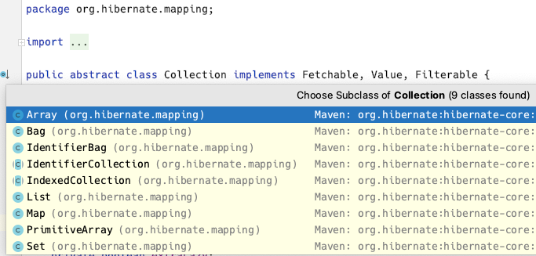
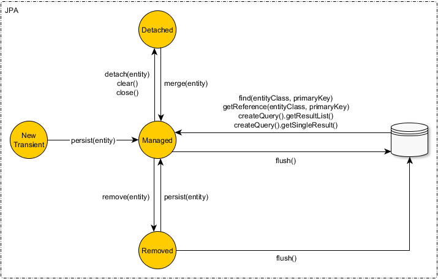

# 14. 컬렉션과 부가 기능

## 14.1 컬렉션

- Collection, List, Set, Map 컬렉션 지원
- 사용 범위
  - @OneToMany, @ManyToMany 로 매핑 할 때
  - @ElementCollection 으로 값 타입을 하나 이상 보관할 때
- JPA 구현체에 따라 제공 기능이 다를 수 있다. 



### 1. JPA 와 컬렉션

```java
public class Team {
  @Id
  private String id;
  @OneToMany
  @JoinColumn
  private Collection<Member> members = new ArrayList<>();
}
```

- 엔티티를 영속 상태로 만들 때 컬렉션 필드를 하이버네이트에서 준비한 컬렉션으로 감싸서 사용한다.
  - 컬렉션을 효율적으로 사용하기 위해 원본 상태를 감싸고 있는 하이버네이트 내장 컬렉션(혹은 래퍼 컬렉션)을 생성해서 참조를 변경한다.
    - Collection, List → PersistentBag : 중복 O, 순서 X
    - Set → PersistentSet : 중복 X, 순서 X
    - List + @OrderColumn → PersistentList : 중복 O, 순서 O
  - 사용시 초기화 해서 사용하는 것을 권장한다.

### 2. Collection, List

```java
@Entity
public class Parent {
    @Id @GeneratedValue
    private Long id;
    
    @OneToMany
    @JoinColumn
    private Collection<CollectionChild> collection = new ArrayList<>();
    
    @OneToMany
    @JoinColumn
    private List<ListChild> list = new ArrayList<>();
}
```

- 중복 확인(비교) 없이 저장 → 엔티티 추가해도 지연 로딩된 컬렉션을 초기화 하지 않는다

### 3. Set

```java
@Entity
public class Parent {
    @OneToMany
    @JoinColumn
    private Set<SetChild> set = new HashSet<>();
}
```

- hashcode + equals 로 비교하여 추가 → 엔티티 추가 할 때 지연 로딩된 컬렉션을 초기화

### 4. List + @OrderColumn

```java
@Entity
public class Board {
    @Id @GeneratedValue
    private Long id;
    
    private String title;
    private String content;
    
    @OneToMany(mappedBy = "board")
    @OrderColumn(name = "POSITION")
    private List<Comment> comments = new ArrayList<>();
}

@Entity
public class Comment {
    @Id @GeneratedValue
    private Long id;
    
    private String comment;
    
    @ManyToOne
    @JoinColumn(name = "BOARD_ID")
    private Board board;
}
```

- List + @OrderColumn: 순서가 있는 특수 컬렉션 → 데이터베이스에 순서 값 저장해서 조회에서 사용한다
- @OrderColumn 단점
  - Board 엔티티에서 매핑하므로 Comment INSERT 시 POSITION 저장되지 않고, UPDATE SQL 이 추가로 발생한다.
  - List 를 변경하면 연관된 많은 위치 값을 변경해야 한다. 중간의 댓글을 삭제하면 이후 댓글 POSITION UPDATE 실행
  - 중간에 POSITION 이 없으면 조회한 리스트에는 null 이 포함된다. 컬렉션 순회할 때 NPE 발생

### 5. @OrderBy

```java
@Entity
public class Team {
    @Id @GeneratedValue
    private Long id;
    
    private String name;
    
    @OneToMany(mappedBy = "team")
    @OrderBy("username desc, id asc")
    private Set<Member> members = new HashSet<>();
}

@Entity
public class Member {
    @Id @GeneratedValue
    private Long id;
    
    @Column(name = "MEMBER_NAME")
    private String username;
    
    @ManyToOne
    private Team team;
}
```

- 엔티티 필드를 대상으로 ORDER BY 절을 이용해 컬렉션 정렬

## 14.2 @Converter

- 엔티티의 데이터를 변환하여 데이터베이스에 저장

```sql
CREATE TABLE MEMBER {
	ID VARCHAR(255) NOT NULL,
	USERNAME VARCHAR(255),
	VIP VARCHAR(1) NOT NULL,
	PRIMARY KEY (ID)
}
```

```java
@Entity
public class Member {
    @Id
    private String id;
    private String username;
    
    @Converter(converter=BooleanToYNConverter.class)
    private boolean vip;
}
```

```java
@Converter
public class BooleanToYNConverter implements AttributeConverter<Boolean, String> {
    @Override
    public String convertToDatabaseColumn(Boolean attribute) {
        return (attribute != null && attribute) ? "Y" : "N";
    }
    @Override
    public String convertToEntityAttribute(String dbData) {
        return "Y".equals(dbData);
    }
}
```

- convertToDatabaseColumn() : 엔티티 데이터 → 데이터베이스 컬럼 저장 데이터
- convertToEntityAttribute() : 데이터베이스 컬럼 조회 데이터 → 엔티티 데이터

```java
// 클래스 레벨 설정
@Entity
@Converter(converter=BooleanToYNConverter.class, attributeName = "vip")
public class Member { ... }
```

### 1. 글로벌 설정

```java
@Converter(autoApply = true)
public class BooleanToYNConverter implements AttributeConverter<Boolean, String> {
```

- 모든 Boolean 타입에 Converter 자동 적용
- 적용하지 않으려면 @Converter(disableConversion = true)

## 14.3 리스너

- JPA 리스너 기능을 사용해 엔티티 생명주기에 따른 이벤트를 처리할 수 있다 

### 1. 이벤트 종류



- @PostLoad : 엔티티 로드 된 후
- @PrePersist : 새 엔티티에 대해 persist 호출 전
- @PreUpdate : flush/commit 으로 수정하기 전
- @PreRemove : remove 로 엔티티 삭제 전
- @PostPersist  : flush/commit 으로 저장한 후
- @PostUpdate : flush/commit 으로 수정한 후
- @PostRemove : flush/commit 으로 삭제한 후

### 2. 이벤트 적용 위치

#### 엔티티에 직접 적용

```java
@Entity
public class Duck {
    @Id @GeneratedValue
    public Long id;
    
    private String name;
    
    @PrePersist
    public void prePersist() {
        System.out.println("Duck.prePersist id=" + id);
    }
    @PostPersist
    public void postPersist() {
        System.out.println("Duck.postPersist id=" + id);
    }
    @PostLoad
    public void postLoad() {
        System.out.println("Duck.postLoad");
    }
    @PreRemove
    public void preRemove() {
        System.out.println("Duck.preRemove");
    }
    @PostRemove
    public void postRemove() {
        System.out.println("Duck.postRemove");
    }
}
```

#### 별도의 리스너 등록

```java
@Entity
@EntityListeners(DuckListrner.class)
public class Duck { ... }
```

#### 기본 리스너 사용

- META-INF/orm.xml

```xml
<entity-mapping ...>
    <persistence-unit-metadata>
        <persistence-unit-defaults>
            <entity-listeners>
                <entity-listener class="....DefaultListener" />
            </entity-listeners>
        </persistence-unit-defaults>
    </persistence-unit-metadata>
</entity-mapping>
```

- 이벤트 호출 순서
  - 기본 리스너
  - 부모 클래스 리스너
  - 리스너
  - 엔티티

#### 더 세밀한 설정

- javax.persistence.ExcludeDefaultListeners : 기본 리스너 무시
- javax.persistence.ExcludeSuperclassListeners : 상위 클래스 이벤트 리스너 무시

```java
@Entity
@EntityListeners(DuckListener.class)
@ExcludeDefaultListeners
@ExcludeSuperclassListeners
public class Duck extends BaseEntity { ... }
```

## 14.4 엔티티 그래프

- 기존 연관 엔티티 조회 방법의 문제
  - 글로벌 페치 옵션: FetchType.EAGER → 애플리케이션 전체에 영향을 주고 변경할 수 없다
  - FetchType.LAZY + 페치 조인 → 기능적 필요에 의해 중복 JPQL 작성 문제
- 엔티티 그래프: 엔티티 조회 시점에 연관된 엔티티들을 함께 조회하는 기능 (JPA 2.1+)
  - 정적 Named  엔티티 그래프
  - 동적 엔티티 그래프

### 1.  Named 엔티티 그래프

```java
// 아래 설정으로 Order 조회시 member 도 함께 조회된다
@NamedEntityGraph(name = "Order.withMember", attributeNodes = {
  @NamedAttributeNode("member")
})
@Entity
@Table(name = "ORDERS")
public class Order {
	  @Id @GeneratedValue
  	@Column(name = "ORDER_ID")
  	public Long id;
  	
    @ManyToOne(fetch = FetchType.LAZY, optional = false)
  	@JoinColumn(name = "MEMBER_ID")
  	private Member member;
}
```

- @NamedEntityGraph
  - name : 이름
  - attributeNodes : 함께 조회할 속성
  - 둘 이상은 @NameEntityGraphs 사용

### 2. em.find() 에서 엔티티 그래프 사용

```java
EntityGraph graph = em.getEntityGraph("Order.withMember");

Map hints = new HashMap();
hints.put("javax.persistence.fetchgraph", graph);

Order order = em.find(Order.class, orderId, hints);
```

- JPA 힌트를 이용

### 3. subgraph

- Order → OrderItems → Item 조회

```java
@NamedEntityGraph(name = "Order.withAll", attributeNodes = {
    @NamedAttributeNode("member"),
    @NamedAttributeNode(value = "orderItems", subgraph = "orderItems")
	},
  subgraph = @NamedSubgraph(name = "orderItems", attributeNodes = {
    @NamedAttributeNode("item")               
}))
@Entity
@Table(name = "ORDERS")
public class Order {
 	  ...
    @OneToMany(mappedBy = "order", cascade = CascadeType.ALL)
  	@JoinColumn(name = "MEMBER_ID")
  	private List<OrderItem> orderItem = new ArrayList<>();
}

@Entity
@Table(name = "ORDER_ITEM") 
public class OrderItem {
	  @Id @GeneratedValue
  	@Column(name = "ORDER_ITEM_ID")
  	public Long id;
  	
    @ManyToOne(fetch = FetchType.LAZY)
  	@JoinColumn(name = "ITEM_ID")
  	private Item item;
}
```

```java
Map hints = new HashMap();
hints.put("javax.persistence.fetchgraph", em.getEntityGraph("Order.withAll"));

Order order = em.find(Order.class, orderId, hints);
```

### 4. JPQL 에서 엔티티 그래프 사용

```java
List<Order> resultList = 
  em.createQuery("select o from Order o where o.id = :orderId", Order.class)
    .setParameter("orderId", orderId)
    .setHint("javax.persistence.fetchgraph", em.getEntityGraph("Order.withAll"))
    .getResultList();
```

### 5. 동적 엔티티 그래프

- public <T> EntityGraph<T> **createEntityGraph**(Class<T> rootType);

```java
EntityGraph<Order> graph = em.createEntityGraph(Order.class);
graph.addAttributeNodes("member");

Map hints = new HashMap();
hints.put("javax.persistence.fetchgraph", graph);

Order order = em.find(Order.class, orderId, hints);
```

```java
EntityGraph<Order> graph = em.createEntityGraph(Order.class);
graph.addAttributeNodes("member");
Subgraph<OrderItem> orderItems = graph.addSubgraph("orderItems");
orderItems.addAttributeNodes("item");

Map hints = new HashMap();
hints.put("javax.persistence.fetchgraph", graph);

Order order = em.find(Order.class, orderId, hints);
```

### 6. 엔티티 그래프 정리

- ROOT 에서 시작 : 조회하는 엔티티의 ROOT 에서 시작해야 한다
- 이미 로딩된 엔티티 : 영속성 컨텍스트에 이미 로딩되어 있으면 엔티티 그래프가 적용되지 않는다(프록시에는 적용)
- fetchgraph, loadgraph 의 차이
  - javax.persistence.fetchgraph : 선택한 속성만 함께 조회
  - javax.persistence.loadgraph : 선택 속성 + FetchType.EAGER 설정된 연관관계도 포함


## Q&A

#### p616 - 그림 14.2 @OrderColumn은 id 별로 순서 값이 관리 될까요?

> OneToMany 관계에서 BOARD_ID 를 기준으로 순서 값이 COMMENT 테이블에 관리됩니다.


#### p617 - 댓글 2가 삭제되고 position 정보가 update되지 않았을 경우 별도로 해당 정보(position)를 어떻게 update할 수 있을까요?

> @OrderColumn 을 사용하는 경우에 POSITION 컬럼 값이 업데이트 되지 않는다면 정상적은 처리가 되지 않은 경우로 볼 수 있으므로 트랜잭션 롤백이 일어날 것 같네요
>
> update 쿼리에 대한 부분이라면, 벌크 연산을 통해서 일괄 업데이트 할 수 있겠습니다. 


#### p621 - @Convert 를 클래스 레벨에서 설정할 때 2개 이상의 필드를 설정하고 싶으면 어떻게 해야할까요?

> @Converts 에 복수의 @Convert 를 설정합니다.
>
> ```java
> @Entity
> @Converts({
>   @Convert(attributeName="startDate",
>            converter=DateConverter.class),
>   @Convert(attributeName="endDate", 
>            converter=DateConverter.class)})
> public class FullTimeEmployee extends GenericEmployee { ... }
> ```
> - 참고: https://docs.oracle.com/javaee/7/api/javax/persistence/Convert.html : Example 11


#### p628 - 엔티티 그래프를 적용하는 예시는 무엇이 있을까요?

> 성능을 위해 기본 로딩 전략을 지연 로딩으로 하고, 필요한 경우 연관 엔티티를 함께 조회해야 하는 경우.
>
> EER 에서 상담 화면에서 단위 티켓을 조회해야 할때, Ticket 과 함께 관련된 TicketProcess, TicketOption 정보를 조회한다거나.

